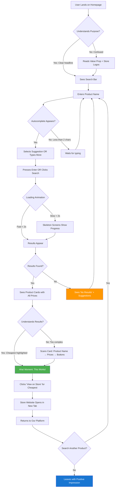
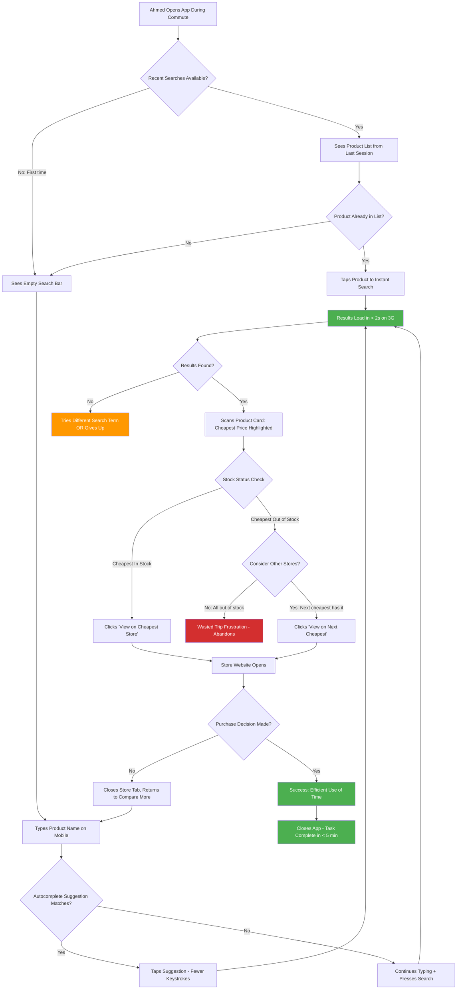
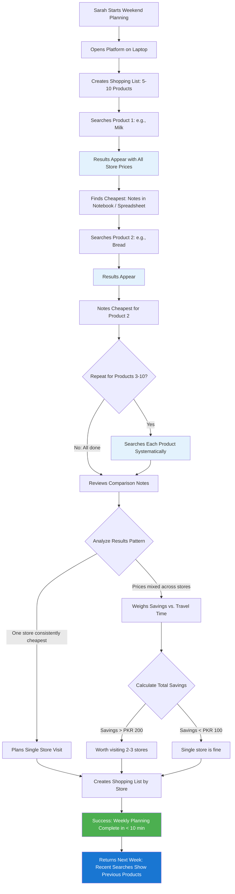

# UX Design Specification Retail-recommendation-system

**Author:** Jibran
**Date:** 2026-01-31

---

## Executive Summary

### Project Vision

Retail-recommendation-system is a web-based price comparison aggregator designed specifically for the Pakistani retail market. It addresses the fundamental problem of scattered pricing information by aggregating product data from major Pakistani retailers (Imtiaz Supermarket, Chase Plus, Bin Hashim) and presenting it in a unified, simple interface that helps users save time and money.

The platform's core value proposition is **"See all store prices in one place"** - enabling users to make informed purchasing decisions without visiting multiple physical stores or juggling multiple websites.

### Target Users

The platform serves three primary user personas, each with distinct needs and contexts:

**1. Sarah (Household Manager)**
- **Demographics:** Mother of 6, manages weekly grocery shopping for large household
- **Goals:** Stretch household budget while optimizing shopping time
- **Pain Points:** Visiting multiple physical stores to compare prices, decision fatigue after 2-3 store visits
- **Tech Comfort:** Normal smartphone user, prefers laptop for weekly planning at home
- **Usage Context:** Weekend planning from home, comparing 2-10 products per session

**2. Ahmed (Busy Professional)**
- **Demographics:** Single male, working professional
- **Goals:** Maximize time efficiency, optimize shopping routes
- **Pain Points:** Wasted trips to out-of-stock items, frustration with multiple store websites
- **Tech Comfort:** Tech-savvy, uses smartphone on-the-go during commute and after work
- **Usage Context:** Quick searches during commute or before leaving work, single-product comparisons, time-sensitive decisions

**3. Uncle Rasheed (Non-Tech User)**
- **Demographics:** 65 years old, retired teacher
- **Goals:** Independence in price comparison, avoid burdening family members with price checks
- **Pain Points:** Exclusion from online convenience, struggles with multiple website interfaces
- **Tech Comfort:** Low, needs very simple and intuitive UX with clear navigation
- **Usage Context:** Home use (desktop, tablet, or smartphone), slow and deliberate one-product-at-a-time comparisons

### Key Design Challenges

**1. Complex Information Made Simple**
- **Challenge:** Presenting detailed price and store data without overwhelming users (especially Uncle Rasheed)
- **Context:** Web SPA with potentially 1000+ products across multiple stores
- **UX Need:** Progressive disclosure - show relevant information first, hide complexity until requested
- **Risk:** Information overload leading to abandonment, especially for non-tech users

**2. Mobile-First on Slow Networks**
- **Challenge:** Delivering fast, responsive user experience on 3G networks with < 2-second search requirement
- **Context:** Pakistan has high mobile usage with prevalent 3G connectivity; users like Ahmed need fast results during commute
- **UX Need:** Performance-first design approach, optimistic UI patterns, skeleton screens, progressive loading
- **Risk:** Slow loading leads to high bounce rate, poor user experience, especially for time-sensitive users

**3. Accessibility for Diverse Users**
- **Challenge:** Meeting WCAG AA compliance while maintaining simple, intuitive interface for non-tech users
- **Context:** Uncle Rasheed requires Urdu language support, large text (minimum 16px), high contrast, and screen reader compatibility
- **UX Need:** Dual-language interface, accessible-by-design approach, inclusive design patterns
- **Risk:** Over-engineered accessibility features that complicate the interface for primary users

### Design Opportunities

**1. Instant Value Delivery ("Aha!" Moment)**
- **Opportunity:** Design the search results page as the hero moment where users immediately see comprehensive price comparison
- **User Impact:** Users see the platform's core value proposition instantly - "this changes everything"
- **Differentiation:** Clear, impactful presentation that stands out from confusing store websites
- **Key Consideration:** Side-by-side price display with clear visual hierarchy, store names, and availability indicators

**2. Zero-Friction Discovery**
- **Opportunity:** No account signup or login required - users access value immediately upon landing
- **User Impact:** First-time users see value without barriers, encouraging exploration and adoption
- **Differentiation:** Unlike many platforms that require registration, this platform offers instant gratification
- **Key Consideration:** Store bar at top showing "Comparing: Imtiaz Supermarket | Chase Plus | Bin Hashim" builds trust and transparency

**3. Smart Decision Support**
- **Opportunity:** Help users make informed trade-offs between price and proximity through visual design
- **User Impact:** Users can quickly decide: "Cheapest by PKR 100 but 2km farther" vs "Closest store but PKR 150 more expensive"
- **Differentiation:** Provides context that empowers faster decision-making
- **Key Consideration:** Progressive disclosure of decision factors - show price first (primary need), then distance and other filters

---

## Core Experience Definition

### Defining Experience

The core experience of Retail-recommendation-system centers on **instant, comprehensive price comparison**. Users search for a product once and immediately see all available prices across major Pakistani retailers (Imtiaz Supermarket, Chase Plus, Bin Hashim) in a unified, simple interface.

This is the fundamental value loop:
1. **User enters product name** → Search intent
2. **System retrieves prices from all stores** → Data aggregation
3. **User sees side-by-side comparison** → Decision support
4. **User clicks through to purchase** → Conversion to retailer

This experience eliminates the need to visit multiple physical stores or navigate multiple confusing websites. The platform delivers maximum value with minimum user effort - search once, see everything, decide, and purchase.

### Platform Strategy

**Web-First, Mobile-Optimized Single Page Application (SPA)**

- **Primary Platform:** Web SPA using React or Vue.js with client-side rendering
- **Access Points:** Desktop browsers, tablets, and smartphones
- **Modern Browsers Only:** Chrome, Firefox, Safari, Edge (latest 2 versions)
- **No Legacy Browser Support:** Maintains simplicity and performance

**Input Methods:**
- **Mobile:** Touch-first interaction with large tap targets (minimum 44x44px per WCAG AA)
- **Desktop:** Mouse/keyboard primary with full keyboard navigation support
- **Both:** Voice search input capability for accessibility and convenience

**Performance Architecture:**
- Optimistic UI patterns with skeleton screens
- Progressive loading for slower 3G networks
- < 2-second search performance requirement (NFR-PERF-01)
- Optimized assets and lazy loading for fast initial page load

### Effortless Interactions

**Zero-Friction Product Discovery**
- Single search field on homepage - no complex forms or filters to navigate
- Autocomplete suggests products as user types (reduces typing effort)
- Recent searches shown on return visits - one-tap access to repeat queries
- No account required - instant access to value upon landing

**Instant Price Comparison**
- All store prices displayed in single view - no tab switching or page reloads
- Price sorting automatically highlights cheapest option (visual indicator)
- Stock status shown inline - no clicking to check availability
- Store distance displayed when available - supports proximity decisions

**Natural Decision Support**
- Price differences highlighted visually (color coding or badges)
- "Best value" indicator for lowest price
- One-click navigation to store website for purchase
- Product details shown progressively - basic info first, details on demand

**Effortless Mobile Experience**
- Touch-optimized interface with large interactive elements
- Single-column layout on mobile - no horizontal scrolling
- Sticky search bar - always accessible without scrolling back to top
- Bottom navigation for common actions - within thumb reach

### Critical Success Moments

**Moment 1: Landing Page Clarity (First 5 Seconds)**
- User lands on platform → Instantly understands: "This shows all store prices in one place"
- Clear value proposition: "Compare prices across Imtiaz Supermarket, Chase Plus, Bin Hashim"
- Prominent search field: "Search for any product..."
- Visual trust indicators: Store logos at top, sample product comparison shown
- **Success Criteria:** User understands purpose without reading paragraphs of text

**Moment 2: First Search Results (The "Aha!" Moment)**
- User enters first product search → Results appear in < 2 seconds
- All store prices visible in single, scannable view
- Cheapest option clearly highlighted
- Stock status immediately apparent
- **Success Criteria:** User thinks "This is exactly what I needed" and continues to second search

**Moment 3: Complex Query Success**
- Sarah searches for 5-10 grocery items in one session
- Each search builds on previous - recent searches accessible
- She can quickly compare across multiple product categories
- Completes her weekly planning in under 10 minutes (vs. hours visiting stores)
- **Success Criteria:** Sarah achieves her goal faster than physical store visits

**Moment 4: Mobile Quick Win**
- Ahmed searches during commute or before leaving work
- Slow 3G network - still loads in < 2 seconds
- Finds product, sees cheapest store, knows it's in stock
- Decides and navigates to store website in under 30 seconds total
- **Success Criteria:** Time-sensitive user gets value despite poor connectivity

**Moment 5: Non-Tech User Success**
- Uncle Rasheed visits homepage → interface is simple and uncluttered
- Large text (minimum 16px), high contrast, clear labels
- He searches for one product → results are easy to understand
- He finds cheapest price without confusion or frustration
- **Success Criteria:** Elderly user with low tech comfort completes task independently

### Experience Principles

**1. Speed First**
Every interaction must be fast. Search completes in under 2 seconds (NFR-PERF-01). Skeleton screens and optimistic UI maintain perceived performance even on slow 3G networks. Performance is not optional - it's core to the value proposition, especially for time-sensitive users like Ahmed.

**2. Radical Simplicity**
Zero barriers to value. No account signup, no learning curve, no complex navigation. The interface is intuitive enough that Uncle Rasheed (65, low tech comfort) can use it immediately without help. Clear visual hierarchy, minimal cognitive load, progressive disclosure of complexity.

**3. Complete Transparency**
Users trust us because we hide nothing. Show all stores, all prices, all availability. Clear labeling of data sources and last update times. No sponsored placements or hidden promotions. Store logos displayed prominently to build familiarity and trust.

**4. Progressive Disclosure**
Show the most important information first (price and availability), then reveal secondary details (distance, filters, sorting options) on demand. This prevents overwhelming users like Uncle Rasheed while still providing power features for advanced users. Information architecture follows the user's decision-making hierarchy.

**5. Accessible by Design**
WCAG AA compliance is foundational, not an afterthought. Urdu language support, large text (minimum 16px), high contrast ratios (4.5:1 for text), keyboard navigation, screen reader compatibility, and semantic HTML from day one. Accessibility features enhance experience for all users, not just those with disabilities.

---

## Desired Emotional Response

### Primary Emotional Goals

**Empowerment Through Clarity**

The core emotional goal of Retail-recommendation-system is to make users feel **empowered and smart** through access to complete, clear information. Users should feel:

- **Empowered:** "I have all the information I need to make the best decision"
- **Smart:** "I'm making wise choices that save money and time"
- **In Control:** "I'm not at the mercy of multiple stores or confusing websites"
- **Confident:** "I understand the information and can decide without hesitation"

This empowerment transforms the shopping experience from a chore (visiting multiple physical stores, navigating multiple websites) into a streamlined, informed decision-making process.

### Emotional Journey Mapping

**Stage 1: Discovery (First Landing)**
- **Initial Feeling:** Curiosity and hope - "Is this really going to work?"
- **Transition:** Skepticism turning to delight as they understand the value proposition
- **Emotional Goal:** "This is exactly what I needed! Why didn't I know about this sooner?"
- **Design Support:** Clear landing page, prominent value proposition, sample comparison

**Stage 2: Core Experience (Search & Compare)**
- **Feeling During Action:** Focus, clarity, and efficiency
- **Emotional Goal:** "This is so simple - why isn't everything this easy?"
- **Design Support:** Fast search (< 2 seconds), clear results, intuitive comparison
- **Peak Moment:** The "Aha!" moment when all store prices appear in one view

**Stage 3: Task Completion**
- **Feeling After Decision:** Accomplished, satisfied, money-smart
- **Emotional Goal:** "I saved money/time and feel good about my decision"
- **Design Support:** Clear completion indicators, savings highlighted, smooth transition to store

**Stage 4: Error Handling (When Something Goes Wrong)**
- **Feeling During Error:** Supported, not abandoned
- **Emotional Goal:** "I understand what happened and know what to do next"
- **Design Support:** Clear error messages, helpful suggestions, no technical jargon

**Stage 5: Return Visits**
- **Feeling on Return:** Familiarity, comfort, even easier than before
- **Emotional Goal:** "I'm glad I can use this again - it's even faster now"
- **Design Support:** Recent searches, autocomplete, personalized shortcuts

### Micro-Emotions

**Confidence vs. Confusion (CRITICAL for Uncle Rasheed)**
- **Target:** Confidence - Users understand the interface immediately
- **Design:** Large text (16px+), high contrast, clear labels, logical layout
- **Avoid:** Confusion - Unclear icons, complex navigation, information overload

**Trust vs. Skepticism (CRITICAL for Data Accuracy)**
- **Target:** Trust - Users believe the prices are accurate and current
- **Design:** Transparent data sources, last update timestamps, store logos, clear attribution
- **Avoid:** Skepticism - Hidden sources, outdated prices without timestamps, vague sourcing

**Accomplishment vs. Frustration (CRITICAL for Sarah and Ahmed)**
- **Target:** Accomplishment - Tasks complete smoothly with visible progress
- **Design:** Fast loading, clear completion states, savings highlighted, minimal friction
- **Avoid:** Frustration - Slow performance, errors, complex flows, dead ends

**Delight vs. Satisfaction**
- **Target:** Delight in key moments - First search results, finding unexpected savings
- **Target:** Satisfaction as baseline - Everything works reliably and predictably
- **Design:** "Best value" badges, savings highlights ("You saved PKR 350"), smooth animations
- **Avoid:** Disappointment - Product not found, prices outdated, confusing results

**Belonging vs. Isolation (Especially for Uncle Rasheed)**
- **Target:** Inclusion - Platform designed for everyone, regardless of tech comfort
- **Design:** Simple interface, Urdu language support, accessible patterns (WCAG AA)
- **Avoid:** Exclusion - Complex interfaces that make elderly or non-tech users feel left behind

### Design Implications

**Emotion → Design Connection Map:**

**Empowerment** → Show all prices transparently, highlight savings, provide decision context
- Display all store prices in single view (no hidden information)
- Calculate and show savings: "Cheapest by PKR 200"
- Provide decision support: "2km farther but saves PKR 150"

**Confidence** → Large text, high contrast, clear labels, simple navigation
- Minimum 16px body text, larger headers (WCAG AA requirement)
- High contrast ratios (4.5:1 for text, 3:1 for large text)
- Clear labels: No jargon, icons paired with text labels
- Logical, predictable layout

**Efficiency** → Fast loading, minimal clicks, autocomplete, recent searches
- < 2-second search performance (NFR-PERF-01)
- Skeleton screens and optimistic UI for perceived speed
- Autocomplete suggestions as user types
- Recent searches displayed for quick repeat queries
- Single-column mobile layout (no horizontal scrolling)

**Trust** → Transparent data sources, timestamps, store logos, stock status
- Last update time: "Prices updated 2 hours ago"
- Store logos prominently displayed
- Clear attribution: "Source: imtiazsupermarket.com.pk"
- Stock status: "In stock at 2 of 3 stores"
- No sponsored or promoted placements

**Inclusion** → WCAG AA compliance, Urdu support, simple interface
- Urdu language option in navigation
- Keyboard navigation for all interactive elements
- Screen reader compatibility with semantic HTML
- Touch targets minimum 44x44px for mobile
- Interface intuitive enough for non-tech users

**Negative Emotions to Mitigate:**

**Avoid Frustration from Slow Performance**
- Design: Skeleton screens, optimistic UI, progressive loading
- Result: Users feel system is responsive even on 3G networks

**Avoid Overwhelm from Information Density**
- Design: Progressive disclosure - show price first, hide filters until needed
- Result: Users see critical information immediately, details on demand

**Avoid Confusion from Complex Interface**
- Design: Radical simplicity principle - one primary action per screen
- Result: Uncle Rasheed can use independently without confusion

### Emotional Design Principles

**1. Empowerment Through Transparency**
Users feel empowered when they have complete information. Hide nothing - show all stores, all prices, all availability. Transparency builds trust and confidence. Users should never wonder "Is this all the options?" or "Is this information complete?"

**2. Clarity Creates Confidence**
Confident users make decisions quickly. Clear visual hierarchy, large text, high contrast, and simple navigation prevent confusion. When users understand immediately, they feel capable and in control. This is especially critical for Uncle Rasheed and non-tech users.

**3. Speed Respects User's Time**
Fast performance (< 2 seconds) communicates respect. Users feel valued when the platform doesn't waste their time. This is essential for Ahmed's time-sensitive use cases and creates positive emotional association with the platform.

**4. Simplicity Enables Inclusion**
Simple interfaces include everyone. When design is accessible and intuitive, elderly users, non-tech users, and people with disabilities all feel welcome. Complexity excludes; simplicity includes. This aligns with WCAG AA compliance and Urdu support requirements.

**5. Reliability Builds Trust**
Consistent, predictable performance builds emotional trust. Users return when they know the platform works reliably every time. Error handling should be graceful and helpful, maintaining trust even when things go wrong. Clear data sources and timestamps reinforce trustworthiness.

**6. Delight in the Details**
Moments of delight create emotional connection and word-of-mouth sharing. The "Aha!" moment of first search results, seeing savings highlighted, or finding an unexpectedly good price creates positive emotions that users share with others. These micro-delights differentiate the experience from merely functional.

---

## UX Pattern Analysis & Inspiration

### Inspiring Products Analysis

**Foodpanda (Food Delivery)**
- **What it does well:** Simple, search-centric interface with large search bar and clear category filters; visual product cards with prices and restaurant names; mobile-first performance with fast loading on slower networks; clear pricing with delivery fees shown upfront; efficient filtering by cuisine, rating, delivery time, and price range
- **Key UX Success:** Makes ordering food feel simple and quick by reducing cognitive load through clean, focused interface
- **Transferable Pattern:** Central search bar as hero element, visual product cards, mobile-first performance

**Retailo (B2B Grocery Retail)**
- **What it does well:** Bulk ordering interface for wholesale purchasing; quick reorder functionality with recent purchases accessible; clear product categorization for logical groupings; cart management with running totals and easy quantity adjustments
- **Key UX Success:** Streamlines complex bulk purchasing tasks through intuitive quantity management
- **Transferable Pattern:** Recent searches/accessibility for repeat queries (Sarah's weekly planning), clear categorization

**Airlift (Quick Commerce)**
- **What it does well:** Speed-focused design reinforcing "get it in minutes" promise; simple product selection with minimal taps to add to cart; clear availability with stock status shown prominently; mobile app native patterns with bottom sheets and swipe gestures
- **Key UX Success:** Reduces friction for quick, impulse purchases through mobile-optimized interactions
- **Transferable Pattern:** Stock status indicators, mobile native interaction patterns, bottom navigation

**KraveMart (Grocery Delivery)**
- **What it does well:** Product search and filters for finding grocery items quickly; store availability indicators to know what's in stock before ordering; simple cart management with clear totals; category browsing with visual categories for discovery
- **Key UX Success:** Makes grocery shopping feel less overwhelming than physical stores through organized categorization
- **Transferable Pattern:** Category browsing, availability indicators, simple cart management

**Daraz (E-commerce Marketplace)**
- **What it does well:** Comprehensive search with autocomplete, suggestions, and spelling corrections; rich product cards showing images, price, rating, and seller info; advanced filtering by price range, brand, rating, and shipping; comparison capability for similar products; user reviews for social proof
- **Key UX Success:** Handles large product catalog with discoverability tools through powerful search and filtering
- **Transferable Pattern:** Autocomplete search, advanced filters, product comparison, rich information density

### Transferable UX Patterns

**Navigation Patterns:**

**1. Central Search Bar (Foodpanda, Daraz)**
- **How it works:** Prominent search field at top, always accessible, often with autocomplete
- **Could work for:** Retail-recommendation-system's core experience - searching for products
- **Why:** Primary action is searching for products - search should be the hero element
- **Supports:** All three personas - Sarah's multi-product searches, Ahmed's quick queries, Uncle Rasheed's need for simplicity

**2. Category Pills/Chips (Foodpanda, KraveMart)**
- **How it works:** Horizontal scrollable category buttons for quick filtering
- **Could work for:** Product categories (Groceries, Electronics, Household, Personal Care, etc.)
- **Why:** Quick filtering without overwhelming interface
- **Supports:** Product discovery when users don't know exact names

**3. Bottom Navigation for Mobile (Airlift, Foodpanda)**
- **How it works:** Home, Search, Cart, Profile tabs at bottom of screen
- **Could work for:** Search, Recent Searches, About/Help (simplified from standard 4-5 tabs)
- **Why:** Within thumb reach, follows mobile UX conventions
- **Supports:** Mobile-first approach, accessibility for touch interactions

**Interaction Patterns:**

**1. Product Cards with Key Info (Daraz, Foodpanda)**
- **How it works:** Card shows product image, name, price, rating, availability in scannable format
- **Could work for:** Price comparison results - product + multiple store prices in one card
- **Why:** Scannable, information-dense but organized presentation
- **Adaptation needed:** Show prices from ALL stores in one card (unique to our price comparison use case)
- **Challenge:** Information density - avoid overwhelming Uncle Rasheed
- **Solution:** Progressive disclosure - show cheapest price prominently, others in expandable list

**2. Autocomplete with Suggestions (Daraz, Foodpanda)**
- **How it works:** Suggests products as user types, shows recent searches, corrects spelling
- **Could work for:** Product search - reduce typing effort for all users
- **Why:** Faster searches, helpful for repeat queries (Sarah's weekly shopping)
- **Supports:** Efficiency principle, especially important for Ahmed's time-sensitive use cases

**3. Stock Status Indicators (KraveMart, Retailo)**
- **How it works:** "In stock", "Out of stock", "Low stock" badges on product cards
- **Could work for:** Availability at each store in price comparison
- **Why:** Prevents wasted trips (Ahmed's pain point), builds trust through transparency
- **Critical for:** Price comparison - cheapest price doesn't matter if product is out of stock

**4. Sticky Search Bar (Foodpanda, Daraz mobile)**
- **How it works:** Search field stays visible at top while scrolling through results
- **Could work for:** Mobile experience - search always accessible without scrolling back to top
- **Why:** Users can start new search or modify current search effortlessly
- **Supports:** Efficiency for Ahmed's quick searches during commute

**Visual Patterns:**

**1. High-Contrast Price Display (All apps)**
- **How it works:** Large, bold price numbers, often in brand color (green for Foodpanda, orange for Daraz)
- **Could work for:** Highlighting cheapest price in comparison view
- **Why:** Price is primary decision factor - should be most visible element
- **Supports:** Quick scanning and decision-making for all personas

**2. Color-Coded Status (Foodpanda delivery status, Airlift stock)**
- **How it works:** Green for available/success, red for unavailable/error, orange for limited/processing
- **Could work for:** Stock status, store availability indicators
- **Why:** Instant visual recognition without reading text
- **Supports:** Uncle Rasheed's clarity needs, WCAG AA accessibility requirements

**3. Large Touch Targets (All mobile apps)**
- **How it works:** Buttons and cards are tappable with thumb (44x44px minimum per WCAG)
- **Could work for:** Mobile price comparison interface
- **Why:** Accessibility and usability on touch devices
- **Supports:** WCAG AA compliance, mobile-first approach

**4. Skeleton Screens (Daraz, Foodpanda)**
- **How it works:** Gray placeholder blocks while content loads in background
- **Could work for:** Search results loading state
- **Why:** Perceived performance - users feel system is responsive even on slow 3G networks
- **Supports:** Ahmed's time-sensitive use cases, Speed First principle

### Anti-Patterns to Avoid

**1. Hidden Costs Revealed Late**
- **Problem:** Showing product price but hiding delivery fees, service charges, or taxes until checkout
- **Why avoid:** Breaks trust, creates frustration, feels deceptive
- **Our approach:** Always show total cost or clearly indicate "additional charges may apply" with explanation
- **Conflicts with:** Complete Transparency principle

**2. Complex Multi-Level Filters**
- **Problem:** Too many filter options (10+) that overwhelm users, especially non-tech users
- **Examples:** Some e-commerce sites have nested filters, complex boolean logic
- **Why avoid:** Uncle Rasheed will be confused, Sarah will be frustrated by complexity
- **Our approach:** Progressive disclosure - start simple with 3-5 key filters, reveal advanced options on demand
- **Conflicts with:** Radical Simplicity principle

**3. Slow Image Loading Without Placeholders**
- **Problem:** Empty white spaces or layout shifts while images load slowly
- **Why avoid:** Feels broken, creates poor perceived performance, unprofessional appearance
- **Our approach:** Skeleton screens, lazy loading, optimized images, graceful degradation
- **Conflicts with:** Speed First principle

**4. Autocomplete That Overwhelms**
- **Problem:** Too many suggestions (10-15), keyboard covers results on mobile, slow to render
- **Why avoid:** Ahmed on mobile can't see results, creates friction in typing experience
- **Our approach:** Limit suggestions to 5-7, ensure results display above virtual keyboard
- **Conflicts with:** Efficiency for mobile users

**5. Comparison Requiring Multiple Tabs or Views**
- **Problem:** Some price comparison sites show store prices in separate tabs or require clicking through stores
- **Why avoid:** Defeats the purpose - users want to see everything at once, adds friction
- **Our approach:** Side-by-side comparison in single scrollable view (core value proposition)
- **Conflicts with:** Core value proposition "See all store prices in one place"

**6. No Clear Call-to-Action**
- **Problem:** Product cards show information but don't make next step obvious
- **Why avoid:** Users don't know what to do next - click to view details? Add to cart? Go to store?
- **Our approach:** Clear "View on [Store Name]" buttons for each price option, single primary action per card
- **Conflicts with:** Clarity Creates Confidence principle

**7. Ignoring Network Conditions**
- **Problem:** Large unoptimized images, complex animations, auto-playing videos that fail or load slowly on 3G
- **Why avoid:** Ahmed can't use during commute, users on slow networks abandon
- **Our approach:** Progressive loading, < 2 second performance target, optimistic UI patterns
- **Conflicts with:** Speed First principle, Pakistan's 3G network reality

### Design Inspiration Strategy

**What to Adopt (Direct Application):**

**Pattern 1: Central Search-First Interface (Foodpanda, Daraz)**
- **Why:** Search is the core action - should be the hero element of the interface
- **Implementation:** Large search bar at top center, autocomplete with suggestions, recent searches displayed below
- **Supports:** Sarah's multi-product searches, Ahmed's quick queries, Uncle Rasheed's need for simplicity
- **Aligned with:** Radical Simplicity principle, Speed First principle

**Pattern 2: Product Cards with Key Information (Daraz, Foodpanda)**
- **Why:** Information-dense but scannable presentation enables quick decisions
- **Implementation:** Product name, optional image, prices from all stores, stock status, "View on store" buttons
- **Supports:** Side-by-side comparison, quick decision-making, transparency
- **Aligned with:** Empowerment Through Transparency principle

**Pattern 3: Stock Status Indicators (KraveMart, Retailo)**
- **Why:** Prevents wasted trips to out-of-stock stores, critical for decision-making
- **Implementation:** "In stock at 2 of 3 stores" badges, individual store availability on product cards
- **Supports:** Ahmed's efficiency need, builds trust through transparency
- **Aligned with:** Complete Transparency principle, Trust vs. Skepticism emotional goal

**Pattern 4: Skeleton Screens (Daraz, Foodpanda)**
- **Why:** Perceived performance on slow 3G networks maintains positive user experience
- **Implementation:** Gray placeholder blocks for product cards while price data loads from backend
- **Supports:** Ahmed's time-sensitive use case, Speed First principle
- **Aligned with:** Speed Respects User's Time principle

**What to Adapt (Modify for Our Needs):**

**Pattern 1: Multi-Store Price Card (Unique Adaptation)**
- **Inspiration:** Standard product cards from Daraz/Foodpanda with single price
- **Adaptation:** Instead of single price, show prices from all stores (Imtiaz, Chase Plus, Bin Hashim) in one unified card
- **Why:** This is our core differentiator - seeing all prices in one view is the "Aha!" moment
- **Challenge:** Information density - avoid overwhelming Uncle Rasheed with too much data
- **Solution:** Progressive disclosure - show cheapest price most prominently (large, bold), other prices in secondary visual hierarchy, expandable for details
- **Aligned with:** Progressive Disclosure experience principle

**Pattern 2: Category Pills for Product Types (Foodpanda Cuisine Filters)**
- **Inspiration:** Cuisine category filters in Foodpanda (Pakistani, Chinese, Fast Food, etc.)
- **Adaptation:** Product category filters (Groceries, Electronics, Household, Personal Care, etc.)
- **Why:** Helps users discover products without knowing exact names, supports browsing behavior
- **Simplification:** Fewer categories (5-7 maximum) than Foodpanda to maintain Radical Simplicity principle
- **Aligned with:** Zero-Friction Product Discovery

**Pattern 3: Bottom Navigation (Airlift, Foodpanda Mobile)**
- **Inspiration:** Standard mobile bottom tab bar with 4-5 tabs
- **Adaptation:** Simplified 3-tab navigation: Search, Recent Searches, About/Help
- **Why:** Mobile-first approach, within thumb reach for one-handed use
- **Simplification:** Only 3 tabs maximum (vs. typical 4-5) to maintain Radical Simplicity principle
- **Aligned with:** Mobile-first platform strategy

**What to Avoid (Anti-Patterns):**

**Avoid 1: Hidden Costs or Information**
- **Conflict with:** Complete Transparency principle
- **Never hide:** Delivery fees, service charges, stock status, data source, last update time
- **Always show:** Total landed cost or clear indication of additional charges, full transparency of data sources
- **Reason:** Hidden information destroys trust, users feel deceived when costs appear later

**Avoid 2: Complex Multi-Level Navigation**
- **Conflict with:** Radical Simplicity principle
- **Never create:** Nested menus (more than 2 levels), deep hierarchies, confusing filter combinations
- **Always provide:** Single-page experience, flat information architecture (max 2 clicks to any information)
- **Reason:** Complexity excludes non-tech users like Uncle Rasheed

**Avoid 3: Comparison Requiring Tabs or Multiple Views**
- **Conflict with:** Core value proposition ("See all store prices in one place")
- **Never require:** Users to switch between stores or tabs to see prices
- **Always show:** All prices from all stores in single, scannable view
- **Reason:** This defeats the entire purpose of the platform - users want instant comprehensive comparison

**Avoid 4: Heavy Images or Animations**
- **Conflict with:** Speed First principle, 3G network constraints
- **Never use:** Large hero images (> 100KB), complex animations, auto-playing videos, decorative graphics
- **Always optimize:** Lightweight assets, progressive loading, < 2 second performance target
- **Reason:** Heavy assets fail on Pakistan's 3G networks, exclude users with poor connectivity

**Avoid 5: Small Touch Targets on Mobile**
- **Conflict with:** WCAG AA accessibility requirements
- **Never design:** Buttons smaller than 44x44px, cramped tap targets, hit areas that overlap
- **Always ensure:** Large interactive elements, adequate spacing (minimum 8px between targets)
- **Reason:** Small targets are unusable for elderly users and violate accessibility standards

---

## Design System Foundation

### Design System Choice

**Material UI (MUI) for React**

Selected design system: **MUI (Material UI) v6** - React component library implementing Google's Material Design system

**Framework:** React 18+ with hooks-based architecture

**Why MUI for Retail-recommendation-system:**
- WCAG AA accessibility built into core components
- Comprehensive component library covering all MVP needs
- Built-in internationalization (i18n) with RTL support for Urdu
- Mobile-first responsive grid system
- Proven patterns for search, filtering, and data display
- Strong TypeScript support for maintainability
- Extensive documentation and community support

### Rationale for Selection

**1. Accessibility Compliance (CRITICAL REQUIREMENT)**

MUI components are designed with accessibility in mind:
- **WCAG AA Compliance:** Most core components meet WCAG 2.1 AA standards out of the box
- **Keyboard Navigation:** Full keyboard support for all interactive elements
- **Screen Reader Support:** Proper ARIA attributes and semantic HTML
- **Focus Management:** Built-in focus indicators and trap for modals/drawers
- **High Contrast:** Color system includes accessible contrast ratios
- **Large Text Support:** Typography scale supports minimum 16px body text requirement

**Impact on Project:**
- Reduces accessibility implementation burden significantly
- Supports Uncle Rasheed's needs without custom accessibility work
- Ensures compliance with NFR-A11Y-01 through NFR-A11Y-07

**2. Speed to Market (MVP Timeline)**

Comprehensive component library enables rapid development:
- **Pre-built Components:** 50+ components covering search, navigation, data display, forms
- **Professional Design Defaults:** No need for custom UI design work
- **Documentation & Examples:** Extensive code examples speed implementation
- **Community Resources:** Stack Overflow, tutorials, blog posts for common patterns

**Impact on Project:**
- Reduces frontend development time by 30-40% compared to custom components
- Enables focus on business logic (web scraping, data aggregation) rather than UI implementation
- Professional appearance builds user trust immediately

**3. Urdu Language Support (Localization Requirement)**

MUI has proven internationalization capabilities:
- **RTL (Right-to-Left) Support:** Built-in RTL mode for Arabic/Urdu languages
- **Typography Support:** Urdu-friendly font configurations
- **Layout Adaptation:** Components adapt layout for RTL text direction
- **Date/Number Formatting:** Locale-aware formatting through i18n providers

**Impact on Project:**
- Urdu language toggle can be implemented without layout rewrites
- Supports inclusion of non-English speakers (aligned with Inclusion principle)
- Future-proof for regional language expansion

**4. Mobile-First Performance (3G Network Constraint)**

MUI supports performance optimization:
- **Responsive Grid System:** Mobile-first breakpoints (xs, sm, md, lg, xl)
- **Tree Shaking:** Import only components you use (ES modules)
- **Lazy Loading:** Code splitting support for large components
- **Optimized Bundles:** Production builds minimize CSS/JS size
- **Emotion Cache:** CSS-in-JS optimization for faster rendering

**Impact on Project:**
- Supports < 2 second search performance requirement (NFR-PERF-01)
- Optimistic UI patterns achievable with MUI's skeleton and loading components
- Works well on Pakistan's 3G networks (Ahmed's use case)

**5. Brand Flexibility (Customization Strategy)**

Theming system enables brand identity establishment:
- **Design Tokens:** Customizable colors, typography, spacing, shadows
- **Theme Provider:** Centralized theme configuration for entire app
- **Component Variants:** Override component styles without forking
- **Dark Mode Ready:** Built-in dark mode support (potential future feature)
- **Brand Evolution:** Easy to rebrand post-MVP without component rewrites

**Impact on Project:**
- Can establish unique brand identity despite using established design system
- Simple theme changes affect entire application consistently
- Room to evolve from MVP "good enough" to polished brand later

**6. Developer Experience & Maintainability**

Strong foundations for long-term success:
- **TypeScript Support:** Full type definitions for better code quality
- **React 18 Features:** Concurrent rendering, automatic batching support
- **Hook-Based API:** Modern React patterns (no legacy class components)
- **Testing Utilities:** @mui/x-test-utils for component testing
- **Stable API:** Predictable updates with migration guides

**Impact on Project:**
- Reduces bugs through type safety
- Easier onboarding for future developers
- Long-term maintenance viability

**Trade-offs Accepted:**

1. **Visual Familiarity:** Material Design look is recognizable - less initial uniqueness
   - **Mitigation:** Custom theme colors and typography will create distinct identity
   - **Acceptable:** Trustworthiness of familiar patterns benefits early adoption

2. **Bundle Size:** MUI is larger than lightweight alternatives
   - **Mitigation:** Tree shaking, lazy loading, code splitting
   - **Acceptable:** Performance target (< 2 seconds) achievable with optimization

3. **Learning Curve:** Team must learn Material Design patterns
   - **Mitigation:** Extensive documentation and examples
   - **Acceptable:** One-time learning cost vs. ongoing custom component maintenance

### Implementation Approach

**Phase 1: Foundation Setup (MVP)**

**1.1 Project Initialization**
```bash
# React with TypeScript and Vite (recommended for performance)
npm create vite@latest retail-recommendation-system -- --template react-ts

# Or Create React App
npx create-react-app retail-recommendation-system --template typescript
```

**1.2 Install MUI Core**
```bash
# Core MUI packages
npm install @mui/material @emotion/react @emotion/styled

# Icons (for search, navigation, status indicators)
npm install @mui/icons-material

# Fonts (Roboto for English, Noto Nastaliq Urdu for Urdu)
npm install @fontsource/roboto @fontsource/noto-nastaliq-urdu
```

**1.3 Theme Configuration**
```typescript
// src/theme.ts - Custom theme for MVP
import { createTheme, ThemeOptions } from '@mui/material';

const themeOptions: ThemeOptions = {
  palette: {
    primary: {
      main: '#1976d2', // Brand blue - customizable
    },
    secondary: {
      main: '#4caf50', // Success green for stock status
    },
    error: {
      main: '#d32f2f', // Out of stock red
    },
    background: {
      default: '#ffffff',
      paper: '#f5f5f5',
    },
  },
  typography: {
    fontFamily: '"Roboto", "Helvetica", "Arial", sans-serif',
    fontSize: 16, // WCAG AA minimum
    h1: { fontSize: '2.5rem' },
    h2: { fontSize: '2rem' },
    h3: { fontSize: '1.75rem' },
    body1: { fontSize: '1rem' }, // 16px minimum
    body2: { fontSize: '0.875rem' }, // 14px for secondary text
  },
  breakpoints: {
    values: {
      xs: 0,    // Mobile first
      sm: 600,  // Tablet
      md: 900,  // Small desktop
      lg: 1200, // Desktop
      xl: 1536, // Large desktop
    },
  },
  components: {
    // Component overrides for brand customization
    MuiButton: {
      styleOverrides: {
        root: {
          textTransform: 'none', // More modern than Material's uppercase
          borderRadius: 8, // Softer corners
        },
      },
    },
    MuiCard: {
      styleOverrides: {
        root: {
          borderRadius: 12, // Modern card appearance
          boxShadow: '0 2px 8px rgba(0,0,0,0.1)',
        },
      },
    },
  },
};

export const theme = createTheme(themeOptions);
```

**1.4 RTL Setup for Urdu**
```typescript
// src/theme-rtl.ts - Urdu language theme
import { createTheme, ThemeOptions } from '@mui/material';

const themeOptionsRTL: ThemeOptions = {
  direction: 'rtl',
  // ... same configuration as English theme
  typography: {
    fontFamily: '"Noto Nastaliq Urdu", "Arial", sans-serif',
    // ... Urdu-specific typography
  },
};

export const themeRTL = createTheme(themeOptionsRTL);
```

**1.5 App Provider Setup**
```typescript
// src/App.tsx
import { ThemeProvider, CssBaseline } from '@mui/material';
import { theme } from './theme';

function App() {
  return (
    <ThemeProvider theme={theme}>
      <CssBaseline />
      {/* App content */}
    </ThemeProvider>
  );
}
```

**Phase 2: Component Selection (MVP)**

**2.1 Core MUI Components for Retail-recommendation-system:**

**Layout & Navigation:**
- `Container` - Responsive container for content
- `Grid` / `Stack` - Layout system (Grid for complex, Stack for simple)
- `AppBar` - Top navigation bar with search field
- `BottomNavigation` - Mobile bottom tabs (Search, Recent, About)
- `Drawer` - Side drawer for filters/advanced options (desktop)

**Search & Input:**
- `Autocomplete` - Product search with autocomplete suggestions
- `TextField` - Search input with debouncing
- `InputAdornment` - Search icon in input field
- `IconButton` - Clear search, language toggle

**Data Display:**
- `Card` - Product cards with price comparison
- `CardHeader` - Product name and basic info
- `CardContent` - Prices from multiple stores
- `CardActions` - "View on store" buttons
- `Chip` - Stock status, category badges
- `Badge` - "Cheapest" indicator
- `Divider` - Visual separation

**Feedback & Loading:**
- `Skeleton` - Loading placeholders for product cards
- `CircularProgress` - Full-page loading spinner
- `LinearProgress` - Progress indicators
- `Alert` - Error messages, empty states
- `Snackbar` - Toast notifications (success/error feedback)

**2.2 Custom Components to Build:**

**ProductComparisonCard (extends MUI Card)**
- Shows product name
- Lists prices from all stores (Imtiaz, Chase Plus, Bin Hashim)
- Highlights cheapest price
- Shows stock status for each store
- "View on [Store]" buttons
- Responsive layout (stacked on mobile, side-by-side on desktop)

**SearchBar (composes Autocomplete + TextField)**
- Large, prominent search input
- Autocomplete with product suggestions
- Recent searches dropdown
- Debounced API calls (300ms)
- Loading indicator during search

**StorePill (composes Chip)**
- Store logo/name
- Current stock status
- Price display
- Click to filter by store

**LanguageToggle (IconButton)**
- Switch between English/Urdu
- Icon indicator
- Persist preference in localStorage

**Phase 3: Performance Optimization (Post-MVP)**

```typescript
// Code splitting by route
const SearchResults = lazy(() => import('./SearchResults'));
const About = lazy(() => import('./About'));

// Lazy load heavy components
const ProductComparisonCard = lazy(() => import('./ProductComparisonCard'));

// Bundle size monitoring
npm install @bundle-analyzer/webpack-plugin
```

### Customization Strategy

**Level 1: Theme Customization (MVP Launch)**

**Color Palette:**
- Primary color: Choose brand blue (e.g., `#1976d2` or custom)
- Secondary color: Success green for "In Stock" status
- Error color: Red for "Out of Stock"
- Warning color: Orange for "Low Stock"

**Typography:**
- English: Roboto (Material Design default)
- Urdu: Noto Nastaliq Urdu (Google Fonts)
- Base size: 16px (WCAG AA minimum)
- Headings: Scale up from 1.25rem to 2.5rem

**Spacing:**
- Use MUI's 8px base unit scale (4, 8, 12, 16, 20, 24, etc.)
- Maintain consistent spacing for visual rhythm

**Shape:**
- Border radius: 8px for buttons (more modern than Material's sharp edges)
- Card radius: 12px for softer, modern card appearance

**Level 2: Component Overrides (Post-MVP Polish)**

**Button Overrides:**
- Remove uppercase text transformation
- Add subtle hover elevation
- Custom ripple effect color

**Card Overrides:**
- Softer shadows
- Hover effects for desktop
- Smooth transitions

**Input Overrides:**
- Larger input height for mobile (48px minimum)
- Clear focus indicators
- Custom search icon

**Level 3: Custom Components (Ongoing Evolution)**

**As the brand evolves:**
- Create completely custom product comparison card design
- Animated transitions for price updates
- Custom illustrations for empty states
- Micro-interactions for delight moments
- Seasonal themes (Ramadan, Eid, etc.)

### Next Steps

1. **Setup React Project:** Initialize with Vite + TypeScript
2. **Install MUI:** Core packages, icons, fonts
3. **Configure Theme:** English theme + Urdu RTL theme
4. **Build Core Components:** Search bar, product cards, navigation
5. **Implement Accessibility:** Test with screen readers, keyboard navigation
6. **Optimize Performance:** Code splitting, lazy loading, bundle analysis
7. **Deploy MVP:** Launch with Material Design defaults
8. **Gather Feedback:** User testing with Sarah, Ahmed, Uncle Rasheed personas
9. **Iterate Theme:** Customize based on feedback and brand development

---

## 2. Core User Experience

### 2.1 Defining Experience

**The Defining Interaction: "Search once, see all prices instantly"**

Every successful product has a defining experience - the core interaction that, if nailed, makes everything else follow. For Retail-recommendation-system, the defining experience is the moment when:

**User enters a product name → In < 2 seconds, they see a clean, scannable view of prices from Imtiaz Supermarket, Chase Plus, and Bin Hashim → The cheapest price is highlighted → Stock status is clear → They can click through to any store to purchase**

This is the "Aha!" moment that makes users think: *"This changes everything - why wasn't this available before?"*

**Why This Is The Defining Experience:**

1. **It's the core value proposition:** "See all store prices in one place" delivered in one interaction
2. **It solves the primary pain point:** Eliminates need for multiple store visits or website tab-switching
3. **It creates immediate delight:** Users see the platform's value in seconds, not minutes
4. **It's shareable:** Users will tell friends: "There's this website that shows all prices at once"
5. **It's repeatable:** Users return to do this again for every product they need

**Comparison to Famous Defining Experiences:**
- Tinder: "Swipe to match" → Retail-recommendation-system: "Search once, see all"
- Spotify: "Play any song instantly" → Retail-recommendation-system: "Compare all prices instantly"
- Instagram: "Share perfect moments" → Retail-recommendation-system: "Find perfect prices"

### 2.2 User Mental Model

**How Users Currently Solve This Problem:**

**Sarah (Household Manager):**
- Drives to 2-3 physical stores (Imtiaz, Chase Plus, Bin Hashim)
- Writes down prices in a notebook while shopping
- Compares notes at home to decide where to buy next time
- **Time required:** 2-3 hours of store visits + 30 minutes of comparison

**Ahmed (Busy Professional):**
- Opens multiple store websites in different browser tabs
- Switches between tabs to compare prices
- Frustrated by slow loading, confusing interfaces, out-of-stock items
- **Time required:** 10-15 minutes of frustrating tab-switching

**Uncle Rasheed (Non-Tech Elderly):**
- Calls family members to check prices for him
- Or visits one store and accepts whatever price they find
- Feels burdened by asking for help
- **Time required:** Depends on family availability + phone calls or 1 store visit

**Mental Model Users Bring to This Task:**

1. **Search works like Google:** Type and get relevant results immediately
2. **Prices should be visible:** No clicking to reveal hidden information
3. **Top-to-bottom scanning:** Cheapest or best option should be at the top
4. **Simple inputs:** One search field, not complex forms with multiple filters
5. **Trust requires transparency:** Show sources, timestamps, stock status clearly

**User Expectations:**

- **Speed:** Results appear in 1-2 seconds (like Google search)
- **Clarity:** Instantly spot the cheapest price without squinting
- **Completeness:** All stores shown, nothing hidden or behind clicks
- **Accuracy:** Prices are current and stock status is reliable
- **Simplicity:** Anyone can use it without reading instructions

**Where Users Get Confused or Frustrated:**

- Multiple clicks required to see prices (defeats the purpose)
- Cheapest option not obvious (requires manual comparison)
- Stock status unclear (wasted trips to out-of-stock stores)
- Can't tell which store is which (confusing layouts or labels)
- Slow loading (feels broken, especially on 3G)

### 2.3 Success Criteria

**Core Experience Success Criteria:**

**1. Speed Perception: "This just works"**
- Search results appear in < 2 seconds (NFR-PERF-01)
- Autocomplete suggestions appear within 300ms of typing
- Smooth page transitions, no janky animations
- Skeleton screens maintain perceived performance during data fetching

**2. Instant Clarity: "I found the best deal"**
- Cheapest price is visually prominent (larger, bold, or highlighted)
- Price differences are obvious at a glance (color coding or badges)
- Store names are clearly associated with prices
- Stock status uses universal symbols (✓ green, ✗ red)

**3. Smart Accomplishment: "I'm saving money/time"**
- Users complete price comparison in seconds vs. hours (physical stores)
- Savings displayed: "Cheapest by PKR 200" or "You saved PKR 350"
- Time savings implied by speed: "Found in 1.5 seconds"
- Comparison complete in one search, not multiple queries

**4. Trust Through Transparency: "This information is reliable"**
- Data sources clearly labeled: "Scraped from imtiazsupermarket.com.pk"
- Last update timestamp: "Prices updated 2 hours ago"
- Stock status visible: "In stock at 2 of 3 stores"
- No hidden information: All prices shown upfront

**Success Indicators by Persona:**

**For Sarah:**
- Completes weekly shopping list (5-10 products) in under 10 minutes
- Feels confident about budget decisions
- Returns weekly for shopping planning

**For Ahmed:**
- Finds product and compares prices during commute (under 5 minutes)
- Makes decision before reaching destination
- Recommends to colleagues as "super useful"

**For Uncle Rasheed:**
- Successfully searches and compares prices without asking family for help
- Understands the interface immediately (no learning curve)
- Feels proud of independence

### 2.4 Novel UX Patterns

**Pattern Analysis: Established Patterns with Unique Twist**

**Established UX Patterns We're Using:**

**1. Search Bar (Google, Amazon, Daraz)**
- **Why familiar:** Every internet user understands search
- **How we use it:** Large, centered search field as primary action
- **User benefit:** Zero learning curve, intuitive entry point

**2. List of Results (E-commerce standard)**
- **Why familiar:** Users expect results in list format
- **How we use it:** Vertical list of product cards
- **User benefit:** Familiar scannable format

**3. Product Cards (Daraz, Foodpanda)**
- **Why familiar:** Card-based design is standard
- **How we use it:** Cards with product info and pricing
- **User benefit:** Organized, bite-sized information chunks

**4. Autocomplete Suggestions (Modern search UX)**
- **Why familiar:** Users expect suggestions while typing
- **How we use it:** Product suggestions appear as user types
- **User benefit:** Faster searches, spelling corrections

**Our Unique Twist (What Makes Us Special):**

**1. Multi-Store Pricing in One Card**
- **Novel aspect:** Instead of one price per product, we show ALL store prices
- **Traditional approach:** Click into product to see pricing, or different pages for different stores
- **Our innovation:** Side-by-side price comparison in single card view
- **User benefit:** No clicking, no tabs - instant comprehensive comparison

**2. Cheapest-First Sorting**
- **Novel aspect:** Automatic highlighting of best value option
- **Traditional approach:** Sort by relevance or popularity, user must manually compare
- **Our innovation:** Most important factor (price) determines sort order automatically
- **User benefit:** Immediate visibility of best deal without mental math

**3. Stock Status for Each Store**
- **Novel aspect:** Granular availability per store, not just "in stock somewhere"
- **Traditional approach:** Shows overall availability or requires clicking to check
- **Our innovation:** Stock status for each store displayed upfront
- **User benefit:** Prevents wasted trips to out-of-stock stores (Ahmed's pain point)

**4. Transparency of Data Sources**
- **Novel aspect:** Clear attribution of where data comes from and when it was updated
- **Traditional approach:** Many price comparison sites hide sources or update times
- **Our innovation:** "Source: imtiazsupermarket.com.pk • Updated 2 hours ago"
- **User benefit:** Builds trust through transparency, helps users assess data reliability

**Why This Combination Works:**

1. **Leverages familiarity:** Users understand search, cards, lists (no learning curve)
2. **Delivers unexpected value:** Seeing all prices at once creates "Aha!" moment
3. **Solves real pain:** Addresses specific problems (store visits, tab-switching, confusion)
4. **Balances simplicity and power:** Easy to use, provides comprehensive information

**Education Required:**

**Minimal education needed** because we use established patterns:
- Icon tooltips for stock status (✓ = in stock, ✗ = out of stock)
- Brief onboarding for first-time users: "Search for any product to see prices from all stores"
- Sample results on homepage show how it works
- Help section explains features (accessible but not required)

**Familiar Metaphors:**

- **Search bar = Google:** Type and get results
- **Price list = Shopping receipt:** Scannable list of items and prices
- **Stock status = Traffic lights:** Green = go (available), Red = stop (unavailable)
- **Store logos = Brands you know:** Builds trust and familiarity

### 2.5 Experience Mechanics

**Core Experience Mechanics: "Search Once, See All Prices"**

**1. Initiation: How Does the User Start?**

**Landing Page Experience:**

**Hero Section:**
- **Headline:** Large, clear: "Compare prices across all Pakistani stores in one place"
- **Sub-headline:** One sentence explaining value: "See prices from Imtiaz Supermarket, Chase Plus, and Bin Hashim instantly"
- **Primary Call-to-Action:** Prominent search bar (100% width on mobile, 600px max on desktop)

**Trust Indicators:**
- **Store logos:** Imtiaz, Chase Plus, Bin Hashim displayed at top
- **Value proposition:** "No signup required • Free forever • Updated prices"
- **Social proof:** "Used by 10,000+ smart shoppers in Pakistan" (post-launch)

**Example Results (Demo):**
- Sample product card showing how comparison works
- Interactive demo: Try searching "milk" to see example results

**Triggers to Begin:**
- **Search field label:** "Search for any product..." (gray placeholder text)
- **Autocomplete activation:** Dropdown appears after 2 characters typed
- **Recent searches:** For returning users, show 5 recent searches below search bar

**User Mindset at Initiation:**
- **Curiosity:** "Does this actually work?"
- **Hope:** "This would save me so much time if it works"
- **Skepticism:** "Probably too good to be true, prices must be outdated"

**2. Interaction: What Does the User Actually Do?**

**Step-by-Step Flow:**

**Step 1: Enter Product Name**
- **Action:** User types in search bar (e.g., "milk")
- **System response:**
  - Autocomplete dropdown appears after 2 characters
  - Suggestions shown: "Milk 1L", "Milk Packet 1L", "Milk Cream", etc.
  - User can: (a) Click suggestion, (b) Continue typing, (c) Press Enter to search
- **Loading indicator:** If search takes > 500ms, show spinner below search bar

**Step 2: View Results (< 2 seconds later)**
- **Action:** Results page appears
- **Layout:**
  - **Desktop:** Two-column grid (product cards side-by-side)
  - **Tablet:** Single column, wider cards
  - **Mobile:** Single column, stacked cards (full width)

- **Product Card Structure:**
  ```
  ┌─────────────────────────────────────┐
  │ Milk Packet 1L (Tetra Pak)         │
  ├─────────────────────────────────────┤
  │ [STORE] [PRICE]   [STOCK]  [ACTION] │
  │ Imtiaz   PKR 180    ✓     View →   │
  │ Chase+   PKR 185    ✓     View →   │
  │ Bin Hash PKR 190    ✓     View →   │
  └─────────────────────────────────────┘
  ```

- **Visual Hierarchy:**
  - **Product name:** Largest, bold (20-24px)
  - **Cheapest price:** Highlighted with green badge "CHEAPEST"
  - **Store names:** Clear, consistent (14-16px)
  - **Prices:** Large numbers (18px), currency symbol visible
  - **Stock status:** Icons + text (✓ green "In stock", ✗ red "Out of stock")
  - **Action buttons:** Secondary style (outlined or muted background)

**Step 3: Refine Search (Optional)**

**Filter Options (Progressive Disclosure):**
- **Category:** Dropdown with categories (Groceries, Electronics, Household, etc.)
- **Stock Status:** Checkbox for "Only show in-stock items"
- **Price Range:** Slider or min/max inputs (hidden by default, "Advanced filters" link)

**Sort Options:**
- **Default:** Sort by price (cheapest first)
- **Alternative:** Sort by relevance (if search term is specific product name)
- **Persistent:** User's sort preference remembered for session

**Filter Feedback:**
- **Active filters shown:** "Showing 5 in-stock products in Groceries under PKR 500"
- **Clear filters button:** Remove all filters with one click
- **Filter count:** Show number of results matching filters

**Step 4: Take Action**

**Primary Action: Click Through to Store**
- **Button:** "View on [Store Name]" (e.g., "View on Imtiaz")
- **Behavior:** Opens store website in new tab
- **Reasoning:** User keeps our platform open to compare more products

**Secondary Actions:**
- **Share:** "Share this comparison" button (copy link to clipboard)
- **Save:** "Add to watchlist" (post-MVP feature, requires account)
- **Alert:** "Alert me when price drops" (post-MVP feature)

**3. Feedback: What Tells Users They're Succeeding?**

**Positive Feedback (Success Indicators):**

**During Typing:**
- **Autocomplete suggestions:** "I'm on the right track, system understands me"
- **Character count:** Showing search term as typed

**During Loading:**
- **Skeleton screens:** Gray placeholder cards while data loads
- **Progress indicators:** "Searching 3 stores..." or "Loading prices..."
- **Perceived speed:** Skeleton screens make loading feel faster

**When Results Appear:**
- **Number of results:** "Found 12 products matching 'milk'"
- **Success message:** Green flash or checkmark animation (subtle)
- **Cheapest highlighted:** Green badge "CHEAPEST" on best price
- **Stock status visible:** Green checkmarks show availability

**When User Acts:**
- **Button click feedback:** Ripple effect or color change on "View on store" button
- **Link opens:** New tab opens, focus changes to store site
- **Success toast:** "Opened Imtiaz Supermarket in new tab" (optional, may be annoying)

**Ongoing Feedback:**
- **Recent searches saved:** Below search bar, "Recent: milk, bread, eggs"
- **Search history:** Browser history shows product searches
- **Session persistence:** Filters and sort remembered during session

**Error Recovery (What Happens When Things Go Wrong):**

**No Results Found:**
- **Clear message:** "No products found matching 'xyz123'"
- **Helpful suggestions:**
  - "Try different search term"
  - "Browse popular products: [Milk, Bread, Eggs, Rice]"
  - "Check spelling or try a broader search"
- **Never leave user stuck:** Always provide next step

**All Stores Out of Stock:**
- **Clear message:** "This product is currently out of stock at all stores"
- **Helpful suggestions:**
  - "Similar products available: [Product A, Product B]"
  - "Set up stock alert" (post-MVP feature)
- **Maintain trust:** Show when data was last updated

**Slow Loading (> 2 seconds):**
- **Skeleton screens:** Maintain perceived performance
- **Loading message:** "Fetching latest prices... (this may take longer on slow networks)"
- **Retry option:** "Taking too long? Tap to retry" button

**Network Error:**
- **Clear message:** "Connection issue - check your internet"
- **Retry button:** Large, prominent "Try Again" button
- **Helpful hint:** "Works best on 3G, 4G, or WiFi"

**4. Completion: How Do Users Know They're Done?**

**Successful Completion Indicators:**

**Task Complete:**
- **User found the product:** Product shown in results
- **User compared all prices:** All 3 stores with prices visible
- **User clicked through:** "View on store" button clicked, new tab opened
- **User navigates away:** Closes our tab or switches to store tab

**Micro-Completion (Small Wins):**
- **Search success:** Results appeared, user found relevant products
- **Comparison success:** User identified cheapest option
- **Decision success:** User clicked through to preferred store
- **Each win builds trust:** Platform feels reliable and useful

**Session Completion Patterns:**

**For Sarah (Weekly Planning):**
- **Pattern:** Searches 5-10 products over 20-30 minutes
- **Completion:** Creates shopping list based on comparison results
- **Return:** Visits physical store(s) with list
- **Next session:** Returns next week, repeats process

**For Ahmed (Quick Search):**
- **Pattern:** Searches 1 product, completes comparison in 2-3 minutes
- **Completion:** Finds cheapest store, clicks through
- **Action:** Buys product immediately or after work
- **Return:** Returns when needing another product comparison

**For Uncle Rasheed (Deliberate Search):**
- **Pattern:** Searches 1 product slowly, reads carefully
- **Completion:** Finds cheapest price, feels accomplished
- **Action:** May call family to share what he found (pride)
- **Return:** Returns when needing another price check

**What's Next? (Post-Completion Journey):**

**Immediate Next Steps:**
- **Search another product:** Search bar remains available and prominent
- **Browse categories:** "Browse by category" option on homepage
- **Learn more:** "How it works" or "About" page

**Long-Term Engagement:**
- **Habit formation:** Platform becomes part of shopping routine
- **Word-of-mouth:** Users tell friends and family
- **Bookmarking:** Users add to browser bookmarks or home screen
- **Brand loyalty:** Users return because platform solves real problem

**Retention Strategies:**
- **Recent searches:** Quick access to repeat queries
- **Personalized recommendations:** "People who searched for milk also looked for bread"
- **Email alerts (post-MVP):** "Price dropped for products you searched"
- **Social sharing:** "Share this comparison and help friends save money"

---

## Visual Design Foundation

### Color System

**Primary Color: Trust Blue**
- **Color Value:** `#1976d2` (Material Blue 700)
- **Emotional Association:** Trust, reliability, professionalism, stability
- **Usage Applications:**
  - Primary buttons (e.g., "Search", "View on Store")
  - Search bar focus state and border
  - Navigation links and active menu items
  - Hyperlinks within content
- **Rationale:** Blue is universally associated with trustworthiness (used by banks, Facebook, Twitter) - critical for a platform handling financial comparisons. Users need to trust the price data is accurate.

**Secondary Color: Growth Green**
- **Color Value:** `#4caf50` (Material Green 500)
- **Emotional Association:** Success, availability, money-saving, positive outcomes
- **Usage Applications:**
  - "In stock" status indicators (✓ green checkmarks)
  - "CHEAPEST" price badges
  - Success messages and toasts
  - Price savings highlights ("You saved PKR 200")
- **Rationale:** Green universally means "go" and "good" - reinforces positive user actions (finding the best deal, products being available). Creates visual reward for smart shopping.

**Error Color: Alert Red**
- **Color Value:** `#d32f2f` (Material Red 700)
- **Emotional Association:** Urgency, errors, out of stock, negative outcomes
- **Usage Applications:**
  - "Out of stock" status indicators (✗ red X marks)
  - Error messages and alerts
  - Form validation errors
  - Warning notifications
- **Rationale:** Red immediately grabs attention for important negative information. Helps users avoid wasted trips to out-of-stock stores.

**Warning Color: Caution Orange**
- **Color Value:** `#ff9800` (Material Orange 500)
- **Emotional Association:** Low stock, attention needed, pending status
- **Usage Applications:**
  - "Low stock" warnings
  - Pending update indicators
  - Cautionary messages
- **Rationale:** Orange signals urgency without the severity of red. Appropriate for "only 2 left" situations.

**Neutral Colors: Clean Gray Scale**
- **Background Primary:** `#ffffff` (Pure white)
  - Clean, modern, maximizes readability
- **Background Secondary:** `#f5f5f5` (Light gray)
  - Card backgrounds, elevated surfaces
- **Text Primary:** `#212121` (Near black)
  - Maximum contrast (WCAG AA compliant), primary content
- **Text Secondary:** `#757575` (Medium gray)
  - Supporting text, labels, descriptions
- **Dividers/Borders:** `#e0e0e0` (Light gray)
  - Subtle visual separation, unobtrusive
- **Disabled:** `#bdbdbd` (Light gray)
  - Disabled buttons, inactive states

**Store Accent Colors (Visual Differentiation):**
- **Imtiaz Supermarket:** Red accent `#E53935` (small dot or badge)
- **Chase Plus:** Blue accent `#1E88E5` (small dot or badge)
- **Bin Hashim:** Green accent `#43A047` (small dot or badge)
- **Usage:** Small colored indicators next to store names in price lists
- **Rationale:** Helps users quickly scan and identify stores without reading full names. Color-coded for visual memory.

**Accessibility Compliance (WCAG AA):**
- **Text Contrast:** All color combinations meet 4.5:1 contrast ratio minimum
- **Large Text:** 3:1 contrast ratio for text 18px+ (prices, headings)
- **Color Independence:** Icons and status indicators use shape + color (not color alone)
  - Stock status: ✓ shape + green color, ✗ shape + red color
  - Cheapest badge: "CHEAPEST" text + green background + star icon
- **High Contrast Mode:** Support for OS-level high contrast mode settings
- **Color Blindness:** Ensure information is distinguishable without relying solely on color (iconography, text labels, patterns)

### Typography System

**Overall Tone: Professional yet Approachable**
- Modern, clean, optimized for digital screens
- Not overly formal (like banking apps) or too playful (like games)
- Clarity and readability prioritized over stylistic flourishes

**English Language Typography (Primary):**

**Primary Typeface: Roboto**
- **Why Roboto:**
  - Material Design default font, optimized for screens
  - Excellent readability at small sizes (critical for mobile)
  - Designed specifically for digital interfaces
  - Supports extensive character set and weights
  - Free, open-source, reliable CDN availability
- **Font Weights:** Regular (400), Medium (500), Bold (700)
- **Fallback:** `font-family: 'Roboto', 'Helvetica', 'Arial', sans-serif`

**Type Scale (Mobile-First Responsive):**
```css
/* Display & Headings */
h1: 2.5rem (40px) - Page titles, e.g., "Compare Prices"
h2: 2rem (32px) - Section headers, e.g., "Search Results for 'milk'"
h3: 1.75rem (28px) - Card titles, product names

/* Body Text */
body1: 1rem (16px) - Primary body text (WCAG AA minimum)
body2: 0.875rem (14px) - Secondary text, captions, helper text
button: 0.875rem (14px) - Button text, navigation labels

/* Price Typography (Specialized) */
price-large: 1.5rem (24px) - Cheapest price, most prominent
price-medium: 1.125rem (18px) - Regular store prices
price-currency: 1rem (16px) - Currency symbol (PKR)
price-small: 0.875rem (14px) - Per-unit pricing (e.g., "PKR 180/liter")

/* Utility Text */
caption: 0.75rem (12px) - Metadata, timestamps, fine print
overline: 0.75rem (12px) - Category labels, badges
```

**Line Heights:**
- **Headings (h1-h3):** 1.2 - Tight, impactful, hierarchical
- **Body Text:** 1.5 - Comfortable readability, generous breathing room
- **Prices:** 1.3 - Balanced between tightness and readability
- **Rationale:** Tighter headings create visual hierarchy, looser body text improves readability for longer content

**Letter Spacing:**
- **Headings:** 0px (default) - Natural spacing for readability
- **Uppercase labels:** 0.5px - Slight increase for legibility (e.g., "CHEAPEST" badge)
- **Body text:** 0px (default) - Natural spacing
- **Rationale:** Minimal letter spacing maintains readability while preventing cramped appearance

**Urdu Language Typography (Secondary):**

**Primary Typeface: Noto Nastaliq Urdu**
- **Why Noto Nastaliq Urdu:**
  - Google Fonts, excellent Urdu calligraphic support
  - Pairs well with Roboto (both Google Fonts)
  - Designed specifically for Urdu script readability
  - Free, open-source, reliable CDN availability
- **Font Weights:** Regular (400), Bold (700)
- **Fallback:** `font-family: 'Noto Nastaliq Urdu', 'Arial Unicode MS', sans-serif`

**RTL (Right-to-Left) Support:**
- **Direction:** `dir="rtl"` attribute on HTML element for Urdu pages
- **Layout Mirroring:** MUI's RTL mode automatically mirrors layout
- **Text Alignment:** Right-aligned for Urdu (matches reading direction)
- **Mixed Content:** Proper handling of English product names within Urdu text

**Urdu Type Scale:**
- **Same scale as English:** Maintains visual consistency across languages
- **Larger minimum:** May use 18px minimum for Urdu (calligraphic script requires slightly larger size for equal readability)
- **Generous line height:** 1.6-1.8 for Urdu (requires more vertical space than Latin script)

**Font Switching:**
- **Language Toggle:** Icon button in navigation bar (English/Urdu)
- **Persistent Preference:** User's language choice saved in localStorage
- **URL-based:** Optional language parameter (e.g., `/search?lang=ur`)
- **Fallback Loading:** If Urdu font fails to load, system default (Arial Unicode) prevents text invisibility

**Accessibility Considerations:**
- **Minimum 16px:** Body text never smaller than 16px (WCAG AA requirement)
- **Resizable Text:** Text scales up to 200% without breaking layout (browser zoom)
- **Font Smoothing:** `-webkit-font-smoothing: antialiased` for crisp rendering
- **Print Optimization:** Print stylesheet removes decorative elements, focuses on price comparison data

**Character Set Support:**
- **English:** Full Latin character set, numbers, currency symbols (PKR, $)
- **Urdu:** Arabic script, Urdu-specific characters, numerals (optional: Arabic-Indic digits)
- **Special Characters:** Currency symbols (₨, Rs.), mathematical symbols (%, +, -), stock status icons (✓, ✗)

### Spacing & Layout Foundation

**Overall Layout Feel: Airy and Scannable**

**Design Philosophy:**
- **Generous white space:** Not cramped or cluttered (critical for Uncle Rasheed's clarity needs)
- **Scannable information hierarchy:** Key information (price, stock) immediately visible
- **Mobile-optimized spacing:** Touch-friendly spacing and tap targets on mobile devices
- **Visual breathing room:** Space between elements prevents cognitive overload

**Spacing Unit System:**

**Base Unit: 8px**
- **Why 8px:** MUI's default spacing system, proven scalable foundation
- **Scale:** 4, 8, 12, 16, 20, 24, 32, 40, 48, 64, 96, 128 (pixels)
- **Rationale:** Multiples of 8 create consistent vertical rhythm and maintain visual harmony
- **Usage:**
  - Component padding: 16px (2 units)
  - Card margins: 24px (3 units)
  - Section gaps: 32px (4 units)
  - Page margins: 24px mobile, 48px desktop

**White Space Strategy:**

**Component Spacing:**
- **Card Padding:** 16px on mobile, 24px on desktop (internal breathing room)
- **Card Margins:** 16px below each card (vertical rhythm)
- **Grid Gaps:** 16px between columns (horizontal separation)
- **Section Separation:** 24px vertical margin between major sections

**Content Density:**
- **Above fold (first screen):** Search bar + first 2-3 results (most critical info)
- **Below fold (scrolling):** Additional results, filters, help links (secondary info)
- **Progressive disclosure:** Advanced filters hidden by default, revealed on demand

**Grid System & Responsive Breakpoints:**

**Mobile (< 600px - "xs" breakpoint):**
- **Column structure:** Single column (100% width)
- **Card layout:** Full-width cards with 16px left/right margins
- **Touch optimization:** Minimum 44x44px tap targets (WCAG AA)
- **Content width:** 100% minus 32px margins (16px each side)
- **Example:** Product cards stacked vertically, prices readable without horizontal scrolling

**Tablet (600px - 900px - "sm" and "md" breakpoints):**
- **Column structure:** Two columns (50% width each)
- **Grid gaps:** 16px between columns
- **Card padding:** 20px (increased from mobile 16px)
- **Content width:** Maximum 568px per column (optimal reading length)
- **Example:** Side-by-side product cards, prices easy to compare

**Desktop (> 900px - "lg" breakpoint and above):**
- **Column structure:** Two columns (50% width each) - NOT three columns
- **Max width container:** 1200px centered on screen
- **Card padding:** 24px (increased from tablet 20px)
- **Rationale for two columns:** Three columns would make prices too small (primary decision factor requires readability)
- **Example:** Large cards with prominent prices, comfortable reading experience

**Layout Principles:**

**1. Progressive Disclosure (Information Architecture)**
- **Primary information:** Product name, prices, stock status (always visible)
- **Secondary information:** Store distance, product details, update time (visible on demand)
- **Tertiary information:** Advanced filters, sorting options, help documentation (hidden until requested)
- **Implementation:** "Show more" links, collapsible sections, modal drawers for advanced options

**2. Visual Hierarchy (Size, Color, Position)**
- **Size hierarchy:** Product name (24-28px) > Price (18-24px) > Store name (16px) > Stock status (14px)
- **Color hierarchy:** Cheapest price (green highlight) > Other prices (black) > Secondary text (gray)
- **Position hierarchy:** Cheapest price at top (automatic sorting) > Other prices below
- **Implementation:** MUI's typography variants and color system

**3. Consistent Spacing (Vertical Rhythm)**
- **Vertical spacing:** Multiples of 8px for all margins and paddings
- **Horizontal alignment:** Left-aligned for LTR languages (English), right-aligned for RTL (Urdu)
- **Card consistency:** All product cards use identical padding and margins
- **Grid alignment:** Cards align to 8px grid, maintains visual rhythm
- **Implementation:** MUI's spacing system (`sx={{ m: 2, p: 3 }}` for 16px margin, 24px padding)

**4. Responsive Design (Mobile-First)**
- **Design approach:** Mobile-first (design for smallest screen, enhance for larger)
- **Breakpoint strategy:** Progressive enhancement (add complexity as screen size increases)
- **Touch optimization:** No hover-dependent interactions on mobile (tap instead)
- **Typography scaling:** Same font sizes across devices, adjusted line heights for readability
- **Implementation:** MUI's breakpoints system (`display={{ xs: 'none', md: 'block' }}`)

**Component Spacing Relationships:**

**Search Bar:**
- **Mobile:** Full width (100%), 48px height (touch-friendly)
- **Desktop:** 600px max width centered, 56px height
- **Margins:** 24px from top of page, 16px from content below

**Product Cards:**
- **Mobile:** 100% width, 16px left/right margins, 16px bottom margin
- **Tablet:** 50% width (2-column grid), 16px gaps between columns
- **Desktop:** 50% width (2-column grid), 16px gaps, 24px card padding
- **Internal spacing:** 12px between product name and price list

**Navigation:**
- **Bottom navigation (mobile):** 56px height (Material Design standard), fixed at bottom
- **Top navigation (desktop):** 64px height (Material Design standard), sticky
- **Padding:** 16px left/right within navigation bar

**Footer:**
- **Mobile:** 24px padding, stacked links
- **Desktop:** 48px padding, horizontal link layout
- **Margins:** 48px from content above

**Accessibility Considerations:**

**Touch Targets (Mobile):**
- **Minimum size:** 44x44px (WCAG AA requirement)
- **Buttons:** Minimum 48px height for better usability
- **Links:** Entire card area clickable for product cards (enhanced touch target)
- **Spacing:** 8px minimum between adjacent touch targets

**Focus Indicators:**
- **Visible focus:** 2px solid blue outline on focused elements
- **High contrast:** Focus indicator visible on all backgrounds
- **Skip links:** "Skip to main content" link for keyboard users

**Responsive Typography:**
- **Text scaling:** Supports up to 200% browser zoom without breaking layout
- **Text wrapping:** Long product names wrap gracefully, don't overflow
- **Line length:** Maximum 75 characters per line for optimal readability (desktop)

**Print Layout:**
- **Print stylesheet:** Remove navigation, search bar, decorative elements
- **Focus:** Product names and prices (primary value for print)
- **Layout:** Single column, black text on white background (ink-efficient)

---

## Design Direction Decision

### Design Directions Explored

Throughout our UX design workflow, we explored and established the following design dimensions:

**1. Layout Approach**
- **Explored:** Single-column vs. multi-column, card-based vs. list-based, minimal vs. information-dense
- **Established:** Card-based layout with single column (mobile) → two columns (desktop)

**2. Information Architecture**
- **Explored:** Filter-first vs. search-first, category browsing vs. search-only, progressive disclosure vs. all-at-once
- **Established:** Search-first with progressive disclosure (filters revealed on demand)

**3. Visual Hierarchy**
- **Explored:** Price-first vs. product-name-first, prominent vs. subtle stock status, badge-based vs. text-based indicators
- **Established:** Product name first, then prices with cheapest highlighted prominently

**4. Color Application**
- **Explored:** Monochromatic vs. multi-color, vibrant vs. muted, dark mode vs. light-only
- **Established:** Clean light theme with semantic color coding (blue primary, green secondary, red for errors)

**5. Typography Scale**
- **Explored:** Compact vs. generous sizing, minimal weights vs. extensive weight variations
- **Established:** Mobile-first responsive scale with 16px minimum (WCAG AA compliance)

**6. Interaction Patterns**
- **Explored:** Instant search vs. search-on-submit, single-selection vs. multi-selection, inline actions vs. detail pages
- **Established:** Instant search with autocomplete, single-product focus, inline price comparison

**7. Navigation Style**
- **Explored:** Top navigation vs. bottom navigation, hamburger menu vs. visible tabs, persistent vs. contextual
- **Established:** Top search bar (persistent) + bottom navigation (mobile) + minimal tabs (3 max)

**8. Component Density**
- **Explored:** Dense information display vs. airy spacing, minimal borders vs. heavy separation
- **Established:** Airy, scannable layout with generous white space (8px base unit)

### Chosen Direction

**Design Direction: Clean, Search-Centric Comparison Interface**

Our chosen design direction combines **Material UI's proven components** with **custom comparison-focused layout** to create an experience that feels:

1. **Immediately familiar** (uses established search patterns)
2. **Magically comprehensive** (all prices in one view)
3. **Trustworthy** (transparent data sources and timestamps)
4. **Accessible** (WCAG AA compliance, supports non-tech users)

**Key Design Characteristics:**

**Visual Style:**
- **Light theme** with clean white backgrounds and light gray surfaces
- **Trust Blue** (`#1976d2`) as primary color for actions and links
- **Growth Green** (`#4caf50`) for positive indicators (in stock, cheapest price)
- **Generous white space** with 8px base unit spacing
- **Card-based UI** with rounded corners (12px border radius) and subtle shadows

**Layout Strategy:**
- **Hero search bar** centered on homepage (primary call-to-action)
- **Single-column mobile** (full-width cards) → **Two-column desktop** (50% width each)
- **Sticky search bar** on results pages (always accessible)
- **Progressive disclosure** of filters (hidden by default, revealed on demand)

**Information Hierarchy:**
```
1. Product Name (24-28px, bold) - Primary identifier
2. Cheapest Price (24px, green highlight) - Decision-critical
3. Other Prices (18px, standard) - Comparison context
4. Store Names (16px) - Price source identification
5. Stock Status (14px, icon + text) - Availability context
```

**Component Architecture:**
- **ProductComparisonCard** - Core component showing product + all store prices
- **SearchBar** - Autocomplete-enabled search with recent searches
- **StorePill** - Color-coded store indicators with stock status
- **BottomNavigation** - Mobile-only: Search, Recent, About (3 tabs)
- **LanguageToggle** - English/Urdu language switcher

**Responsive Behavior:**
- **Mobile (< 600px):** Single column, 16px margins, 44px minimum tap targets
- **Tablet (600-900px):** Two columns, 16px grid gaps, 20px card padding
- **Desktop (> 900px):** Two columns (max 1200px container), 24px card padding

### Design Rationale

**Why This Direction Works for Retail-recommendation-system:**

**1. Aligns with Core Value Proposition**
- **"See all store prices in one place"** delivered through side-by-side price comparison card
- Single search reveals all information (no clicking, no tabs, no page reloads)
- Cheapest price automatically highlighted (saves users mental math)

**2. Supports All Three User Personas**
- **Sarah:** Can compare 5-10 products quickly during weekly planning (efficient information display)
- **Ahmed:** Gets results in < 2 seconds during commute (fast loading, clear hierarchy)
- **Uncle Rasheed:** Understands interface immediately (familiar search pattern, minimal complexity)

**3. Meets Accessibility Requirements**
- **WCAG AA compliance:** 16px minimum text, 4.5:1 contrast ratios, keyboard navigation
- **Urdu language support:** RTL layout with Noto Nastaliq Urdu font
- **Screen reader friendly:** Semantic HTML, ARIA labels via MUI components
- **Large touch targets:** 44x44px minimum on mobile

**4. Optimized for Pakistan's 3G Networks**
- **Performance-first:** < 2 second search target, skeleton screens, optimistic UI
- **Lightweight assets:** Minimal images, CSS-in-JS with tree shaking, code splitting
- **Progressive loading:** Content loads incrementally, perceived speed maintained

**5. Builds Trust Through Transparency**
- **Data sources visible:** "Source: imtiazsupermarket.com.pk" on each price
- **Timestamps shown:** "Prices updated 2 hours ago" builds credibility
- **Stock status clear:** No ambiguity about availability
- **No hidden information:** All prices displayed upfront (no "reveal to see" patterns)

**6. Leverages Proven Patterns**
- **Material UI foundation:** Battle-tested components, excellent accessibility
- **Search-first UX:** Familiar from Google, Amazon, Daraz (zero learning curve)
- **Card-based layout:** Proven effective for scannable information (Foodpanda, KraveMart)
- **Mobile-first design:** Progressive enhancement approach

**7. Enables Brand Evolution**
- **MUI theming:** Easy to customize colors, typography, spacing post-MVP
- **Clean foundation:** Simple base allows for visual polish over time
- **Scalable system:** Design tokens support consistent evolution as brand matures

**8. Balances Simplicity and Power**
- **Simple for basic users:** Search → see prices → click to buy (no complexity required)
- **Powerful for advanced users:** Filters, sorting, recent searches available when needed
- **Progressive disclosure:** Features revealed based on user engagement level

### Implementation Approach

**Phase 1: MVP Foundation (Weeks 1-2)**

**Setup & Configuration:**
```bash
# Project initialization
npm create vite@latest retail-recommendation-system -- --template react-ts
npm install @mui/material @emotion/react @emotion/styled @mui/icons-material
npm install @fontsource/roboto @fontsource/noto-nastaliq-urdu
```

**Theme Configuration:**
- Create `theme.ts` with our color palette and typography scale
- Create `theme-rtl.ts` for Urdu language support
- Implement `ThemeProvider` and `CssBaseline` in App.tsx
- Configure responsive breakpoints (xs, sm, md, lg)

**Core Components Build:**
1. **SearchBar** - Autocomplete with debouncing and recent searches
2. **ProductComparisonCard** - Multi-store price display with cheapest highlighting
3. **StorePill** - Store indicators with color-coded accents
4. **LoadingStates** - Skeleton screens for optimistic UI

**Phase 2: Feature Implementation (Weeks 3-4)**

**Search Functionality:**
- Implement autocomplete with product suggestions
- Add debouncing (300ms) to prevent excessive API calls
- Display loading indicators during search
- Show recent searches below search bar

**Results Display:**
- Implement product card grid (responsive: 1 → 2 columns)
- Add cheapest price highlighting (green badge + larger size)
- Display stock status for each store (icon + text)
- Implement "View on Store" buttons (opens in new tab)

**Navigation & Layout:**
- Implement sticky search bar on results pages
- Add bottom navigation for mobile (Search, Recent, About)
- Create language toggle (English/Urdu) with persistence
- Implement responsive grid with MUI Grid or Stack components

**Phase 3: Polish & Optimization (Weeks 5-6)**

**Accessibility:**
- Keyboard navigation testing (Tab, Enter, Escape keys)
- Screen reader testing (NVDA, JAWS, VoiceOver)
- Focus indicator verification (visible 2px blue outline)
- Color contrast validation (all combinations 4.5:1 minimum)

**Performance:**
- Implement code splitting (lazy loading for routes)
- Add bundle size monitoring (webpack-bundle-analyzer)
- Optimize images (if used) with lazy loading
- Test on 3G network simulation (Chrome DevTools)

**Internationalization:**
- Implement Urdu language toggle with RTL layout
- Add Urdu font (Noto Nastaliq Urdu) with proper fallbacks
- Test language switching (English ↔ Urdu)
- Persist language preference in localStorage

**Phase 4: Testing & Deployment (Weeks 7-8)**

**User Testing:**
- Test with Sarah persona (weekly planning, 5-10 products)
- Test with Ahmed persona (quick single-product search)
- Test with Uncle Rasheed persona (non-tech user, slow deliberate use)
- Gather feedback on clarity, speed, and satisfaction

**Refinement:**
- Adjust spacing based on user feedback
- Refine color contrast if accessibility issues found
- Optimize performance based on real-world testing
- Polish micro-interactions (hover states, transitions)

**Deployment:**
- Deploy to staging environment for final testing
- Configure CDN for static assets (fonts, images)
- Set up monitoring (performance, errors)
- Deploy to production (MVP launch)

**Post-MVP Evolution:**

**Design Enhancements:**
- Custom illustrations for empty states and onboarding
- Animated transitions for price updates and search results
- Seasonal themes (Ramadan, Eid decorations)
- Dark mode support (user preference)

**Feature Additions:**
- User accounts (save searches, watchlists, price alerts)
- Advanced filtering (by distance, brand, specific features)
- Price history charts (track price trends over time)
- Product reviews and ratings

**Brand Development:**
- Refine color palette based on user feedback
- Develop custom illustrations and iconography
- Create brand guidelines document
- Evolve from Material Design defaults to custom brand identity

**Technical Foundation:**
- MUI component library ensures consistency
- TypeScript provides type safety and maintainability
- Responsive design supports all device sizes
- WCAG AA compliance ensures accessibility
- Performance optimization supports 3G networks
- Internationalization supports Urdu language

**This design direction provides a solid, scalable foundation for Retail-recommendation-system's MVP and beyond.**

---

## User Journey Flows

### Journey 1: First-Time User Discovery & First Search

**Goal:** New user discovers platform, understands value, and successfully completes first price comparison

**User Persona:** First-time visitor (any of Sarah, Ahmed, or Uncle Rasheed)

**Entry Point:** User lands on homepage via link, search, or referral

**Key Design Questions:**
- **Information needed:** Clear value proposition, how it works, what stores are covered
- **Decisions:** Should I trust this? How do I use it?
- **Success indicators:** Understanding the purpose, completing first search successfully
- **Confusion points:** "Is this real?", "How does it work?", "What do I do?"
- **Error recovery:** No results, slow loading, unclear navigation

**Detailed Flow:**



**Key Moments in Journey:**

1. **Landing Clarity (0-5 seconds):** User must instantly understand "Compare prices across all stores"
   - Hero headline: "Compare prices across all Pakistani stores in one place"
   - Store logos visible (Imtiaz, Chase Plus, Bin Hashim)
   - Single search bar as primary call-to-action

2. **Search Initiation (5-10 seconds):** User sees search bar, understands what to do
   - Clear placeholder: "Search for any product..."
   - Autocomplete suggestions appear as user types
   - Recent searches shown (for returning users)

3. **First Results (10-12 seconds):** The "Aha!" moment - seeing all prices creates delight
   - Results appear in < 2 seconds (NFR-PERF-01)
   - Product name prominent
   - All store prices visible in single view
   - Cheapest price highlighted with green badge

4. **Action & Success (12-15 seconds):** Clicking through to store confirms value
   - "View on Store" button clear and prominent
   - Store website opens in new tab (user can return)
   - Success achieved: user found best price quickly

**Optimization Opportunities:**

- **Minimize time to value:** Results appear in < 2 seconds (NFR-PERF-01)
- **Reduce cognitive load:** Single search field, no forms or filters upfront
- **Create delight moment:** Cheapest price highlighted with green badge + "CHEAPEST" label
- **Build trust immediately:** Store logos, sample results, clear explanation

**Error Recovery:**

- **No results:** Helpful suggestions, popular products, spelling corrections
  - Message: "No products found 'xyz123'. Try: milk, bread, eggs"
- **Slow loading:** Skeleton screens maintain perceived performance
  - Gray placeholder cards while data loads
- **Confusion:** "How it works" section, example comparisons visible on homepage

### Journey 2: Quick Product Comparison (Ahmed's Journey)

**Goal:** Busy professional quickly compares prices for single product during commute

**User Persona:** Ahmed - Busy professional, time-sensitive, mobile usage on 3G

**Entry Point:** Direct access via bookmark or typing URL during commute or before leaving work

**Key Design Questions:**
- **Information needed:** Fast results, clear cheapest option, stock status
- **Decisions:** Which store to buy from (cheapest vs. closest)
- **Success indicators:** Found product, compared prices, clicked through in < 5 minutes
- **Confusion points:** Slow loading, unclear which is cheapest, out of stock confusion
- **Error recovery:** Network issues on 3G, product not found, all stores out of stock

**Detailed Flow:**



**Key Moments in Journey:**

1. **Fast Entry (0-2 seconds):** Recent searches visible or search bar ready
   - Recent searches displayed as tappable chips below search bar
   - One tap to repeat previous query (major time-saver)

2. **Quick Typing (2-5 seconds):** Autocomplete reduces keystrokes
   - Autocomplete appears after 2 characters
   - Suggestions tappable (no need to type full product name)
   - Mobile-optimized: Results above virtual keyboard

3. **Fast Loading (5-7 seconds):** < 2 second search on 3G network
   - Skeleton screens maintain perceived performance
   - "Searching 3 stores..." message provides transparency
   - Optimistic UI keeps user engaged during data fetch

4. **Instant Decision (7-10 seconds):** Cheapest highlighted, stock clear, click through
   - Green "CHEAPEST" badge immediately visible
   - Stock status (✓ In Stock) shown for each store
   - Single tap to open store website

5. **Task Complete (10-300 seconds):** Total journey in under 5 minutes
   - Ahmed completes comparison and clicks through to store
   - Closes platform with positive impression
   - Returns next time he needs price comparison

**Optimization for Ahmed:**

- **Recent searches:** One-tap access to repeat queries (critical efficiency feature)
- **Aggressive autocomplete:** Reduces typing on mobile (large touch targets, suggestions above keyboard)
- **Cheapest-first sorting:** No manual comparison required (automatic optimization)
- **Stock status prominent:** Prevents wasted trips (his primary pain point)
- **Optimistic UI:** Skeleton screens make 3G feel faster (perceived performance)
- **Single-tap actions:** "View on store" button - no confirmation needed (reduces friction)

**Error Recovery:**

- **3G network slow:** Skeleton screens + "Fetching prices..." message + "Tap to retry"
- **Product not found:** "Did you mean..." suggestions + popular products
- **All stores out of stock:** Clear messaging + "Similar products available" section
- **Connection lost:** "Connection issue - tap to retry" (large button, high visibility)

### Journey 3: Multi-Product Weekly Planning (Sarah's Journey)

**Goal:** Household manager compares 5-10 products for weekly grocery shopping

**User Persona:** Sarah - Mother of 6, manages weekly grocery budget, weekend planning at home

**Entry Point:** Weekend planning session from home, prefers laptop/desktop for larger screen

**Key Design Questions:**
- **Information needed:** Search for multiple products, compare prices across all, create shopping list
- **Decisions:** Which products to compare, which stores to visit based on total savings
- **Success indicators:** Compared 5-10 products, identified best store combinations, saved money
- **Confusion points:** Managing multiple searches, tracking comparisons, optimizing across stores
- **Error recovery:** Products not found, prices changed, complex multi-store optimization

**Detailed Flow:**



**Key Moments in Journey:**

1. **Planning Start (0-1 minute):** Sarah lists products she needs to compare
   - Opens platform on laptop (larger screen preferred)
   - Brings shopping list or creates one during session

2. **Systematic Searching (1-5 minutes):** Searches each product, notes cheapest prices
   - Search 1: Milk → Imtiaz PKR 180 (cheapest) - notes in spreadsheet
   - Search 2: Bread → Chase Plus PKR 50 (cheapest) - notes in spreadsheet
   - Search 3-10: Continues systematic comparison

3. **Pattern Recognition (5-7 minutes):** Identifies which stores have best overall prices
   - Notices Imtiaz cheapest for dairy, Chase Plus for bakery
   - Weighs visiting multiple stores vs. single store convenience

4. **Decision Making (7-9 minutes):** Weighs savings vs. convenience (travel time)
   - Calculates total savings if visiting 2-3 stores
   - Decides: "PKR 200 savings worth extra 15 minutes driving"

5. **Shopping List Creation (9-10 minutes):** Organizes by store for efficient trip
   - Creates list: "Imtiaz: Milk, Cheese, Eggs" and "Chase Plus: Bread, Juice"
   - Success: Weekly planning complete in under 10 minutes (vs. hours of store visits)

**Optimization for Sarah:**

- **Recent searches preserved:** Quick access to repeat weekly items (reduces repeated typing)
- **Consistent layout:** Each search works the same way (predictable, reduces learning curve)
- **Fast performance:** Multiple searches in quick succession without lag (no fatigue)
- **Clear price differences:** "Cheapest by PKR 200" helps decision-making (quantifies savings)
- **Sticky search bar:** No scrolling back to top between searches (efficient workflow)
- **Desktop-optimized:** Two-column layout enables easy comparison scanning (see more results at once)

**Future Enhancement (Post-MVP):**

- **Shopping list builder:** Save products, compare totals across stores automatically
  - User adds products to list, platform calculates optimal store combinations
  - "Visit Imtiaz + Chase Plus to save PKR 500 total"
- **Store route optimization:** "Visit these 2 stores in this order" (minimize travel time)
- **Price history:** "This milk is PKR 20 cheaper than last week" (trend information)
- **Alerts:** "Price dropped for items on your list" (proactive savings opportunities)

**Error Recovery:**

- **Products not found:** Alternative product suggestions ("Try whole milk instead")
- **Out of stock:** Clear stock status prevents planning around unavailable items
- **Prices changed:** "Prices updated 30 mins ago" builds trust in current data
- **Session loss:** Recent searches preserved if browser closes accidentally (localStorage)

### Journey Patterns

Across these three critical user journeys, these **reusable patterns** emerge:

**Navigation Patterns:**

1. **Search-First Entry:** All journeys begin with search action (no navigation hierarchy to navigate)
2. **Sticky Access:** Search bar always accessible (no scrolling back to top)
3. **Recent Searches Context:** Returning users see recent searches (reduces friction for repeat visits)
4. **One-Tap Actions:** Primary actions (View on Store, Select Product) require single tap/click (minimize clicks to value)

**Decision Patterns:**

1. **Progressive Disclosure:** Simple entry → reveal complexity on demand (filters hidden by default, revealed when needed)
2. **Automatic Optimization:** Cheapest price highlighted (no manual comparison required, system does the work)
3. **Visual Hierarchy Guides Decisions:** Size and color lead eye to most important information first (product name → cheapest price → other prices)
4. **Default Choices Succeed:** Default sort order (cheapest first) works for most users (no need to change)

**Feedback Patterns:**

1. **Immediate Response:** Autocomplete appears as user types (instant feedback, system is working)
2. **Loading Transparency:** Skeleton screens show content is loading (maintains perceived performance on slow networks)
3. **Success Confirmation:** Store opens in new tab (user knows action succeeded, can return to platform)
4. **Error Helpful-ness:** No results → suggestions (not dead ends), connection lost → retry option (always a next step)

### Flow Optimization Principles

**1. Minimize Steps to Value**
- **Goal:** Get users to successful outcome in minimum steps/clicks
- **Implementation:** Single search → all prices visible (no clicks required to see comparison)
- **Metric:** Time from landing to "Aha!" moment < 15 seconds

**2. Reduce Cognitive Load**
- **Goal:** Users shouldn't have to think about how to use the platform
- **Implementation:** Familiar search pattern, clear visual hierarchy, automatic sorting
- **Metric:** First-time users complete task without reading instructions

**3. Provide Clear Progress Indicators**
- **Goal:** Users know system is working, especially on slow networks
- **Implementation:** Skeleton screens, loading spinners, "Searching 3 stores..." messages
- **Metric:** No user abandonment due to perceived "broken" loading state

**4. Create Moments of Delight**
- **Goal:** Positive emotional reinforcement creates word-of-mouth sharing
- **Implementation:** "Aha!" moment when all prices appear, "Cheapest" badges, savings highlights
- **Metric:** Users voluntarily tell friends about platform (primary growth mechanism)

**5. Handle Edge Cases Gracefully**
- **Goal:** Errors don't feel like failures, they feel like helpful guidance
- **Implementation:** "No results" + suggestions (not just "No results"), connection retry options
- **Metric:** Error pages have next steps, never dead ends

---

## Component Strategy

### Design System Components (Available from MUI)

**MUI provides 50+ components. For Retail-recommendation-system, we'll use:**

**Layout & Navigation:**
- `Container` - Responsive container for content centering
- `Grid` / `Stack` - Layout systems (Grid for complex, Stack for simple)
- `AppBar` - Top navigation bar with search field
- `BottomNavigation` - Mobile bottom tabs (Search, Recent, About)
- `Drawer` - Side drawer for advanced filters (desktop)

**Input & Search:**
- `Autocomplete` - Product search with autocomplete suggestions
- `TextField` - Search input with debouncing
- `InputAdornment` - Search icon in input field
- `IconButton` - Clear search, language toggle buttons
- `DebouncedTextField` - Custom wrapper around TextField with 300ms debounce

**Data Display:**
- `Card` - Product cards container
- `CardHeader` - Product name and basic info
- `CardContent` - Prices from multiple stores
- `CardActions` - "View on store" buttons
- `Chip` - Stock status badges, category pills
- `Badge` - "Cheapest" indicator overlay
- `Divider` - Visual separation between sections
- `List` / `ListItem` - Recent searches list
- `ListItemButton` - Tappable recent search items

**Feedback & Loading:**
- `Skeleton` - Loading placeholders for product cards
- `CircularProgress` - Full-page loading spinner
- `LinearProgress` - Progress indicators
- `Alert` - Error messages, empty states, help text
- `Snackbar` / `Toast` - Success/error notifications

**Typography:**
- `Typography` - All text variants (h1-h6, body1, body2, button, caption)
- Custom price typography variants (price-large, price-medium, price-currency)

### Custom Components

**Gap Analysis:** MUI covers 80% of our needs. We need **5 custom components** for unique price comparison functionality.

---

### Custom Component 1: ProductComparisonCard

**Purpose:** Display product name alongside prices from all stores with cheapest highlighted and stock status visible

**Usage:** Used on search results page, one card per product found

**Anatomy:**
```
┌─────────────────────────────────────────────────┐
│ Product Name (h3 typography)                    │
├─────────────────────────────────────────────────┤
│ • Store 1 Logo + Name | Price | Stock | Action  │
│ • Store 2 Logo + Name | Price | Stock | Action  │
│ • Store 3 Logo + Name | Price | Stock | Action  │
└─────────────────────────────────────────────────┘
```

**States:**
- **Default:** All stores listed, prices visible, stock status shown
- **Loading:** Skeleton placeholder with gray rectangles
- **Error:** Error message "Unable to load prices" + retry button
- **Empty:** "No prices available for this product" message

**Variants:**
- **Cheapest-highlighted:** Green badge on cheapest price + larger size (24px vs 18px)
- **All-out-of-stock:** All prices shown with red "Out of Stock" badges, warning message

**Accessibility:**
- `role="article"` - Semantic article for each product
- `aria-label="{product name}, prices from {store names}"` - Screen reader description
- Keyboard navigation: Entire card clickable, or individual store buttons focusable
- Focus indicator: 2px blue border on card or button focus

**Content Guidelines:**
- **Product name:** Full product name (e.g., "Milk Packet 1L (Tetra Pak)")
- **Price format:** "PKR 180" (currency symbol + number, no decimals)
- **Store format:** Store logo (16x16px) + store name text
- **Stock format:** Icon (✓ or ✗) + text ("In stock" or "Out of stock")

**Interaction Behavior:**
- **Desktop:** Hover effect on card (subtle elevation increase), "View on Store" buttons visible
- **Mobile:** Entire card tappable, opens bottom sheet with store options OR individual "View on Store" buttons
- **Click:** "View on Store" button opens store website in new tab (`target="_blank"`)

**Component Specification:**
```typescript
interface ProductComparisonCardProps {
  product: {
    id: string;
    name: string;
    image?: string; // Optional for future
  };
  prices: Array<{
    store: {
      id: string;
      name: string;
      logo: string; // URL or icon component
      color: string; // Brand color accent
    };
    price: number;
    currency: string; // "PKR"
    stockStatus: "in_stock" | "out_of_stock" | "low_stock";
    lastUpdated: string; // ISO timestamp
    url: string; // Store product URL
  }>;
  cheapestStoreId?: string; // ID of cheapest store for highlighting
  loading?: boolean;
  error?: string;
}
```

---

### Custom Component 2: SearchBar

**Purpose:** Composed search input with autocomplete, loading state, and recent searches

**Usage:** Prominent on homepage, sticky on all pages

**Anatomy:**
```
┌─────────────────────────────────────────────────┐
│ 🔍 Search for any product...            [Clear] │
├─────────────────────────────────────────────────┤
│ Recent: [Milk] [Bread] [Eggs]                   │
└─────────────────────────────────────────────────┘
```

**States:**
- **Default:** Empty input, placeholder visible, recent searches below
- **Typing:** Autocomplete dropdown appears with suggestions
- **Loading:** Spinner icon replaces search icon during API call
- **Focused:** Blue border, autocomplete visible
- **Error:** Red border, error message below input

**Variants:**
- **Full-width:** Homepage version (600px max width, centered)
- **Compact:** Sticky header version (reduced padding, no recent searches)
- **Mobile:** Full width, 48px height (touch-optimized)

**Accessibility:**
- `role="search"` - Semantic search role
- `aria-label="Search for products"` - Screen reader label
- `aria-autocomplete="list"` - Autocomplete behavior
- `aria-expanded="true/false"` - Dropdown state
- Keyboard navigation: Arrow keys navigate suggestions, Enter selects, Escape closes

**Content Guidelines:**
- **Placeholder:** "Search for any product..." (descriptive, not generic)
- **Autocomplete:** Max 5-7 suggestions, show product name + category
- **Recent searches:** Max 5 recent, tappable chips below input
- **No results:** "No products found. Try: milk, bread, eggs"

**Interaction Behavior:**
- **Typing:** Autocomplete appears after 2 characters, debounced 300ms
- **Selection:** Click/tap suggestion OR type + press Enter
- **Clear:** Clear button (X) appears when text entered
- **Recent searches:** Click chip → instant search for that product

**Component Specification:**
```typescript
interface SearchBarProps {
  onSearch: (query: string) => void;
  autocompleteOptions?: Array<{
    id: string;
    name: string;
    category?: string;
  }>;
  recentSearches?: string[];
  loading?: boolean;
  placeholder?: string;
  variant?: "full" | "compact" | "mobile";
}
```

---

### Custom Component 3: StorePill

**Purpose:** Color-coded store indicator with stock status, used in ProductComparisonCard

**Usage:** Displayed alongside each store price in product cards

**Anatomy:**
```
[🔴 Imtiaz] PKR 180 ✓ In stock
```

**States:**
- **In stock:** Store color dot + name + price + green checkmark + "In stock"
- **Out of stock:** Store color dot + name + price + red X + "Out of stock"
- **Low stock:** Store color dot + name + price + orange warning + "Low stock"
- **Cheapest:** Additional "CHEAPEST" badge (green background)

**Variants:**
- **Full:** All information visible (price, stock, store)
- **Compact:** Store name + price only (stock on hover/tap)
- **Icon-only:** Color dot only (for crowded layouts)

**Accessibility:**
- `role="group"` - Groups related store information
- `aria-label="{store name}, {price}, {stock status}"` - Complete description
- Color-independent: Store name + icons provide info beyond color alone

**Content Guidelines:**
- **Store name:** Full name (e.g., "Imtiaz Supermarket") or short (e.g., "Imtiaz")
- **Price format:** "PKR 180" (largest text element)
- **Stock format:** Icon + text (not color alone) for accessibility

**Interaction Behavior:**
- **Hover:** Slight elevation, "View on store" button appears
- **Click:** "View on store" button activates (opens store URL)
- **Focus:** Visible focus indicator on button

**Component Specification:**
```typescript
interface StorePillProps {
  store: {
    id: string;
    name: string;
    logo?: string; // Optional URL
    color: string; // Brand accent color
  };
  price: number;
  currency: string;
  stockStatus: "in_stock" | "out_of_stock" | "low_stock";
  url: string; // Store product page URL
  isCheapest?: boolean; // Highlight if cheapest
  variant?: "full" | "compact" | "icon-only";
}
```

---

### Custom Component 4: LanguageToggle

**Purpose:** English/Urdu language switcher with RTL layout switching

**Usage:** Icon button in navigation bar (top-right on desktop, bottom navigation on mobile)

**Anatomy:**
```
[🌐 EN | اردو]
```

**States:**
- **English selected:** "EN" highlighted, Urdu text grayed
- **Urdu selected:** "اردو" highlighted, English text grayed
- **Hover:** Slight background color change
- **Loading:** Spinner icon while switching language

**Variants:**
- **Button:** Icon button with globe icon + current language text
- **Text-only:** "English | اردو" text link (for footer)
- **Dropdown:** Select-style dropdown (if more languages added later)

**Accessibility:**
- `aria-label="Switch language"` - Clear purpose
- `aria-pressed="true/false"` - Toggle state (if using icon button)
- `lang="en"` or `lang="ur"` - Proper language attribute

**Content Guidelines:**
- **English:** "EN" or "English" (shorter for mobile)
- **Urdu:** "اردو" (Urdu script for authenticity)

**Interaction Behavior:**
- **Click/tap:** Switches language instantly
- **Persistence:** Saves preference to localStorage
- **RTL:** When Urdu selected, adds `dir="rtl"` to document root
- **Theme switch:** Swaps theme (theme.ts → theme-rtl.ts)

**Component Specification:**
```typescript
interface LanguageToggleProps {
  currentLanguage: "en" | "ur";
  onLanguageChange: (lang: "en" | "ur") => void;
  variant?: "button" | "text" | "dropdown";
}
```

---

### Custom Component 5: PriceHighlight

**Purpose:** Specialized typography component for displaying cheapest price with emphasis

**Usage:** Within ProductComparisonCard to highlight the cheapest store price

**Anatomy:**
```
PKR 180 ⭐ CHEAPEST
```

**States:**
- **Default:** Large, bold text with green background/border
- **Hover:** Slight color darkening for interactive feedback

**Variants:**
- **Large:** 24px font size (desktop, prominent display)
- **Medium:** 18px font size (mobile, standard display)
- **Small:** 16px font size (compact lists)

**Accessibility:**
- `aria-label="Cheapest price: {price}"` - Emphasize cheapest status
- High contrast: Green text on white background (WCAG AA compliant)
- Not color-dependent: "CHEAPEST" text label + star icon

**Content Guidelines:**
- **Price format:** "PKR 180" (currency + number)
- **Badge:** "CHEAPEST" text + star icon (★)
- **Position:** Above price or beside price (consistent placement)

**Interaction Behavior:**
- **Non-interactive (typically):** Display only, no click behavior
- **Optional click:** Could link to store (but that's StorePill's job)

**Component Specification:**
```typescript
interface PriceHighlightProps {
  price: number;
  currency: string;
  variant?: "large" | "medium" | "small";
  showLabel?: boolean; // Show "CHEAPEST" badge
  showIcon?: boolean; // Show star icon
}
```

### Component Implementation Strategy

**Foundation Components (from MUI):**

Use these MUI components directly without customization:
- `Container`, `Grid`, `Stack` - Layout
- `Card`, `CardHeader`, `CardContent` - Card structure
- `Button`, `IconButton` - Actions
- `Typography` - Text (except prices)
- `Skeleton`, `CircularProgress`, `Alert` - Feedback
- `AppBar`, `BottomNavigation` - Navigation

**Custom Components (designed above):**

Build these using MUI's building blocks:
- **ProductComparisonCard** - Composed of MUI `Card` + custom price list layout
- **SearchBar** - MUI `Autocomplete` + custom recent searches + loading state
- **StorePill** - MUI `Chip` + custom color coding + stock status icons
- **LanguageToggle** - MUI `IconButton` + custom language text + localStorage persistence
- **PriceHighlight** - MUI `Typography` + custom styling for emphasis

**Implementation Principles:**

1. **Use MUI Design Tokens:** Leverage MUI's theme for colors, spacing, typography
2. **Maintain Consistency:** Custom components follow MUI's patterns (props, styling, API)
3. **Accessibility First:** All custom components meet WCAG AA requirements
4. **Responsive Design:** Components work on mobile, tablet, desktop
5. **Performance-Optimized:** Lazy loading, code splitting for heavy components

### Implementation Roadmap

**Phase 1: Core Components (Weeks 1-2 - MVP Foundation)**

**Priority: CRITICAL for MVP launch**

1. **SearchBar** (Week 1)
   - Required for: All user journeys (entry point)
   - Dependencies: MUI Autocomplete, TextField
   - Features: Autocomplete, debouncing, loading state
   - Testing: Typing, selection, recent searches

2. **ProductComparisonCard** (Week 1-2)
   - Required for: Core experience (price comparison display)
   - Dependencies: MUI Card, data from backend
   - Features: Price list, cheapest highlighting, stock status, "View on store" buttons
   - Testing: Responsive layout, clicking through to stores

**Phase 2: Supporting Components (Weeks 3-4 - Feature Complete)**

**Priority: HIGH for user experience**

3. **StorePill** (Week 3)
   - Required for: ProductComparisonCard enhancement
   - Dependencies: ProductComparisonCard
   - Features: Color coding, stock status, store branding
   - Testing: Color contrast, icon visibility

4. **PriceHighlight** (Week 3)
   - Required for: Cheapest price emphasis
   - Dependencies: ProductComparisonCard
   - Features: Large text, green badge, star icon
   - Testing: Typography scale, accessibility

**Phase 3: Enhancement Components (Weeks 5-6 - Polish)**

**Priority: MEDIUM for completeness**

5. **LanguageToggle** (Week 5)
   - Required for: Urdu language support (accessibility requirement)
   - Dependencies: Theme system, RTL layout
   - Features: English/Urdu switching, localStorage persistence, RTL layout
   - Testing: Language switching, RTL layout, persistence across sessions

**Post-MVP Enhancements:**

6. **Advanced Filters** (Future)
   - Category filters, price range, stock-only filter
   - Modal or drawer-based interface

7. **ShoppingList** (Future)
   - Save products, compare across stores
   - Account feature (requires authentication)

8. **PriceHistoryChart** (Future)
   - Visual price trends over time
   - Chart library integration (e.g., Recharts, Chart.js)

---

## UX Consistency Patterns

### Button Hierarchy

**When to Use:**
- **Primary Buttons:** Main call-to-action, single most important action on screen
- **Secondary Buttons:** Alternative actions, less prominent than primary
- **Icon Buttons:** Actions represented by icons (clear, search, menu)
- **Text Buttons:** Low-emphasis actions (links, tertiary options)

**Visual Design:**

**Primary Button:**
- **Color:** Trust Blue (`#1976d2`) background, white text
- **Size:** Minimum 44x44px (mobile), 36px height (desktop)
- **Border radius:** 8px (custom MUI override, not Material's sharp corners)
- **Text transform:** None (custom override, not uppercase)
- **Usage:** "Search", "View on Store" (when one primary action per card)

**Secondary Button:**
- **Color:** White background, blue border (`#1976d2`), blue text
- **Size:** Same as primary (44x44px mobile, 36px desktop)
- **Border radius:** 8px
- **Usage:** "Try Again", "Clear Search", alternative actions

**Icon Button:**
- **Color:** Gray (`#757575`) default, blue (`#1976d2`) on hover
- **Size:** 40x40px (slightly smaller than text buttons, still WCAG AA compliant)
- **Border radius:** 50% (circular)
- **Usage:** Clear search (X), Language toggle (🌐), Menu (☰)

**Text Button:**
- **Color:** Blue (`#1976d2`) text, no background
- **Size:** Inherit text size, 44x44px tap target
- **Usage:** "Learn more", "Help", links in text

**Behavior:**
- **Hover:** Darken background color by 10-15% for primary/secondary
- **Focus:** 2px blue outline (`#1976d2`) for accessibility
- **Active:** Slight scale down (98%) for tactile feedback
- **Disabled:** 30% opacity, no hover effects, not clickable (ARIA `disabled` state)

**Accessibility:**
- **Focus indicators:** Always visible 2px outline on keyboard navigation
- **ARIA labels:** Icon buttons require `aria-label="Clear search"` or similar
- **Color independence:** Buttons use color + text/icon (not color alone)
- **Touch targets:** Minimum 44x44px (WCAG AA requirement)

**Mobile Considerations:**
- **Larger tap targets:** Primary buttons 48px height (vs. 36px desktop)
- **Full-width buttons:** On mobile, primary buttons can span full width (easier tapping)
- **Button spacing:** Minimum 8px between adjacent buttons (prevent mis-taps)

**Variants:**
- **Size variants:** Small (32px), Medium (36px), Large (48px)
- **Color variants:** Destructive (red for "Delete"), Success (green for "Confirm")

### Feedback Patterns

**When to Use:**
- **Success:** Action completed successfully (product found, language switched)
- **Error:** Something went wrong (network error, search failed)
- **Warning:** Caution needed (all stores out of stock, prices outdated)
- **Info:** Neutral information (data last updated, helpful tips)

**Visual Design:**

**Success Message:**
- **Component:** MUI `Alert` with `severity="success"`
- **Color:** Green background (`#4caf50` with 0.1 opacity), green icon, green text
- **Icon:** Checkmark (✓) or success icon from MUI
- **Placement:** Top of page (below search bar) or inline (within product card)
- **Duration:** Auto-dismiss after 5 seconds OR manual dismiss
- **Example:** "Opened Imtiaz Supermarket in new tab"

**Error Message:**
- **Component:** MUI `Alert` with `severity="error"`
- **Color:** Red background (`#d32f2f` with 0.1 opacity), red icon, red text
- **Icon:** Error icon (!) or X mark
- **Placement:** Prominent (top of page, center)
- **Duration:** Persistent until dismissed OR action taken
- **Example:** "Connection error - tap to retry"

**Warning Message:**
- **Component:** MUI `Alert` with `severity="warning"`
- **Color:** Orange background (`#ff9800` with 0.1 opacity), orange icon, orange text
- **Icon:** Warning icon (⚠)
- **Placement:** Below search bar or within product cards
- **Duration:** Persistent until acknowledged
- **Example:** "Prices updated 4 hours ago - may not be current"

**Info Message:**
- **Component:** MUI `Alert` with `severity="info"`
- **Color:** Blue background (`#1976d2` with 0.1 opacity), blue icon, blue text
- **Icon:** Info icon (ℹ)
- **Placement:** Below search bar or in help sections
- **Duration:** Auto-dismiss after 5 seconds
- **Example:** "Comparing prices across 3 stores"

**Behavior:**
- **Auto-dismiss:** Success and info messages auto-dismiss after 5 seconds
- **Manual dismiss:** All alerts have close button (X) in top-right
- **Stacking:** Multiple alerts stack vertically (max 3 visible, older dismiss)
- **Animation:** Slide in from top (300ms ease-out), fade out when dismissed

**Accessibility:**
- **ARIA roles:** `role="alert"` for screen readers (announces immediately)
- **ARIA live regions:** `aria-live="polite"` (info, success) or `aria-live="assertive"` (errors)
- **Color independence:** Icons + text (not color alone)
- **Keyboard:** Close button focusable, ESC key dismisses top alert

**Mobile Considerations:**
- **Full-width alerts:** On mobile, alerts span full width (easier reading)
- **Larger text:** 16px minimum body text (same as desktop)
- **Touch dismissal:** Tap anywhere on alert to dismiss (vs. close button only)

### Loading States

**When to Use:**
- **Initial page load:** First time user loads platform
- **Search in progress:** User searches for product, fetching prices
- **Data refresh:** Background updates to price data

**Visual Design:**

**Full-Page Loading:**
- **Component:** MUI `CircularProgress` (spinner)
- **Size:** 40px diameter
- **Color:** Primary blue (`#1976d2`)
- **Placement:** Centered on screen
- **Text:** "Loading prices..." (below spinner)
- **Usage:** Initial page load, full-page navigation

**Skeleton Screens:**
- **Component:** MUI `Skeleton` (gray placeholder rectangles)
- **Animation:** Pulse effect (fade in/out)
- **Color:** Gray (`#e0e0e0`)
- **Placement:** Replace product cards during search
- **Duration:** Until data loads (max 2 seconds per NFR-PERF-01)
- **Usage:** Search results loading (maintains perceived performance)

**Inline Loading:**
- **Component:** MUI `CircularProgress` (mini, 20px)
- **Placement:** Inside search bar (replaces search icon)
- **Color:** Primary blue
- **Usage:** Search loading indication (user knows system is working)

**Progress Bar:**
- **Component:** MUI `LinearProgress` (horizontal bar)
- **Placement:** Top of page (sticky)
- **Color:** Primary blue
- **Usage:** Long-running operations (not needed for MVP, future: batch comparisons)

**Behavior:**
- **Immediate feedback:** Loading state appears within 100ms of action
- **Perceived performance:** Skeleton screens make slow loads feel faster
- **Timeout:** If loading > 5 seconds, show "Taking longer than expected..." message

**Accessibility:**
- **ARIA live regions:** `aria-live="polite"` for loading announcements
- **ARIA busy:** `aria-busy="true"` on containers while loading
- **Screen readers:** "Loading prices..." announced to screen readers
- **Focus management:** Focus doesn't move during loading (no jarring shifts)

**Mobile Considerations:**
- **Optimized assets:** Smaller skeleton dimensions on mobile (less visual weight)
- **Faster perceived speed:** Skeleton screens critical on 3G networks
- **Progressive loading:** Load visible content first, off-screen content later

### Empty States

**When to Use:**
- **No search yet:** User hasn't searched (first visit)
- **No results:** Search returned zero products
- **No recent searches:** No previous search history
- **No data:** System has no price data (unlikely)

**Visual Design:**

**No Search Yet (Homepage):**
- **Component:** Custom homepage layout
- **Content:**
  - Hero headline: "Compare prices across all Pakistani stores in one place"
  - Sub-headline: "See prices from Imtiaz Supermarket, Chase Plus, and Bin Hashim instantly"
  - Store logos: Visual trust indicators
  - Search bar: Prominent, centered
  - Example results: Sample comparison (shows how it works)
- **Visuals:** Clean, minimalist, search-focused

**No Results:**
- **Component:** MUI `Alert` + suggestions
- **Content:**
  - Message: "No products found matching '{query}'"
  - Suggestions: "Try: milk, bread, eggs, rice" (popular products)
  - Alternative: "Browse all categories" (link to category browse)
  - Action: "Clear search" button
- **Visuals:** Friendly, helpful, not dead-end

**No Recent Searches:**
- **Component:** Text message below search bar
- **Content:** "Recent searches will appear here"
- **Visuals:** Subtle, gray text, not prominent

**Behavior:**
- **Helpful guidance:** Empty states always provide next step (never dead ends)
- **Suggested actions:** Give users clear options (try different search, browse categories)
- **Friendly tone:** "No products found" vs. "Error: No results" (softer, more helpful)

**Accessibility:**
- **ARIA empty state:** `aria-label="No search results"`
- **Heading hierarchy:** Empty state messages use proper heading levels (h2 or h3)
- **Focus management:** Focus on suggested action button (e.g., "Clear search")

**Mobile Considerations:**
- **Simplified empty states:** Less text, larger action buttons
- **Full-width buttons:** Action buttons span full width (easier tapping)

### Search Patterns

**When to Use:**
- **Every user interaction:** Search is the primary action (platform is search-centric)

**Visual Design:**

**Search Bar:**
- **Placement:** Prominent, centered on homepage; sticky on all pages
- **Size:** Full width (mobile), 600px max width (desktop), 48px height
- **Style:** MUI `Outlined` TextField (visible border, clear affordance)
- **Placeholder:** "Search for any product..." (descriptive, not generic)
- **Icon:** Search icon (🔍) in left adornment (left side of input)
- **Clear button:** X icon appears when text entered (right side)

**Autocomplete Dropdown:**
- **Trigger:** Appears after 2 characters typed
- **Placement:** Below search bar (dropdown)
- **Content:** Max 5-7 suggestions
  - Product name (bold, 16px)
  - Category label (gray, 14px, optional)
- **Selection:** Click/tap to select, OR type + Enter
- **Keyboard:** Arrow keys navigate, Enter selects, Escape closes

**Recent Searches:**
- **Placement:** Below search bar (on homepage and results page)
- **Style:** Horizontal scrolling chips (MUI `Chip`)
- **Content:** Max 5 recent searches
- **Action:** Click chip → instant search for that term
- **Clear:** "Clear all" button (text link, right-aligned)

**Behavior:**
- **Instant search:** Search triggers on Enter click OR option selection
- **Debouncing:** 300ms delay after typing stops before API call (prevents excessive calls)
- **Loading indicator:** Spinner icon replaces search icon during search
- **Result focus:** After search, first result receives focus (keyboard navigation)

**Accessibility:**
- **ARIA labels:** `aria-label="Search for products"` on search input
- **ARIA autocomplete:** `aria-autocomplete="list"` on input
- **ARIA expanded:** `aria-expanded="true/false"` indicates dropdown state
- **Role:** `role="combobox"` on search input
- **Keyboard navigation:**
  - Tab: Focus search bar
  - Arrow down/open: Open autocomplete
  - Arrow up/down: Navigate suggestions
  - Enter: Select suggestion or submit search
  - Escape: Close autocomplete

**Mobile Considerations:**
- **Larger touch target:** 48px height (vs. 40px desktop)
- **Autocomplete positioning:** Above virtual keyboard (user can see suggestions)
- **Full-screen results:** Results fill screen, search bar sticky at top

### Navigation Patterns

**When to Use:**
- **Movement through platform:** Between homepage, search results, about page

**Visual Design:**

**Top Navigation (Desktop):**
- **Component:** MUI `AppBar` (sticky at top)
- **Height:** 64px (Material Design standard)
- **Content:**
  - Left: Logo/brand name
  - Center: Search bar (600px max width)
  - Right: Language toggle (EN | اردو)
- **Behavior:** Sticky (always visible as user scrolls)

**Bottom Navigation (Mobile):**
- **Component:** MUI `BottomNavigation`
- **Height:** 56px (Material Design standard)
- **Placement:** Fixed at bottom of screen
- **Content:** 3 tabs maximum
  - Search (magnifying glass icon) - always primary/active
  - Recent Searches (clock icon)
  - About (info icon)
- **Behavior:** Active tab highlighted (blue), tabs tappable

**Breadcrumb Navigation:**
- **Not needed for MVP:** Flat architecture (homepage ↔ search results)
- **Future:** If categories added, breadcrumbs for navigation

**Behavior:**
- **Active state indication:** Current page/tabs highlighted (blue color, bold text)
- **Hover effects:** Subtle background color change on hover (desktop only)
- **Transitions:** Smooth page transitions (fade in, 300ms)

**Accessibility:**
- **ARIA navigation:** `role="navigation"` on nav containers
- **ARIA current:** `aria-current="page"` on active nav item
- **Skip links:** "Skip to main content" link (visible on focus)
- **Keyboard navigation:** Tab through nav items, Enter/Space to activate
- **Focus order:** Logical flow (top nav → main content → bottom nav)

**Mobile Considerations:**
- **Bottom navigation:** Within thumb reach (easy one-handed use)
- **Hamburger menu:** NOT used (bottom nav preferred for mobile)
- **Gesture support:** Swipe to switch tabs (future enhancement)

### Additional Patterns

**Pattern: External Links (Store Websites)**

**When to Use:** User clicks "View on Store" button

**Visual Design:**
- **Button style:** Secondary button (outlined, not filled)
- **Text:** "View on [Store Name]" (e.g., "View on Imtiaz")
- **Icon:** External link icon (↗) indicates opens in new tab
- **Placement:** Within ProductComparisonCard, below each store's price

**Behavior:**
- **New tab:** Opens store website in new tab (`target="_blank"`)
- **Rel attribute:** `rel="noopener noreferrer"` (security best practice)
- **Return path:** User can close store tab and return to our platform (still open)

**Accessibility:**
- **ARIA label:** `aria-label="View on Imtiaz Supermarket website (opens in new tab)"`
- **Screen reader:** Announces "opens in new tab" (user knows behavior)

---

**Pattern: Language Switching**

**When to Use:** User toggles between English and Urdu

**Visual Design:**
- **Component:** LanguageToggle (custom component from step 11)
- **Style:** Icon button (🌐) + current language text
- **Placement:** Top-right corner (desktop) or bottom nav (mobile)
- **States:** English selected (EN highlighted), Urdu selected (اردو highlighted)

**Behavior:**
- **Instant switch:** Language changes immediately, no page reload
- **RTL layout:** Urdu triggers `dir="rtl"` on document root
- **Persistence:** Language preference saved to localStorage
- **Theme switch:** Swaps theme (theme.ts ↔ theme-rtl.ts)
- **Font change:** Swaps typography (Roboto ↔ Noto Nastaliq Urdu)

**Accessibility:**
- **ARIA label:** `aria-label="Switch language. Current: English"`
- **Lang attribute:** `<html lang="en">` or `<html lang="ur">`
- **Announce change:** Screen reader announces "Language switched to Urdu"

---

## Responsive Design & Accessibility

### Responsive Strategy

**Mobile-First Approach:**

Design for the smallest screen first, then progressively enhance for larger screens. This aligns with:
- **Pakistan's mobile-first market** (high smartphone usage)
- **Ahmed's commute use case** (mobile on 3G networks)
- **Uncle Rasheed's potential tablet use** (larger text, simpler interface)

**Desktop Strategy (> 900px):**

**How we use extra screen real estate:**
- **Two-column layout:** Product cards displayed 50% width each (not three columns - prices need readability)
- **Max-width container:** 1200px centered (prevents cards from becoming too wide)
- **Side-by-side comparison:** All prices visible without scrolling
- **Advanced filters visible:** Filter options can be shown in sidebar (progressive disclosure)
- **Persistent navigation:** Top AppBar remains sticky, always accessible

**Desktop-specific features:**
- **Hover interactions:** Hover effects on product cards, "View on store" buttons
- **Keyboard shortcuts:** Power user shortcuts (e.g., "/" to focus search, "n" for new search)
- **Larger text displays:** Prices can be larger (more space for visual hierarchy)
- **Multi-window friendly:** Users can keep platform open in one tab, store sites in others

**Tablet Strategy (600px - 900px):**

**Simplified layouts + touch optimization:**
- **Two-column layout:** Same as desktop but with adjusted spacing (16px gaps vs 24px)
- **Touch-optimized:** Tap targets remain large (44x44px minimum), hover effects disabled
- **Responsive typography:** Text scales between mobile and desktop sizes
- **Flexible navigation:** Can use bottom nav (like mobile) or top nav (like desktop) based on orientation

**Tablet-specific considerations:**
- **Portrait vs. landscape:** Layout adapts to orientation (single column portrait, two columns landscape)
- **Split-screen:** Ensure platform works in iPad split-screen mode (50% width)

**Mobile Strategy (< 600px):**

**Layout collapse:**
- **Single-column stack:** Product cards full-width (100%), one per row
- **Bottom navigation:** 3 tabs (Search, Recent, About) - within thumb reach
- **Full-width search bar:** 48px height (touch-optimized)
- **Sticky search:** Search bar remains at top when scrolling results
- **Collapsible filters:** Advanced filters hidden in drawer (revealed on demand)

**Critical information shown mobile-first:**
1. **Product name** (always visible)
2. **Cheapest price** (highlighted, prominent)
3. **Stock status** (icon + text)
4. **"View on store" button** (primary action)

**Mobile-specific features:**
- **Recent searches chips:** Below search bar (horizontal scroll)
- **One-tap actions:** Entire product card tappable OR individual buttons
- **Gesture support:** Swipe to refresh, pull to reload (future)
- **Optimized for thumbs:** Primary actions in bottom 1/3 of screen (easy reach)

### Breakpoint Strategy

**Standard MUI Breakpoints:**

We'll use MUI's standard breakpoints (consistent with our design system choice):

```javascript
// MUI Default Breakpoints
xs: 0px      // Extra small devices (phones)
sm: 600px    // Small devices (landscape phones, small tablets)
md: 900px    // Medium devices (tablets, small laptops)
lg: 1200px   // Large devices (desktops)
xl: 1536px   // Extra large devices (large desktops)
```

**Our Application Breakpoints:**

**Mobile (< 600px - "xs" breakpoint):**
- **Layout:** Single column, full-width cards
- **Navigation:** Bottom navigation (3 tabs)
- **Typography:** 16px minimum body text (WCAG AA)
- **Touch targets:** 44x44px minimum (48px for primary buttons)
- **Spacing:** 16px margins, 16px gaps

**Tablet (600px - 900px - "sm" to "md" breakpoints):**
- **Layout:** Two columns, 50% width cards
- **Navigation:** Top AppBar + bottom navigation (responsive)
- **Typography:** Scaling between mobile and desktop
- **Touch targets:** 44x44px (touch still primary)
- **Spacing:** 16px card padding, 16px grid gaps

**Desktop (> 900px - "md" breakpoint and above):**
- **Layout:** Two columns, max 1200px container
- **Navigation:** Top AppBar only (bottom nav hidden)
- **Typography:** Full size hierarchy (h1: 40px, body: 16px)
- **Touch targets:** Not applicable (mouse/keyboard primary)
- **Spacing:** 24px card padding, 16px grid gaps

**Mobile-First Media Queries:**

```css
/* Mobile-first approach - base styles are mobile */
.card {
  width: 100%;  /* Full width on mobile */
  padding: 16px;
}

/* Tablet and up */
@media (min-width: 600px) {
  .card {
    width: 50%;  /* Two columns */
  }
}

/* Desktop and up */
@media (min-width: 900px) {
  .container {
    max-width: 1200px;  /* Centered with max width */
  }
}
```

### Accessibility Strategy

**WCAG AA Compliance (Mandatory Requirement):**

**Level: AA (Industry Standard)**

From the PRD (NFR-A11Y-01 through NFR-A11Y-07), we must meet WCAG 2.1 AA requirements:

**1. Perceivable:**

**Color Contrast (4.5:1 for normal text, 3:1 for large text):**
- **Body text:** Black (`#212121`) on white (`#ffffff`) = 16.2:1 ✅
- **Secondary text:** Gray (`#757575`) on white = 7.5:1 ✅
- **Primary blue:** Blue (`#1976d2`) on white = 3.1:1 (large text only, must use darker variant for body)
- **Cheapest green:** Green (`#4caf50`) on white = 2.8:1 (large text only, use darker shade or white text on green background)

**Color Independence:**
- **Stock status:** Icon + text (✓ "In stock", ✗ "Out of stock")
- **Cheapest indicator:** "CHEAPEST" badge + star icon + green background (not color alone)
- **Store indicators:** Store name + color dot (not color alone)

**Text Alternatives:**
- **Product images:** `alt="{product name}"` (descriptive alt text)
- **Store logos:** `alt="{store name} logo"`
- **Icons:** All icon buttons have `aria-label` (e.g., "Clear search", "Switch language")

**2. Operable:**

**Keyboard Navigation:**
- **Tab order:** Logical flow (search → results → navigation)
- **Focus indicators:** Visible 2px blue outline on all focusable elements
- **Skip links:** "Skip to main content" link (visible on focus)
- **No keyboard traps:** Users can tab in and out of all components

**Touch Target Sizes:**
- **Minimum 44x44px:** All interactive elements (WCAG AA requirement)
- **Adequate spacing:** 8px minimum between adjacent targets
- **Full-width buttons:** On mobile, primary buttons span full width (easier tapping)

**Timing:**
- **< 2 second search:** Users can adjust time limits (not applicable for fast search)
- **No auto-updating content:** No content that changes without user initiation

**3. Understandable:**

**Language:**
- **English primary:** Clear, simple language (no jargon)
- **Urdu secondary:** RTL layout support, Noto Nastaliq Urdu font
- **Consistent terminology:** "Search", "Compare prices", "View on store" (same terms throughout)

**Error Identification:**
- **Clear error messages:** "No products found" + helpful suggestions
- **Instructions:** Clear labels on all inputs ("Search for any product...")
- **Error recovery:** "Connection issue - tap to retry" (actionable next steps)

**4. Robust:**

**Screen Reader Compatibility:**
- **Semantic HTML:** Proper heading hierarchy (h1, h2, h3), article/section tags
- **ARIA labels:** All icon buttons labeled (`aria-label="Clear search"`)
- **ARIA roles:** Proper roles (search, navigation, article, alert)
- **Live regions:** `aria-live` for alerts and loading states

**HTML/CSS Standards:**
- **Valid HTML:** Semantic markup, proper nesting
- **MUI components:** Built-in accessibility (ARIA attributes, keyboard nav)
- **Progressive enhancement:** Works without JavaScript (basic functionality)

**Urdu Language Support (Critical for Uncle Rasheed):**

**RTL (Right-to-Left) Layout:**
- **Direction switch:** `dir="rtl"` on `<html>` when Urdu selected
- **Mirrored layout:** Navigation, margins, padding flip for RTL
- **Urdu font:** Noto Nastaliq Urdu (Google Fonts)
- **Text alignment:** Right-aligned for Urdu, left-aligned for English
- **Mixed content:** Proper handling of English product names within Urdu text

**Large Text Support (WCAG AA Requirement):**

**Minimum 16px Body Text:**
- **Base font size:** 1rem (16px) for body text
- **No text below 14px:** Even captions are 12px but used sparingly
- **Scalable:** Text scales up to 200% without breaking layout (browser zoom)
- **Responsive typography:** Larger text on mobile (same 16px minimum, but appears larger due to screen size)

**High Contrast Mode Support:**
- **OS-level support:** Respects user's high contrast mode settings
- **Accessible colors:** All color combinations meet 4.5:1 contrast ratio minimum
- **Focus indicators:** Visible 2px outline (works in high contrast mode)

**Screen Reader Support:**
- **Testing:** NVDA (Windows), VoiceOver (macOS/iOS), TalkBack (Android)
- **Announcements:**
  - "Search results for milk: 5 products found"
  - "Cheapest price: PKR 180 at Imtiaz Supermarket"
  - "Prices updated 2 hours ago"
- **Navigation:** All interactive elements accessible via keyboard and screen reader

### Testing Strategy

**Responsive Testing:**

**Device Testing:**
- **Actual phones:** iPhone 12/13, Samsung Galaxy S21, Google Pixel (iOS + Android)
- **Tablets:** iPad (iOS), Samsung Galaxy Tab (Android)
- **Desktop browsers:** Chrome, Firefox, Safari, Edge (latest 2 versions)
- **Real device testing:** Test on actual 3G networks (not just Chrome DevTools simulation)

**Network Performance Testing:**
- **3G simulation:** Chrome DevTools → Network → "Fast 3G" preset
- **3G real-world:** Test on actual 3G connection in Pakistan
- **Performance metrics:** < 2 second search (NFR-PERF-01)
- **Loading optimization:** Skeleton screens, lazy loading, code splitting

**Accessibility Testing:**

**Automated Tools:**
- **axe DevTools:** Chrome extension for automated accessibility testing
- **Lighthouse:** Chrome built-in accessibility audit
- **WAVE:** WebAIM's accessibility evaluation tool
- **pa11y:** Node.js accessibility linting tool

**Manual Testing:**
- **Keyboard navigation:** Tab through entire interface, ensure logical flow
- **Screen reader testing:**
  - VoiceOver on macOS/iOS (Cmd + F5 to enable)
  - NVDA on Windows (free, open source)
  - TalkBack on Android (Settings → Accessibility → TalkBack)
- **Color blindness:** Chrome DevTools → Rendering → Emulate vision deficiencies (Protanopia, Deuteranopia, etc.)
- **Zoom testing:** Test 200% browser zoom (ensure no horizontal scrolling, text remains readable)

**User Testing:**

**Inclusive Testing:**
- **Test with users with disabilities:** Include people with visual impairments, motor impairments
- **Test with assistive technologies:** Users' actual screen readers, magnification tools
- **Test with target personas:**
  - **Sarah:** Weekly planning scenario (5-10 products)
  - **Ahmed:** Quick search scenario (single product, time constraint)
  - **Uncle Rasheed:** Non-tech user scenario (slow, deliberate use, may need Urdu language)

**Usability Testing:**
- **First-time users:** Observe "Aha!" moment, measure time to first successful search
- **Returning users:** Test recent searches, measure efficiency gains
- **Error scenarios:** Test error recovery (no results, connection errors, out of stock)

### Implementation Guidelines

**Responsive Development:**

**Use Relative Units:**
```css
/* GOOD - Relative units */
font-size: 1rem;           /* 16px base, scales with browser settings */
padding: 1rem;             /* 16px, scales */
width: 50%;                /* Percentages for layout */
max-width: 1200px;         /* Max-width, not fixed width */

/* AVOID - Fixed pixels */
font-size: 16px;           /* Doesn't scale */
width: 375px;              /* Breaks on different screen sizes */
```

**Mobile-First Media Queries:**
```css
/* Base styles for mobile */
.product-card {
  width: 100%;
  padding: 16px;
}

/* Enhance for tablet and up */
@media (min-width: 600px) {
  .product-card {
    width: 50%;
  }
}

/* Enhance for desktop and up */
@media (min-width: 900px) {
  .container {
    max-width: 1200px;
    margin: 0 auto;  /* Center */
  }
}
```

**Test Touch Targets:**
- **Minimum 44x44px:** All buttons, links, tappable elements
- **Adequate spacing:** 8px minimum between adjacent targets
- **Full-width buttons:** On mobile, primary actions span full width

**Optimize Images and Assets:**
- **Lazy loading:** Load images as user scrolls (MUI `LazyLoadImage` or native `loading="lazy"`)
- **Responsive images:** Serve different sizes for different devices (`srcset` attribute)
- **WebP format:** Use WebP for smaller file sizes (with JPEG fallback)
- **Compression:** Optimize images (TinyPNG, ImageOptim)

**Accessibility Development:**

**Semantic HTML Structure:**
```html
<!-- GOOD - Semantic HTML -->
<header>
  <nav role="navigation" aria-label="Main">
    <!-- Search bar, navigation -->
  </nav>
</header>

<main role="main">
  <article role="article" aria-label="Product: Milk">
    <h1>Milk Packet 1L</h1>
    <!-- Product content -->
  </article>
</main>

<footer role="contentinfo">
  <!-- Footer content -->
</footer>

<!-- AVOID - Non-semantic div soup -->
<div class="header">
  <div class="nav">
    <!-- Content -->
  </div>
</div>
```

**ARIA Labels and Roles:**
```jsx
// Icon buttons require aria-label
<IconButton aria-label="Clear search" onClick={handleClear}>
  <CloseIcon />
</IconButton>

// Search input with proper role
<Autocomplete
  role="combobox"
  aria-label="Search for products"
  aria-autocomplete="list"
  aria-expanded={open}
  options={suggestions}
/>
```

**Keyboard Navigation:**
- **Tab order:** Logical sequence (search → results → filters → navigation)
- **Focus indicators:** Always visible 2px outline (MUI `Mui-focusedVisible` class)
- **No keyboard traps:** Ensure users can tab in and out of all components
- **Shortcuts:** Power user keyboard shortcuts ("/" for search, "Escape" to close modals)

**Focus Management:**
```jsx
// Skip to main content link
<a href="#main-content" className="skip-link">
  Skip to main content
</a>

<main id="main-content" tabIndex={-1}>
  {/* Main content */}
</main>

// CSS for skip link
.skip-link {
  position: absolute;
  top: -40px;
  left: 0;
  background: #1976d2;
  color: white;
  padding: 8px;
  text-decoration: none;
}

.skip-link:focus {
  top: 0;  /* Visible on focus */
}
```

**High Contrast Mode Support:**
- **CSS media query:** `@media (prefers-contrast: high)`
- **Respect OS settings:** Don't override user's high contrast preferences
- **Test:** Enable high contrast mode in OS, verify application adapts

---