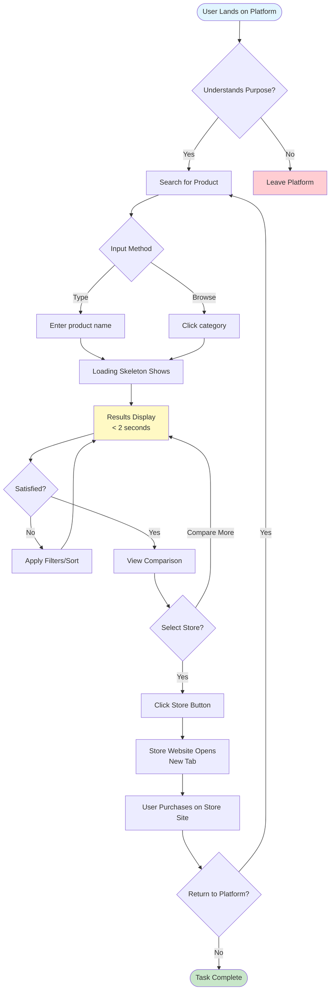
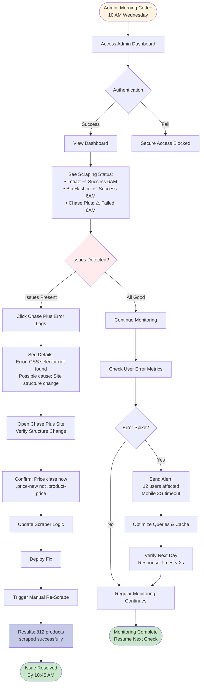

# User Flow Diagrams - Retail Recommendation System

**Document Version:** 1.0
**Last Updated:** 2026-02-03
**Author:** Jibran

---

## Table of Contents

1. [Universal User Flow](#universal-user-flow)
2. [Sarah's Weekly Planning Flow](#sarahs-weekly-planning-flow)
3. [Ahmed's Quick Search Flow](#ahmeds-quick-search-flow)
4. [Uncle Rasheed's Simple Discovery Flow](#uncle-rasheeds-simple-discovery-flow)
5. [First-Time User Onboarding Flow](#first-time-user-onboarding-flow)
6. [Admin Monitoring Flow](#admin-monitoring-flow)

---

## Universal User Flow

This diagram represents the core user journey that all users follow through the platform.



### Universal Flow Key Points

**Critical Success Moments:**
- **Landing Clarity:** User understands purpose in first 5 seconds
- **Fast Search:** Results appear in < 2 seconds
- **Complete Comparison:** All stores shown side-by-side
- **Easy Exit:** Click-through to store website is seamless

**Decision Points:**
1. **Discovery Phase** - Does user understand value proposition?
2. **Search Satisfaction** - Are results relevant and complete?
3. **Store Selection** - Which store offers best value?

---

## Sarah's Weekly Planning Flow

Sarah (household manager) plans her weekly grocery shopping, comparing 5-10 products in one session.

```mermaid
flowchart TD
    Start([Sarah: Sunday Evening<br/>Weekly Planning]) --> Open[Open Platform on Laptop]
    Open --> Motivation{Needs to optimize<br/>budget & time}

    Motivation --> Search1[Search: "Cooking Oil 5kg"]
    Search1 --> Results1[View 3 Stores Prices]
    Results1 --> Decision1{Make Decision?}

    Decision1 -->|Need more info| Filter1[Sort by Price Low-High]
    Filter1 --> Results1
    Decision1 -->|Decided| Note1[Mental Note:<br/>Chase Plus - PKR 2650<br/>Saves PKR 150]

    Note1 --> Continue{More Items?}
    Continue -->|Yes| Search2[Search: "Basmati Rice 5kg"]
    Search2 --> Results2[View 3 Stores Prices]
    Results2 --> Decision2{Compare}

    Decision2 --> Note2[Mental Note:<br/>Bin Hashim - Best Price<br/>But farthest]
    Note2 --> Calculate[Calculate: Distance vs Savings]
    Calculate --> Decision3{Worth trip?}

    Decision3 -->|Yes| Note3[Add to Route Plan]
    Decision3 -->|No| Search3[Search Alternative]

    Note3 --> Continue
    Search3 --> Results2
    Continue -->|No, Complete List| Review[Review Full List]

    Review --> Route[Optimize Route:<br/>1. Chase Plus Oil<br/>2. Bin Hashim Rice<br/>3. Imtiaz Dairy]
    Route --> Savings[Calculate Total Savings:<br/>~PKR 800]

    Savings --> Success([Planning Complete<br/>Time: 15 minutes<br/>vs 2+ hours physical])

    style Start fill:#fff3e0
    style Success fill:#c8e6c9
    style Savings fill:#e1bee7
    style Note1 fill:#c5cae9
    style Note2 fill:#c5cae9
    style Note3 fill:#c5cae9
```

### Sarah's Flow Key Points

**Emotional Journey:**
- **Start:** Dreaded chore (Sunday evening)
- **Middle:** Efficient discovery, empowered decisions
- **End:** Relief, money saved, time optimized

**Key Features Used:**
- Multiple searches in session
- Price sorting (low to high)
- Distance consideration
- Multi-store comparison
- Savings calculation

**Success Criteria:**
- Completes weekly list in < 15 minutes
- Identifies PKR 500-800 in savings
- Plans optimal route to 2-3 stores

---

## Ahmed's Quick Search Flow

Ahmed (busy professional) needs quick product info while commuting or before leaving work.

```mermaid
flowchart TD
    Start([Ahmed: Tuesday 5:30 PM<br/>Needs Printer Cartridge]) --> Mobile[Open Platform on Phone]
    Mobile --> Context{In Traffic on Korangi Road}

    Context --> Search[Type: "HP 680 cartridge"]
    Search --> Loading[Load on 3G<br/>Skeleton Screen]
    Loading --> Results[Results: 2 Stores]

    Results --> Scan{Scan Quickly}
    Scan --> Price[See Prices:<br/>Imtiaz PKR 3500<br/>Chase PKR 3400]
    Price --> Distance[Check Distance:<br/>Imtiaz 2.5km<br/>Chase 3.8km]

    Distance --> Analyze{Quick Analysis}
    Analyze --> Decision["PKR 100 savings vs<br/>1.3km extra driving"]
    Decision --> Route[Chase Plus on route home<br/>Worth it!]

    Route --> Verify[Click: View on Chase Plus Website]
    Verify --> StoreSite[Store Site Opens<br/>Confirm Hours & Stock]
    StoreSite --> Maps[Click: Open in Google Maps]

    Maps --> Navigation[Turn-by-turn Navigation Starts]
    Navigation --> Drive[Drive to Chase Plus]
    Drive --> Arrive([Arrive 6:45 PM<br/>Mission Accomplished])

    style Start fill:#e3f2fd
    style Arrive fill:#c8e6c9
    style Navigation fill:#fff9c4
    style Decision fill:#ffe0b2
```

### Ahmed's Flow Key Points

**Time-Critical Context:**
- **Scenario:** Commuting, before work, time-sensitive
- **Network:** 3G mobile connection
- **Device:** Smartphone (small screen)
- **Goal:** Make decision in < 3 minutes total

**Key Features Used:**
- Mobile-optimized interface
- Fast search (< 2 seconds on 3G)
- Price + distance comparison
- Click-through to store
- Google Maps integration

**Success Criteria:**
- Decision made in < 3 minutes
- Knows product is in stock
- Has navigation ready
- Confident in choice

---

## Uncle Rasheed's Simple Discovery Flow

Uncle Rasheed (65, non-tech) needs independence in price comparison without family help.

```mermaid
flowchart TD
    Start([Uncle Rasheed: Home<br/>Wants to Check Prices]) --> Discover[Hears About Platform<br/>WhatsApp Group]
    Discover --> Hesitate{Hesitant:<br/>"Can I do this?"}

    Hesitate --> Try[Decides to Try]
    Try --> Open[Open Platform]
    Open --> Observe{Observe Interface}

    Observe --> Notice[Notices:<br/>• Large Text<br/>• Simple Layout<br/>• No Signup Required]
    Notice --> Relieved["Feels relieved:<br/>This is simple!"]

    Relieved --> Search[Types: "Daal 1kg"<br/>In Roman Urdu]
    Search --> Results[Results Appear]

    Results --> Read[Read Large Numbers:<br/>• Imtiaz: 550<br/>• Chase Plus: 525<br/>• Bin Hashim: 540]
    Read --> Understand[Understands Immediately]

    Understand --> Compare["Chase Plus is cheapest<br/>by PKR 25"]
    Compare --> Feel{Emotion}
    Feel --> Success["I can do this myself!"]

    Success --> Confidence[Gain Confidence]
    Confidence --> Share[Tells Friend at Mosque]
    Share --> Loyal([Becomes Loyal User<br/>Advocates to Others])

    style Start fill:#f3e5f5
    style Loyal fill:#c8e6c9
    style Relieved fill:#fff9c4
    style Success fill:#b2dfdb
    style Notice fill:#c5cae9
```

### Uncle Rasheed's Flow Key Points

**Accessibility Focus:**
- **Language:** Roman Urdu search support
- **Visual:** Large text (minimum 16px)
- **Cognitive:** Simple, uncluttered interface
- **Technical:** No account/signup barrier

**Key Features Used:**
- Large, readable text
- Clear product categories
- Simple search (no advanced features)
- Urdu language option
- Minimal clicks to value

**Success Criteria:**
- Completes task without assistance
- Feels independent and included
- Gains confidence over time
- Becomes advocate

---

## First-Time User Onboarding Flow

User discovers platform via Google search and needs instant understanding.

```mermaid
flowchart TD
    Start([User: Google Search<br/>"cooking oil price Karachi"]) --> Click[Click Platform Link]
    Click --> Land[Land on Homepage]

    Land --> ThreeSecond{3-Second Rule}
    ThreeSecond --> See[Sees Immediately:<br/>• Headline: "See all store prices"<br/>• Store logos<br/>• Large search bar<br/>• Categories]

    See --> Understand[Understands Instantly:<br/>"This shows prices from<br/>all stores in one place"]
    Understand --> Trust{Trust Check}

    Trust -->|Stores recognized| Proceed[Proceed to Search]
    Trust -->|Unclear| Bounce[Leave After 10s<br/>Bounce Rate Increases]

    Proceed --> SearchFirst[Type First Search:<br/>"cooking oil 5kg"]
    SearchFirst --> Aha["Aha! Moment:<br/>Sees 3 stores,<br/>3 prices side-by-side"]

    Aha --> Impressed["Impressed:<br/>This is useful!"]
    Impressed --> ClickStore[Click Store Link<br/>Verify Price]

    ClickStore --> Return[Return to Platform]
    Return --> Mental[Mental Note:<br/>"Use this next time<br/>I need groceries"]

    Mental --> Future([Platform Added to<br/>Mental Toolkit])

    style Start fill:#e1f5fe
    style Future fill:#c8e6c9
    style Aha fill:#fff9c4
    style Impressed fill:#c5cae9
    style Bounce fill:#ffcdd2
```

### Onboarding Flow Key Points

**Critical First 5 Seconds:**
1. Clear value proposition visible
2. Store logos build trust
3. Single, obvious action (search)
4. No barriers (no signup)

**The "Aha!" Moment:**
- User sees all store prices in one view
- Immediate understanding of value
- Creates positive emotional response
- Drives repeat usage intention

**Failure Mode:**
- If value prop unclear → bounce in 10s
- High bounce rate = onboarding failure

---

## Admin Monitoring Flow

System administrator monitors platform health and responds to issues.



### Admin Flow Key Points

**Proactive Monitoring:**
- Automated status checks
- Real-time error alerts
- Quick issue resolution
- Manual re-scrape capability

**Key Admin Features:**
- Scraping status indicators
- Error logs with diagnostics
- Performance metrics tracking
- Manual trigger controls

**Success Criteria:**
- Issues detected within 15 minutes
- Resolved before user impact severe
- Platform maintains 95%+ uptime

---

## User Flow Summary

| Flow | Primary Persona | Time to Complete | Key Success Metric |
|------|-----------------|------------------|-------------------|
| **Universal** | All users | 30 seconds - 5 minutes | Find relevant prices quickly |
| **Sarah's Planning** | Household Manager | 10-15 minutes | Compare 5-10 products efficiently |
| **Ahmed's Quick Search** | Busy Professional | < 3 minutes | Decision made on-the-go |
| **Uncle Rasheed** | Non-Tech User | 2-5 minutes | Complete task independently |
| **First-Time User** | New User | < 30 seconds | Understand value proposition |
| **Admin Monitoring** | System Admin | Ongoing | Detect & resolve issues quickly |

---

## Next Steps

- Review wireframes for screen-by-screen flow
- Validate with stakeholders
- Test with real users (each persona)
- Iterate based on feedback

