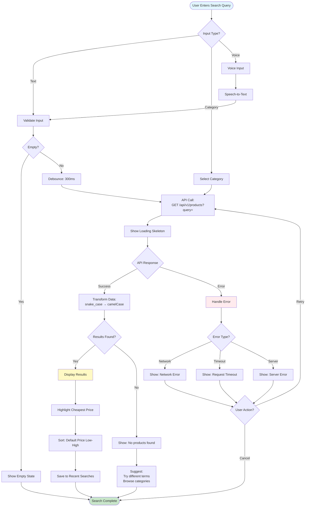
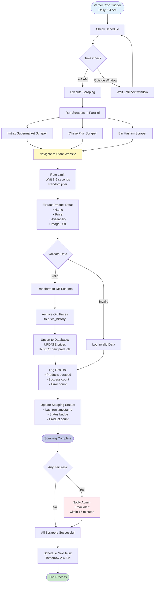

# Process Flows - Retail Recommendation System

**Document Version:** 1.0
**Last Updated:** 2026-02-03
**Author:** Jibran

---

## Table of Contents

1. [Product Search Process](#product-search-process)
2. [Price Comparison Process](#price-comparison-process)
3. [Filter & Sort Process](#filter--sort-process)
4. [Store Click-Through Process](#store-click-through-process)
5. [Error Handling Process](#error-handling-process)
6. [Data Scraping Process](#data-scraping-process)

---

## Product Search Process

Detailed flow for searching products on the platform.



### Search Process Specifications

**Performance Requirements:**
- **Debounce delay:** 300ms
- **API response time:** < 2 seconds (95th percentile)
- **Loading indicator:** Skeleton screens
- **Error recovery:** Graceful degradation

**Input Validation:**
- Minimum characters: 2
- Maximum characters: 100
- Supports English and Roman Urdu
- Fuzzy matching for typos

**API Endpoint:**
```
GET /api/v1/products?query={query}&category={category}
Response: {
  success: true,
  data: [{ id, name, category, prices: [...] }],
  meta: { count, lastUpdated }
}
```

---

## Price Comparison Process

Flow for comparing prices across multiple stores.

```mermaid
flowchart TD
    Start([User Views Product]) --> LoadPrices[Load Prices from All Stores]
    LoadPrices --> Data{Price Data?}

    Data -->|Multiple Stores| Compare[Side-by-Side Comparison]
    Data -->|Single Store| Single[Show Single Store]
    Data -->|No Prices| Unavailable[Show: Unavailable]

    Compare --> Process[Process Price Data]
    Process --> Extract[Extract:<br/>• Store Name<br/>• Price<br/>• Availability<br/>• Distance<br/>• Last Updated]

    Extract --> Identify[Identify Cheapest]
    Identify --> Highlight[Highlight:<br/>Green badge "Best Value"]

    Highlight --> Availability{Check Availability}
    Availability -->|All In Stock| ShowAll[Show All Stores]
    Availability -->|Some In Stock| FilterStock[Filter: In Stock First<br/>Gray out out-of-stock]
    Availability -->|None In Stock| ShowNone[Show: Out of Stock<br/>at all stores]

    ShowAll --> Display[Display Comparison Card]
    FilterStock --> Display
    ShowNone --> Display

    Display --> Sort[Sort Options:<br/>• Price (default)<br/>• Distance]
    Sort --> Actions[Action Buttons:<br/>• View on Store Website<br/>• Store Info]

    Actions --> Click{User Clicks?}
    Click -->|Store Website| External[Open Store Website<br/>New Tab]
    Click -->|Store Info| Modal[Open Store Info Modal]

    External --> Track[Track Click-Through]
    Track --> Complete([Comparison Complete])

    Modal --> ShowModal[Show:<br/>• Store Name<br/>• Address<br/>• Phone<br/>• Hours]
    ShowModal --> Maps{Mobile?}
    Maps -->|Yes| MapsButton[Show: Open in Google Maps]
    Maps -->|No| NoMaps[Hide Maps Button]
    MapsButton --> Close[User Closes Modal]
    NoMaps --> Close
    Close --> Complete

    Single --> Complete
    Unavailable --> Complete

    style Start fill:#e1f5fe
    style Complete fill:#c8e6c9
    style Display fill:#fff9c4
    style External fill:#c5cae9
    style Track fill:#b2dfdb
```

### Comparison Process Specifications

**Data Display:**
- **Stores:** Imtiaz Supermarket, Chase Plus, Bin Hashim
- **Price format:** PKR X,XXX (with comma separators)
- **Distance:** X.X km (from user location)
- **Availability:** In Stock / Out of Stock / Unknown
- **Last updated:** "X hours ago"

**Visual Hierarchy:**
1. **Cheapest price** - Green "Best Value" badge
2. **In-stock items** - Full opacity
3. **Out-of-stock** - Grayed out (50% opacity)
4. **Store name** - Prominent, with logo if available

**Comparison Features:**
- Side-by-side layout (desktop) or stacked (mobile)
- One-click store website access
- Store information modal
- Google Maps integration (mobile)

---

## Filter & Sort Process

Process for applying filters and sorting results.

```mermaid
flowchart TD
    Start([User Views Results]) --> Filters[Filter Options Available]

    Filters --> UserAction{User Action?}
    UserAction -->|Apply Filter| FilterType{Filter Type?}
    UserAction -->|Sort| SortType{Sort Type?}
    UserAction -->|Clear All| ClearAll[Clear All Filters]

    FilterType -->|Price Range| PriceRange[Set Min/Max Price]
    FilterType -->|Store| StoreSelect[Select Stores<br/>Multi-select]
    FilterType -->|Availability| StockToggle[Toggle: In Stock Only]

    SortType -->|Price| PriceSort[Sort: Price Low-High<br/>or High-Low]
    SortType -->|Distance| DistanceSort[Sort: Distance Near-Far]
    SortType -->|Relevance| RelevanceSort[Sort: Relevance Score]

    PriceRange --> ValidatePrice{Valid Range?}
    ValidatePrice -->|Yes| ApplyPrice[Apply Price Filter]
    ValidatePrice -->|No| ShowError[Show: Invalid Range]

    StoreSelect --> ApplyStore[Apply Store Filter]
    StockToggle --> ApplyStock[Apply Stock Filter]

    PriceSort --> ApplySort[Apply Sort]
    DistanceSort --> ApplySort
    RelevanceSort --> ApplySort

    ApplyPrice --> FetchFiltered[Fetch Filtered Results]
    ApplyStore --> FetchFiltered
    ApplyStock --> FetchFiltered
    ApplySort --> SortLocal[Sort Local Results<br/>No API Call]

    FetchFiltered --> LoadingFilter[Show Loading]
    LoadingFilter --> ResultsFiltered{Results Found?}

    ResultsFiltered -->|Yes| DisplayFiltered[Display Filtered Results]
    ResultsFiltered -->|No| NoMatch[Show: No products match<br/>your filters]

    SortLocal --> DisplaySorted[Display Sorted Results]

    DisplayFiltered --> UpdateCount[Update Results Count:<br/>"Showing X of Y products"]
    DisplaySorted --> UpdateCount

    UpdateCount --> ActiveFilters[Show Active Filters<br/>as chips/pills]
    ActiveFilters --> ClearOption[Show: Clear Filters<br/>button]

    ClearOption --> UserAction
    ClearAll --> Reset[Reset All Filters]
    Reset --> FetchAll[Fetch All Results]
    FetchAll --> LoadingFilter

    ShowError --> Start
    NoMatch --> SuggestAdjust[Suggest:<br/>Adjust filters<br/>Clear all]
    SuggestAdjust --> Start

    style Start fill:#e1f5fe
    style DisplayFiltered fill:#fff9c4
    style DisplaySorted fill:#fff9c4
    style ClearAll fill:#ffccbc
```

### Filter & Sort Specifications

**Filter Types:**

1. **Price Range**
   - Slider: Min 0 to Max 50,000 PKR
   - Dual-thumb for range selection
   - Number inputs for precise control

2. **Store Selection**
   - Multi-select checkboxes
   - "Select All" / "Clear All" buttons
   - Count display: "Imtiaz (15), Chase Plus (12)"

3. **Availability**
   - Toggle switch: "In Stock Only"
   - Shows only products with stock_status = "in_stock"

**Sort Options:**

| Sort Option | Order | Use Case |
|-------------|-------|----------|
| **Price (Low to High)** | Ascending | Budget-conscious users (Sarah) |
| **Price (High to Low)** | Descending | Premium products |
| **Distance (Near to Far)** | Ascending | Time-sensitive users (Ahmed) |
| **Relevance** | Score | Search result relevance |

**Filter State Management:**
- Persisted in localStorage
- Survives page navigation
- Clears on manual reset
- Visual indicator: Filter pills with "×" to remove

---

## Store Click-Through Process

Process for navigating to store websites.

```mermaid
flowchart TD
    Start([User Clicks Store Button]) --> Validate{Valid Store URL?}

    Validate -->|Yes| Security[Security Check:<br/>rel="noopener noreferrer"]
    Validate -->|No| ShowError[Show: Store website<br/>unavailable]

    Security --> NewTab[Open New Browser Tab]
    NewTab --> Track{Track Analytics?}

    Track -->|Yes| Log[Log Click-Through Event:<br/>• Product ID<br/>• Store ID<br/>• Timestamp<br/>• User Session]
    Track -->|No| Open[Open Store URL]

    Log --> Open

    Open --> Load[Store Website Loads]
    Load --> Success{Page Loads?}

    Success -->|Yes| UserAction{User Action on Store?}
    Success -->|No| ErrorPage[Store Site Error]

    UserAction -->|Purchase| Purchase[User Purchases Product]
    UserAction -->|Browses| Browse[User Browses More]
    UserAction -->|Closes| Return[User Closes Tab<br/>Returns to Platform]

    Purchase --> Complete([Click-Through Complete:<br/>Conversion Tracked])
    Browse --> Complete
    Return --> Complete

    ErrorPage --> Notify[Notify User:<br/>"Store website unavailable"]
    Notify --> Fallback{Backup Available?}
    Fallback -->|Yes| ShowLink[Show Store Link<br/>as Copyable URL]
    Fallback -->|No| ShowError
    ShowLink --> Complete
    ShowError --> Complete

    style Start fill:#e1f5fe
    style Complete fill:#c8e6c9
    style Purchase fill:#c5cae9
    style ErrorPage fill:#ffebee
```

### Click-Through Specifications

**Button Specifications:**
- **Text:** "View on [Store Name] Website"
- **Variant:** Contained (MUI Button)
- **Target:** `_blank` (new tab)
- **Security:** `rel="noopener noreferrer"`
- **Touch target:** Minimum 44x44px

**Analytics Tracking:**
```javascript
{
  eventType: "store_clickthrough",
  productId: "123",
  storeId: "1",
  storeName: "Imtiaz Supermarket",
  price: 2650,
  timestamp: "2026-02-03T10:30:00Z",
  sessionId: "abc123"
}
```

**Error Handling:**
- **Store URL unavailable:** Show error message
- **Store site down:** Notify user, provide backup link
- **Timeout:** Retry or provide alternative

---

## Error Handling Process

Unified error handling across all user interactions.

```mermaid
flowchart TD
    Start([Error Occurs]) --> Categorize{Error Type?}

    Categorize -->|Network| Network[Network Error]
    Categorize -->|API| API[API Error]
    Categorize -->|Validation| Validation[Validation Error]
    Categorize -->|Scraping| Scraping[Data Scraping Error]

    Network --> Detect{Detect Issue}
    Detect -->|Offline| Offline[Show: "You're offline<br/>Check connection"]
    Detect -->|Slow| Slow[Show: "Slow connection<br/>Please wait"]
    Detect -->|Timeout| Timeout[Show: "Request timeout<br/>Try again"]

    Offline --> Retry{User Action?}
    Slow --> Retry
    Timeout --> Retry

    Retry -->|Retry| Start
    Retry -->|Cancel| Dismiss[Dismiss Error]

    API --> StatusCode{Status Code?}
    StatusCode -->|400| BadRequest[Show: "Invalid request"]
    StatusCode -->|404| NotFound[Show: "Resource not found"]
    StatusCode -->|500| ServerError[Show: "Server error<br/>Try again later"]

    BadRequest --> UserMessage[User-Friendly Message]
    NotFound --> UserMessage
    ServerError --> LogError[Log Error for Admin]

    UserMessage --> Dismiss
    LogError --> AlertAdmin[Alert Admin<br/>If recurring]

    Validation --> Field{Field?}
    Field -->|Search| SearchError[Show: "Enter at least 2 characters"]
    Field -->|Price Range| RangeError[Show: "Invalid price range"]
    Field -->|Email| EmailError[Show: "Invalid email format"]

    SearchError --> Highlight[Highlight Field]
    RangeError --> Highlight
    EmailError --> Highlight

    Highlight --> Fix[User Fixes Input]
    Fix --> Start

    Scraping --> Store{Store Affected?}
    Store -->|One Store| Partial[Show: "Chase Plus prices<br/>temporarily unavailable"]
    Store -->|All Stores| Complete[Show: "Price data temporarily<br/>unavailable"]

    Partial --> Graceful[Graceful Degradation:<br/>Show other stores]
    Complete --> RetryLater[Suggest: Try again later<br/>or visit stores directly]

    Graceful --> Dismiss
    RetryLater --> Dismiss
    AlertAdmin --> ScheduleCheck[Schedule Check:<br/>Admin investigates]

    Dismiss --> Recover([Platform Recovers<br/>Continue Operation])
    ScheduleCheck --> Recover

    style Start fill:#ffebee
    style Recover fill:#c8e6c9
    style Offline fill:#fff3e0
    style ServerError fill:#ffebee
    style Partial fill:#fff9c4
```

### Error Handling Specifications

**Error Recovery Strategies:**

1. **Graceful Degradation**
   - Partial failures: Show available data
   - Complete failures: Show helpful message
   - Never break entire platform

2. **User Communication**
   - Clear, non-technical language
   - Actionable suggestions
   - No jargon or error codes

3. **Retry Logic**
   - Automatic retry for transient failures
   - Manual retry option for user
   - Exponential backoff

**Error Message Examples:**

| Error | User Message | Action |
|-------|--------------|--------|
| Offline | "You're offline. Check your internet connection." | Retry button |
| Timeout | "Request timed out. Please try again." | Retry button |
| Invalid Input | "Please enter at least 2 characters." | Focus field |
| Scraping Failed | "Prices for Chase Plus are temporarily unavailable." | Show other stores |

---

## Data Scraping Process

Background process for scraping product data from store websites.



### Scraping Process Specifications

**Anti-Scraping Measures:**
1. **Rate limiting:** 3-5 seconds between requests
2. **Random jitter:** ±500ms variability
3. **User agent rotation:** Randomize browser identity
4. **Off-peak timing:** 2-4 AM Pakistan time
5. **Robots.txt compliance:** Respect crawling directives

**Data Validation:**
- Product name: Not empty, trimmed
- Price: Numeric, > 0
- Availability: Valid enum value
- Store ID: Must exist in stores table

**Error Handling:**
- **Partial failure:** Continue with other stores
- **Complete failure:** Alert admin within 15 minutes
- **Validation failure:** Log and skip invalid products
- **Network error:** Retry with exponential backoff

**Database Operations:**
```sql
-- Archive old prices before updating
INSERT INTO price_history (price_id, price_cents, availability, recorded_at)
SELECT id, price_cents, availability, NOW() FROM prices
WHERE product_id = ? AND store_id = ?;

-- Upsert new prices
INSERT INTO prices (product_id, store_id, price_cents, availability)
VALUES (?, ?, ?, ?)
ON CONFLICT (product_id, store_id) DO UPDATE
SET price_cents = EXCLUDED.price_cents,
    availability = EXCLUDED.availability,
    scraped_at = NOW();
```

---

## Process Flow Summary

| Process | Complexity | API Calls | User Impact |
|---------|-----------|-----------|-------------|
| **Product Search** | Medium | 1 | Core functionality |
| **Price Comparison** | Low | 0 (local data) | Decision support |
| **Filter & Sort** | Medium | 1 (if filtering) | Refinement |
| **Store Click-Through** | Low | 1 (analytics) | Conversion |
| **Error Handling** | High | Variable | Recovery |
| **Data Scraping** | High | 0 (background) | Data freshness |

---

## Next Steps

- Validate processes with development team
- Confirm API endpoints and data structures
- Test error scenarios thoroughly
- Document API contracts

