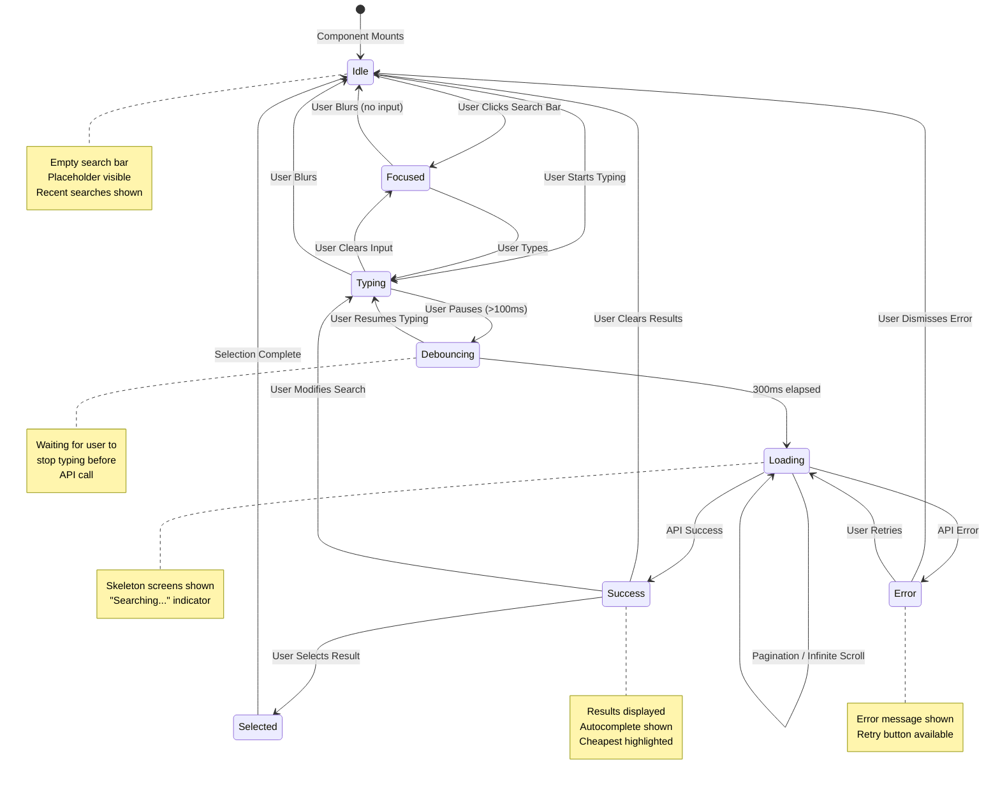
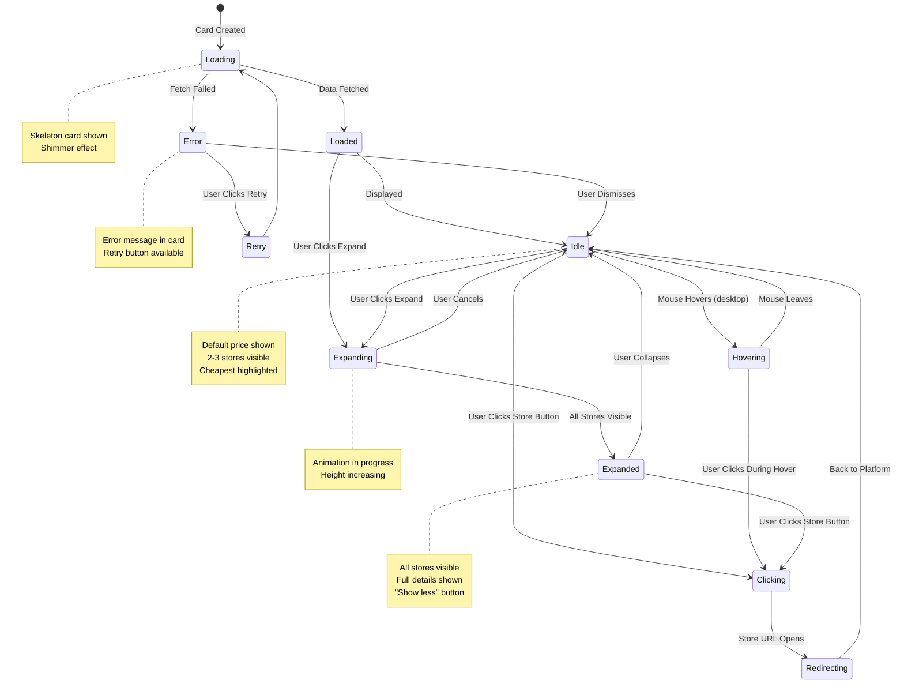
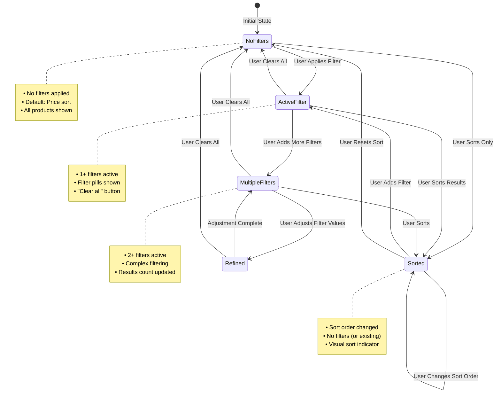
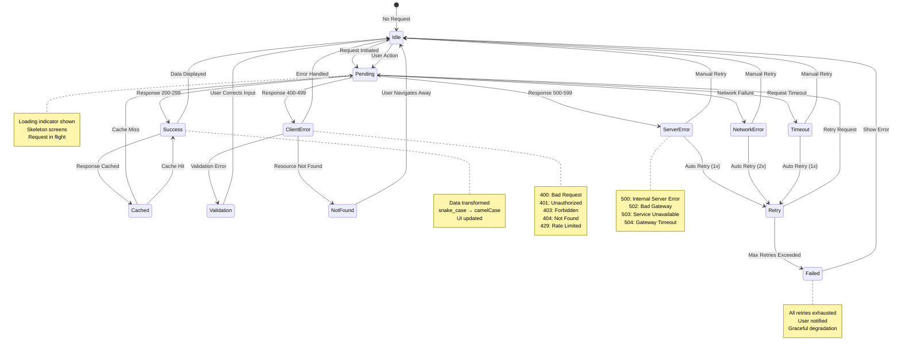
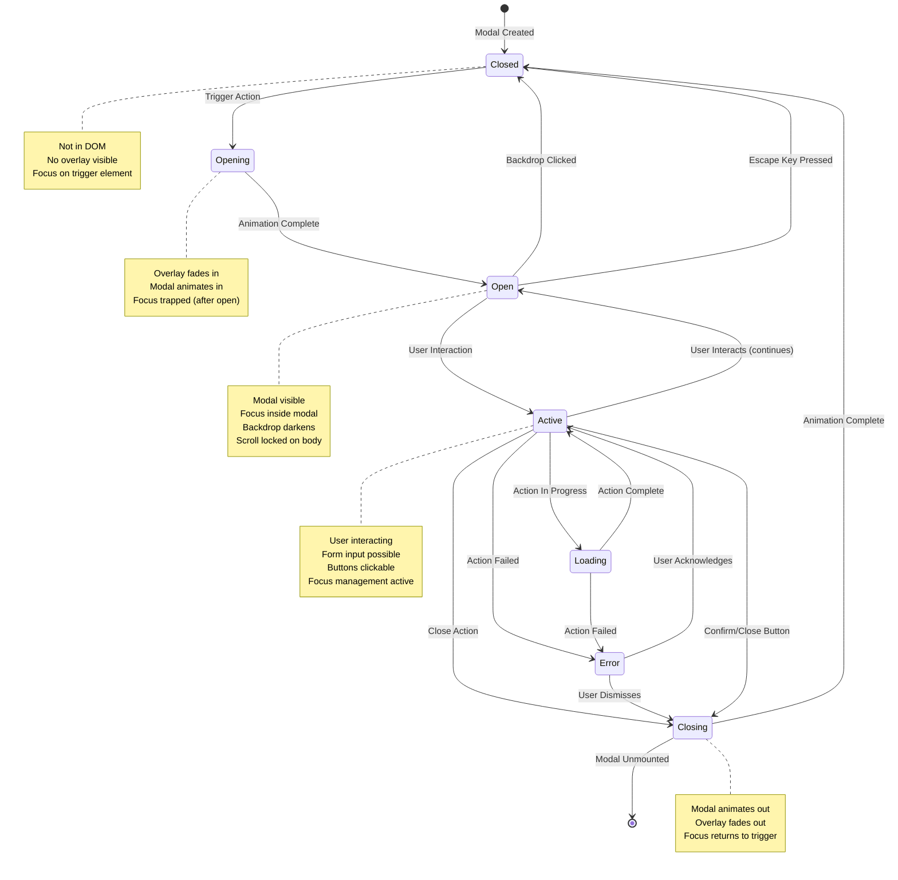
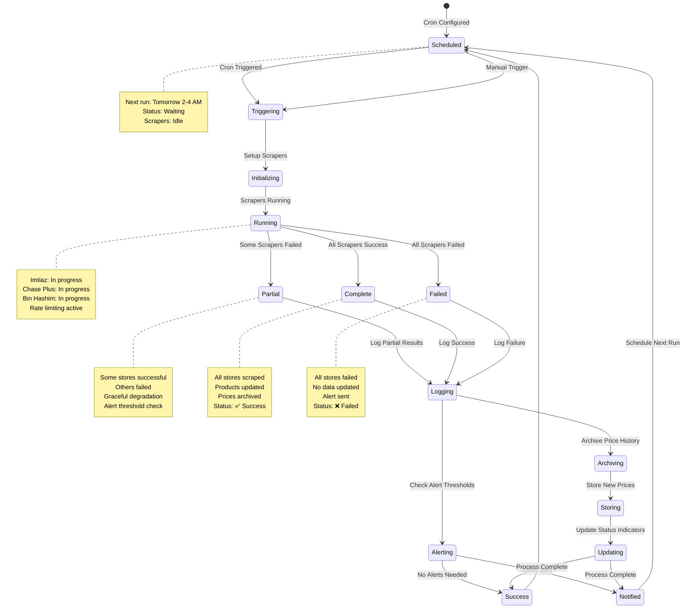

# State Diagrams - Retail Recommendation System

**Document Version:** 1.0
**Last Updated:** 2026-02-03
**Author:** Jibran

---

## Table of Contents

1. [Search Component State](#search-component-state)
2. [Product Card State](#product-card-state)
3. [Filter State Management](#filter-state-management)
4. [API Request State](#api-request-state)
5. [Modal State](#modal-state)
6. [Data Scraping State](#data-scraping-state)

---

## Search Component State

States for the search bar and search functionality.



### Search State Specifications

**Component:** `SearchBar.tsx` + `SearchResults.tsx`

**State Structure:**
```typescript
interface SearchState {
  query: string;           // Current search query
  status: 'idle' | 'focused' | 'typing' | 'loading' | 'success' | 'error';
  results: Product[];      // Search results
  hasMore: boolean;        // Pagination available
  error: AppError | null;  // Error object
  suggestion: string | null; // Autocomplete suggestion
}
```

**Transition Triggers:**
- `onFocus()` → Focused
- `onChange()` → Typing
- `onBlur()` → Idle
- `300ms debounce` → Loading
- `API success` → Success
- `API error` → Error

---

## Product Card State

States for individual product comparison cards.



### Product Card State Specifications

**Component:** `ProductCard.tsx`

**State Structure:**
```typescript
interface ProductCardState {
  status: 'loading' | 'loaded' | 'error';
  isExpanded: boolean;    // Show all stores
  isHovered: boolean;      // Desktop hover state
  isClicking: boolean;     // Button click in progress
  primaryStore: Price;     // Best value store
  allStores: Price[];      // All available prices
  error: AppError | null;
}
```

**Visual States:**

| State | Stores Shown | Actions |
|-------|--------------|---------|
| **Idle (collapsed)** | 2-3 stores | Hover to preview |
| **Hovering** | 2-3 stores + preview | Click to expand |
| **Expanded** | All stores (3+) | Collapse button |
| **Loading** | Skeleton | None (disabled) |
| **Error** | Error message | Retry button |

---

## Filter State Management

Global state for filters and sorting across the platform.



### Filter State Specifications

**Context:** `FilterContext.tsx`

**State Structure:**
```typescript
interface FilterState {
  // Active filters
  priceRange: { min: number; max: number } | null;
  stores: number[];           // Selected store IDs
  inStockOnly: boolean;       // Stock status filter

  // Sorting
  sortBy: 'price' | 'distance' | 'relevance';
  sortOrder: 'asc' | 'desc';

  // UI state
  hasActiveFilters: boolean;
  resultsCount: number;
  totalCount: number;

  // Computed
  filteredProducts: Product[];
}

interface FilterActions {
  setPriceRange: (min: number, max: number) => void;
  toggleStore: (storeId: number) => void;
  setInStockOnly: (enabled: boolean) => void;
  setSortBy: (sort: SortOption) => void;
  clearAllFilters: () => void;
  removeFilter: (filterType: string) => void;
}
```

**Filter Persistence:**
- Stored in `localStorage`
- Key: `retail_comparison_filters`
- Synced across browser sessions
- Survives page refreshes

---

## API Request State

Universal state for all API requests throughout the platform.



### API Request State Specifications

**Hook:** `useApiRequest.ts` (custom hook)

**State Structure:**
```typescript
interface ApiRequestState<T> {
  status: 'idle' | 'pending' | 'success' | 'error';
  data: T | null;
  error: AppError | null;
  isLoading: boolean;
  isSuccess: boolean;
  isError: boolean;
  retryCount: number;
  lastRequest: Date | null;
  cached: boolean;
}

interface RequestOptions {
  method: 'GET' | 'POST' | 'PUT' | 'DELETE';
  endpoint: string;
  body?: unknown;
  retry?: boolean;
  retryCount?: number;
  cache?: boolean;
  cacheTTL?: number; // milliseconds
}
```

**Retry Strategy:**
- **Network errors:** 2 retries with exponential backoff
- **Server errors:** 1 retry
- **Timeout:** 1 retry
- **Client errors:** No retry (user action required)
- **Backoff:** 30s → 60s → 120s

---

## Modal State

State management for modal dialogs (store info, alerts, etc.).



### Modal State Specifications

**Component:** MUI `Dialog` / `Modal`

**State Structure:**
```typescript
interface ModalState {
  isOpen: boolean;
  isAnimating: boolean;
  type: 'store_info' | 'error' | 'confirm' | 'alert';
  title: string;
  content: React.ReactNode;
  actions: ModalAction[];
  focusSelector: string | null;  // Element to focus on open
  returnFocus: boolean;          // Return focus on close
}

interface ModalAction {
  label: string;
  primary: boolean;
  onClick: () => void | Promise<void>;
  disabled?: boolean;
}
```

**Accessibility Features:**
- **Focus trap:** Tab stays within modal
- **Focus return:** Focus returns to trigger element
- **Escape key:** Closes modal
- **Backdrop click:** Closes modal
- **ARIA attributes:** `role="dialog"`, `aria-modal="true"`, `aria-labelledby`

---

## Data Scraping State

Background scraping service state (server-side, not user-facing).



### Scraping State Specifications

**Service:** Scraping Service (Node.js/TypeScript)

**State Structure:**
```typescript
interface ScrapingState {
  status: 'scheduled' | 'running' | 'partial' | 'complete' | 'failed';
  lastRun: Date | null;
  nextRun: Date | null;
  scrapers: ScraperStatus[];
  productsScraped: number;
  errors: ScrapingError[];
}

interface ScraperStatus {
  storeId: number;
  storeName: string;
  status: 'pending' | 'running' | 'success' | 'failed';
  productsScraped: number;
  error: string | null;
  startedAt: Date | null;
  completedAt: Date | null;
}

interface ScrapingError {
  storeId: number;
  type: 'network' | 'validation' | 'blocking' | 'timeout';
  message: string;
  timestamp: Date;
  resolved: boolean;
}
```

**Status Indicators (Admin Dashboard):**
- **🟢 Success:** All scrapers successful
- **🟡 Warning:** Partial failure (some scrapers failed)
- **🔴 Failed:** Complete failure
- **⚪ Pending:** Scheduled, not yet run

---

## State Transition Summary

| State Machine | States | Complexity | User Impact |
|---------------|--------|-----------|-------------|
| **Search** | 7 states | Medium | Core navigation |
| **Product Card** | 8 states | Low | Comparison view |
| **Filters** | 4 states | Medium | Result refinement |
| **API Request** | 11 states | High | All data fetching |
| **Modal** | 7 states | Low | Secondary actions |
| **Scraping** | 8 states | High | Data freshness (admin) |

---

## State Management Architecture

```
AppContext (Global)
├── SearchContext
│   └── Search State (local to search components)
├── FilterContext
│   └── Filter State (global, persisted)
└── UIContext
    ├── Loading states (local per component)
    ├── Modal states (global, one at a time)
    └── Error states (local per component)
```

**Key Principles:**
1. **Local loading states** - No global loading indicator
2. **Persisted filters** - Survive navigation and refresh
3. **Error boundaries** - Isolate component failures
4. **Optimistic UI** - Update UI before API confirmation
5. **Graceful degradation** - Partial failures don't break everything

---

## Next Steps

- Implement state machines in code
- Add state transition logging
- Test all error states
- Monitor state transitions in production

