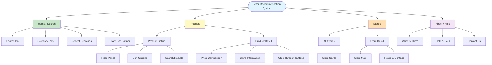
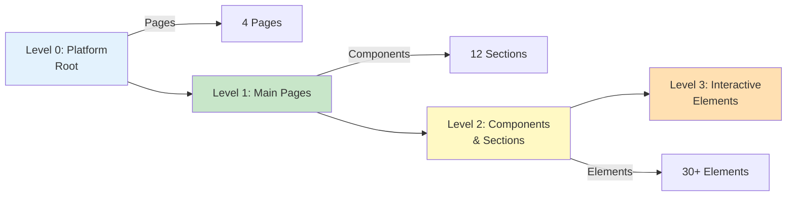
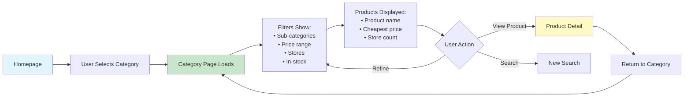
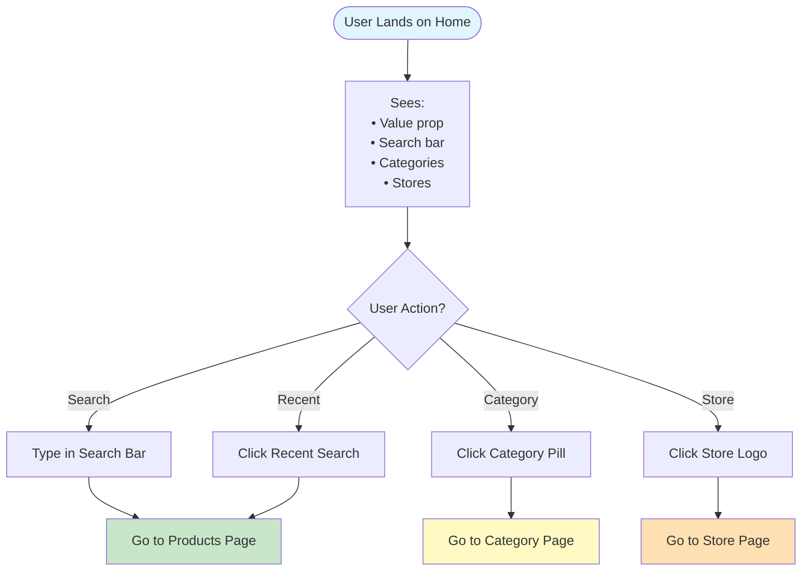
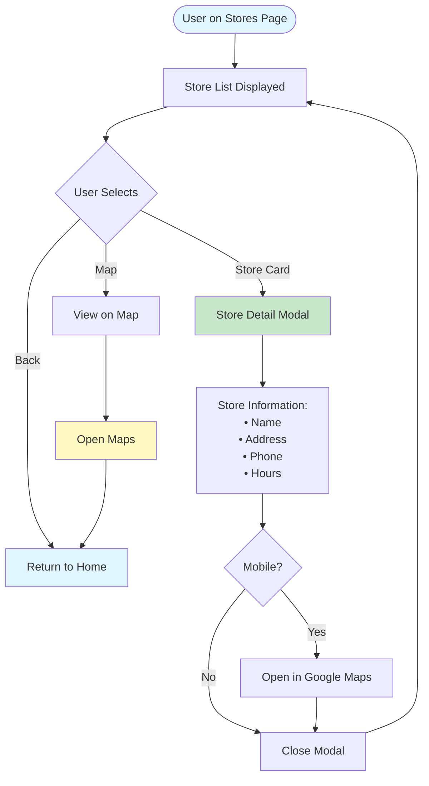
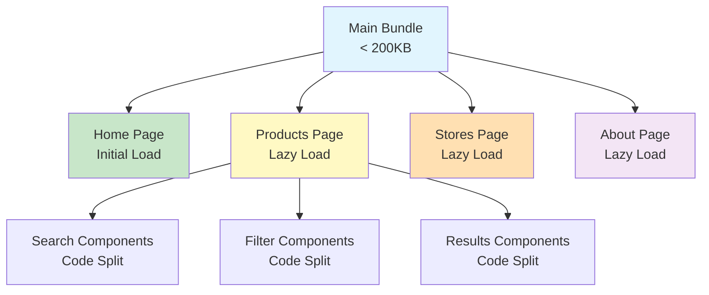

# Information Architecture - Retail Recommendation System

**Document Version:** 1.0
**Last Updated:** 2026-02-03
**Author:** Jibran

---

## Table of Contents

1. [Site Structure Overview](#site-structure-overview)
2. [Page Hierarchy](#page-hierarchy)
3. [Navigation Structure](#navigation-structure)
4. [Content Organization](#content-organization)
5. [Category Taxonomy](#category-taxonomy)
6. [User Flows by Page](#user-flows-by-page)

---

## Site Structure Overview



### Site Structure Summary

**Total Pages:** 4 main pages
- **Home** (Primary landing page)
- **Products** (Search results)
- **Stores** (Store information)
- **About** (Platform info)

**URL Structure:**
```
/                           → Home
/products                   → Product listing
/products/:id               → Product detail
/stores                     → Store listing
/stores/:id                 → Store detail
/about                      → About platform
/help                       → Help & FAQ
```

---

## Page Hierarchy



### Page Breakdown

| Level | Type | Count | Examples |
|-------|------|-------|----------|
| **0** | Pages | 4 | Home, Products, Stores, About |
| **1** | Sections | 12 | Search bar, Filters, Results, Store cards |
| **2** | Components | 30+ | Buttons, Inputs, Modals, Badges |

---

## Navigation Structure

### Primary Navigation (Desktop)

```mermaid
graph LR
    LOGO[Platform Logo]
    NAV[Navigation Links]
    SEARCH[Search Bar]
    ACTIONS[Actions]

    LOGO --> HOME[Home]
    NAV --> STORES[Stores]
    NAV --> ABOUT[About]
    SEARCH --> INPUT[Search Input]
    ACTIONS --> LANG[Language Toggle]

    LANG --> EN[English | اردو]

    style LOGO fill:#1976d2
    style NAV fill:#424242
    style SEARCH fill:#fff
    style ACTIONS fill:#757575
```

### Primary Navigation (Mobile)

```mermaid
graph TB
    TOP[Top Bar]
    BOTTOM[Bottom Navigation]

    TOP --> LOGO[Logo]
    TOP --> SEARCH[Search Bar]
    TOP --> LANG[EN | اردو]

    BOTTOM --> HOME[Home Icon]
    BOTTOM --> RECENT[Recent Icon]
    BOTTOM --> STORES[Stores Icon]
    BOTTOM --> ABOUT[About Icon]

    style TOP fill:#e1f5fe
    style BOTTOM fill:#c8e6c9
```

### Navigation Specifications

**Desktop Navigation:**
- **Position:** Fixed top bar
- **Height:** 64px
- **Links:** Left-aligned
- **Search:** Center-aligned
- **Actions:** Right-aligned

**Mobile Navigation:**
- **Top bar:** Logo + Search + Language
- **Bottom nav:** 4 icons (Home, Recent, Stores, About)
- **Height:** 56px (bottom nav)
- **Touch targets:** Minimum 48x48px

**Navigation Items:**

| Page | Desktop Link | Mobile Icon | Priority |
|------|--------------|-------------|----------|
| **Home** | Logo (clickable) | Home icon | Primary |
| **Products** | Search bar | Search in top bar | Primary |
| **Stores** | "Stores" link | Stores icon | Secondary |
| **About** | "About" link | About icon | Tertiary |

---

## Content Organization

### Homepage Content Blocks

```mermaid
graph TD
    HOMEPAGE[Homepage]

    HOMEPAGE --> HEADER[Header Section]
    HOMEPAGE --> HERO[Hero Section]
    HOMEPAGE --> SEARCH[Search Section]
    HOMEPAGE --> CATEGORIES[Category Section]
    HOMEPAGE --> STORES[Store Bar]
    HOMEPAGE --> RECENT[Recent Searches]
    HOMEPAGE --> FOOTER[Footer]

    HEADER --> Logo[Logo + Nav]
    HEADER --> LangToggle[Language Toggle]

    HERO --> Headline["See all store prices<br/>in one place"]
    HERO --> Subhead["Compare prices across Imtiaz, Chase Plus, Bin Hashim"]
    HERO --> CTA["Start searching..."]

    SEARCH --> SearchBar[Large Search Bar]
    SEARCH --> AutoComplete[Autocomplete Dropdown]
    SEARCH --> Voice[Voice Search Icon]

    CATEGORIES --> Pills[Category Pills/Chips]
    Pills --> Cat1[Cooking Oil]
    Pills --> Cat2[Rice & Grains]
    Pills --> Cat3[Dairy]
    Pills --> Cat4[Beverages]
    Pills --> Cat5[+ More]

    STORES --> StoreLogos[Store Logos]
    StoreLogos --> S1[Imtiaz]
    StoreLogos --> S2[Chase Plus]
    StoreLogos --> S3[Bin Hashim]

    RECENT --> RecentList[Last 5 Searches]
    RecentList --> Clear[Clear History]

    FOOTER --> Links[About, Help, Contact]
    FOOTER --> Copyright["© 2026 Retail Recommendation System"]

    style HEADER fill:#e3f2fd
    style HERO fill:#c8e6c9
    style SEARCH fill:#fff9c4
    style CATEGORIES fill:#ffe0b2
    style STORES fill:#f3e5f5
```



### Homepage Layout

**Desktop Layout (Grid System):**
```
┌─────────────────────────────────────────────────────────────┐
│ Header (Logo | Nav | Language)                              │
├─────────────────────────────────────────────────────────────┤
│ Hero Section                                                 │
│ ┌───────────────────────────────────────────────────────┐   │
│ │ Headline: "See all store prices in one place"        │   │
│ │ Subhead: "Compare across Imtiaz, Chase Plus, Bin..."│   │
│ └───────────────────────────────────────────────────────┘   │
├─────────────────────────────────────────────────────────────┤
│ Search Section (Large search bar centered)                  │
├─────────────────────────────────────────────────────────────┤
│ Category Section (Horizontal pills/chips)                    │
│ [Cooking Oil] [Rice] [Dairy] [Beverages] [+]              │
├─────────────────────────────────────────────────────────────┤
│ Store Bar (Store logos: "Comparing prices from:")            │
│ [Imtiaz] [Chase Plus] [Bin Hashim]                          │
├─────────────────────────────────────────────────────────────┤
│ Recent Searches (Last 5)                                     │
│ [cooking oil 5kg] [basmati rice] [dairy] [+ Clear]        │
├─────────────────────────────────────────────────────────────┤
│ Footer (About | Help | Contact | Copyright)                 │
└─────────────────────────────────────────────────────────────┘
```

**Mobile Layout:**
```
┌─────────────────────────────┐
│ [Logo]        [EN | اردو]   │
├─────────────────────────────┤
│ Search Bar                  │
│ ┌─────────────────────────┐ │
│ │ Search for products...  │ │
│ └─────────────────────────┘ │
├─────────────────────────────┤
│ Categories (scrollable)      │
│ → [Oil] [Rice] [Dairy] →   │
├─────────────────────────────┤
│ Stores                      │
│ [Imtiaz] [Chase] [BinHashim]│
├─────────────────────────────┤
│ Recent Searches             │
│ • cooking oil 5kg           │
│ • basmati rice              │
│ [Clear History]             │
├─────────────────────────────┤
│ [Home] [Recent] [Stores] [⋮]│ Bottom Nav
└─────────────────────────────┘
```

---

## Category Taxonomy

### Product Category Structure

```mermaid
graph TD
    ROOT[Products]

    ROOT --> CAT1[Cooking Oil & Ghee]
    ROOT --> CAT2[Rice & Grains]
    ROOT --> CAT3[Dairy & Eggs]
    ROOT --> CAT4[Beverages]
    ROOT --> CAT5[Household]

    CAT1 --> Sub1[Vegetable Oil]
    CAT1 --> Sub2[Olive Oil]
    CAT1 --> Sub3[Ghee]
    CAT1 --> Sub4[Blended Oils]

    CAT2 --> Sub5[Basmati Rice]
    CAT2 --> Sub6[Other Rice]
    CAT2 --> Sub7[Daal & Pulses]
    CAT2 --> Sub8[Flour & Atta]

    CAT3 --> Sub9[Milk]
    CAT3 --> Sub10[Yogurt & Curd]
    CAT3 --> Sub11[Cheese]
    CAT3 --> Sub12[Eggs]
    CAT3 --> Sub13[Butter & Cream]

    CAT4 --> Sub14[Tea & Coffee]
    CAT4 --> Sub15[Juices]
    CAT4 --> Sub16[Soft Drinks]
    CAT4 --> Sub17[Water & Beverages]

    CAT5 --> Sub18[Cleaning Supplies]
    CAT5 --> Sub19[Paper Products]
    CAT5 --> Sub20[Trash Bags]

    style ROOT fill:#e1f5fe
    style CAT1 fill:#c8e6c9
    style CAT2 fill:#fff9c4
    style CAT3 fill:#ffe0b2
    style CAT4 fill:#f3e5f5
    style CAT5 fill:#ffccbc
```



### Category Hierarchy

**Level 1: Main Categories** (5 categories)
- Displayed as pills/chips on homepage
- Horizontal scroll on mobile
- Click → Show all products in category

**Level 2: Sub-categories** (3-5 per category)
- Displayed as filters in category view
- Multi-select allowed
- Helps narrow down results

**Level 3: Products** (50-500 per sub-category)
- Individual products with prices
- Sorted by price (default)
- Filtered by store, stock status

### Category Navigation Flow



---

## User Flows by Page

### Home Page Flow



### Products Page Flow

```mermaid
flowchart TD
    Start([User on Products Page]) -> Display[Search Results Displayed]

    Display --> Actions[Available Actions]
    Actions --> Filter[Apply Filters]
    Actions --> Sort[Change Sort Order]
    Actions --> Compare[View Product Comparison]
    Actions --> Click[Click Store Button]

    Filter --> Refresh[Results Refresh]
    Sort --> Refresh
    Refresh --> Display

    Compare --> Expand[Expand Product Card]
    Expand --> Collapse[Collapse Product Card]
    Collapse --> Display

    Click --> External[Open Store Website]
    External --> Return[Return to Platform]
    Return --> Display

    style Start fill:#e1f5fe
    style Display fill:#c8e6c9
    style External fill:#fff9c4
```

### Stores Page Flow



---

## URL Structure & Routing

### Route Definitions

```mermaid
graph LR
    ROOT[/]
    ROOT --> PRODUCTS[/products]
    ROOT --> STORES[/stores]
    ROOT --> ABOUT[/about]

    PRODUCTS --> SEARCH[/products?query=]
    PRODUCTS --> CATEGORY[/products?category=]
    PRODUCTS --> DETAIL[/products/:id]

    STORES --> STORE_LIST[/stores]
    STORES --> STORE_DETAIL[/stores/:id]

    ABOUT --> HELP[/about/help]
    ABOUT --> CONTACT[/about/contact]

    style ROOT fill:#e1f5fe
    style PRODUCTS fill:#c8e6c9
    style STORES fill:#fff9c4
    style ABOUT fill:#ffe0b2
```

### Route Parameters

| Route | Params | Query Params | Example |
|-------|--------|--------------|---------|
| `/` | None | None | `https://platform.com/` |
| `/products` | None | `query`, `category`, `sort`, `price_min`, `price_max`, `stores`, `in_stock` | `/products?query=oil&sort=price_asc` |
| `/products/:id` | `id` | None | `/products/123` |
| `/stores` | None | None | `/stores` |
| `/stores/:id` | `id` | None | `/stores/1` |
| `/about` | None | None | `/about` |
| `/about/help` | None | None | `/about/help` |

### Lazy Loading Strategy



---

## Information Architecture Summary

**Content Organization Principles:**

1. **Flat Structure** - Maximum 2 levels deep
2. **Progressive Disclosure** - Show critical info first
3. **Clear Navigation** - Obvious paths to all features
4. **Mobile-First** - Designed for smallest screens
5. **Accessible** - Semantic HTML, ARIA labels, keyboard nav

**Navigation Patterns:**

- **Hub-and-Spoke:** Homepage is hub, other pages are spokes
- **Breadcrumbs:** Simple, always shows path back to home
- **Search-Centric:** Search bar is primary navigation
- **Category Browsing:** Alternative to search for discovery

**Content Priority:**

1. **Critical:** Search, price comparison, store info
2. **Important:** Categories, filters, recent searches
3. **Supporting:** About, help, store details

---

## Next Steps

- Validate IA with user testing
- Test navigation flows with each persona
- Confirm mobile navigation patterns
- Review accessibility compliance

