# Wireframes - Retail Recommendation System

**Document Version:** 1.0
**Last Updated:** 2026-02-03
**Author:** Jibran

---

## Table of Contents

1. [Desktop Wireframes](#desktop-wireframes)
2. [Mobile Wireframes](#mobile-wireframes)
3. [Component Wireframes](#component-wireframes)
4. [State Wireframes](#state-wireframes)

---

## Desktop Wireframes

### Homepage Wireframe (Desktop)

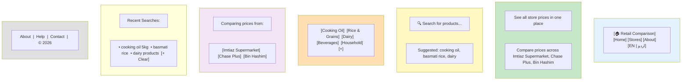

### Desktop Layout Specifications

**Dimensions:**
- **Breakpoint:** 769px and above
- **Max width:** 1200px (centered)
- **Padding:** 24px左右
- **Header height:** 64px
- **Search bar height:** 56px

**Spacing:**
- **Section spacing:** 48px vertical
- **Card spacing:** 16px gaps
- **Button padding:** 12px 24px

**Typography:**
- **Headline:** 48px, Bold
- **Subhead:** 20px, Regular
- **Body:** 16px, Regular (minimum per WCAG AA)
- **Captions:** 14px, Regular

### Search Results Page (Desktop)

```mermaid
graph TB
    subgraph HEADER[" "]
        H1["[🏠] [Search] [Stores] [About]    [EN | اردو]"]
    end

    subgraph SEARCH_BAR[" "]
        SB["  🔍   cooking oil 5kg                      [X]  "]
    end

    subgraph MAIN_CONTENT[" "]
        subgraph FILTERS[" "]
            F1["FILTERS"]
            F2["Price Range"]
            F3["├─────┬─────┬─────┤"]
            F4["  0  2.5K  5K  "]
            F5["Stores"]
            F6["☑ Imtiaz (23)"]
            F7["☑ Chase Plus (18)"]
            F8["☐ Bin Hashim (15)"]
            F9["Availability"]
            F10["☑ In Stock Only"]
            F11["[Clear All]"]
        end

        subgraph RESULTS[" "]
            R1["56 products found  Sorted: Price (Low-High) ↓"]
            R2["═════════════════════════════════════════════════════════"]
            R3["  PRODUCT: Cooking Oil 5kg - Habib Oil  "]
            R4["  ┌─────────────────────────────────────────────────┐  "]
            R5["  │ 💚 BEST VALUE                                   │  "]
            R6["  │ Chase Plus - PKR 2,650  •  In Stock  •  3.2km  │  "]
            R7["  │ Imtiaz - PKR 2,800        •  In Stock  •  2.5km  │  "]
            R8["  │ Bin Hashim - PKR 2,700    •  In Stock  •  4.1km  │  "]
            R9["  │ [View on Chase Plus] [View on Imtiaz] [View on Bin Hashim] │  "]
            R10[" └─────────────────────────────────────────────────┘  "]
            R11["Updated: 2 hours ago"]
            R12["═════════════════════════════════════════════════════════"]
            R13["  PRODUCT: Basmati Rice 5kg - Guard Rice  "]
            R14["  ┌─────────────────────────────────────────────────┐  "]
            R15["  │ 💚 BEST VALUE                                   │  "]
            R16["  │ Bin Hashim - PKR 1,800   •  In Stock  •  4.1km  │  "]
            R17["  │ Imtiaz - PKR 1,950       •  In Stock  •  2.5km  │  "]
            R18["  │ [View on Bin Hashim] [View on Imtiaz]           │  "]
            R19[" └─────────────────────────────────────────────────┘  "]
        end
    end

    subgraph PAGINATION[" "]
        P1["  ← Previous  [1] [2] [3] ... [10]  Next →  "]
    end

    style HEADER fill:#e3f2fd
    style SEARCH_BAR fill:#fff9c4
    style FILTERS fill:#f5f5f5
    style RESULTS fill:#ffffff
    style R5 fill:#c8e6c9
    style R15 fill:#c8e6c9
```

### Desktop Search Results Layout

**Grid System:**
- **Total columns:** 12
- **Sidebar (filters):** 3 columns (25%)
- **Main content:** 9 columns (75%)
- **Gutter:** 24px

**Filter Panel:**
- **Width:** 280px fixed
- **Position:** Sticky (stays visible while scrolling)
- **Height:** Up to viewport height
- **Overflow:** Auto scrollable

**Results Grid:**
- **Product cards:** Full width (not grid)
- **Card height:** Variable (auto based on content)
- **Spacing:** 16px vertical between cards

---

## Mobile Wireframes

### Homepage Wireframe (Mobile)

```mermaid
graph TB
    subgraph TOP_BAR[" "]
        T1["[🏠]                    Search...        [EN|ur]"]
    end

    subgraph HERO[" "]
        H1["        See all store prices        "]
        H2["      in one place      "]
    end

    subgraph SEARCH[" "]
        S1["   🔍   Search for products...   "]
    end

    subgraph CATEGORIES[" "]
        C1["→ [Cooking Oil] [Rice] [Dairy] →"]
    end

    subgraph STORES[" "]
        ST1["Comparing prices from:"]
        ST2["[Imtiaz] [Chase Plus] [Bin Hashim]"]
    end

    subgraph RECENT[" "]
        R1["Recent Searches:"]
        R2["• cooking oil 5kg"]
        R3["• basmati rice"]
        R4["[Clear History]"]
    end

    subgraph BOTTOM_NAV[" "]
        B1[" [🏠]  [🕐]  [🏪]  [⋮] "]
        B2[" Home  Recent  Stores  More "]
    end

    style TOP_BAR fill:#e3f2fd
    style HERO fill:#c8e6c9
    style SEARCH fill:#fff9c4
    style CATEGORIES fill:#ffe0b2
    style BOTTOM_NAV fill:#424242,,#ffffff
```

### Mobile Layout Specifications

**Dimensions:**
- **Breakpoint:** 320px - 480px
- **Width:** 100% viewport
- **Padding:** 16px左右
- **Top bar height:** 56px
- **Bottom nav height:** 56px

**Touch Targets:**
- **Minimum size:** 44x44px (WCAG AA)
- **Spacing:** 8px between targets
- **Thumb zone:** Bottom nav for primary actions

**Typography:**
- **Headline:** 32px, Bold
- **Subhead:** 18px, Regular
- **Body:** 16px, Regular
- **Buttons:** 16px, Medium

### Search Results Page (Mobile)

```mermaid
graph TB
    subgraph TOP_BAR[" "]
        T1["[←]    🔍 cooking oil 5kg    [✕] [☰]"]
    end

    subgraph SORT_FILTER[" "]
        SF1["[Filters]  Sorted: Price ↓ [Map]"]
    end

    subgraph RESULTS[" "]
        R1["────────────────────────────────────"]
        R2["💚 BEST VALUE"]
        R3["Chase Plus - PKR 2,650"]
        R4["In Stock • 3.2km away"]
        R5["[View on Chase Plus →]"]
        R6[""]
        R7["Imtiaz - PKR 2,800"]
        R8["In Stock • 2.5km away"]
        R9["[View on Imtiaz →]"]
        R10["────────────────────────────────────"]
        R11["[↓ Show more stores]"]
        R12["────────────────────────────────────"]
        R13["💚 BEST VALUE"]
        R14["Bin Hashim - PKR 1,800"]
        R15["In Stock • 4.1km away"]
        R16["[View on Bin Hashim →]"]
        R17["────────────────────────────────────"]
    end

    subgraph BOTTOM_NAV[" "]
        B1[" [🏠]  [🕐]  [🏪]  [⋮] "]
    end

    style TOP_BAR fill:#e3f2fd
    style SORT_FILTER fill:#fff9c4
    style R2 fill:#c8e6c9
    style R13 fill:#c8e6c9
    style BOTTOM_NAV fill:#424242,,#ffffff
```

### Mobile Filter Modal

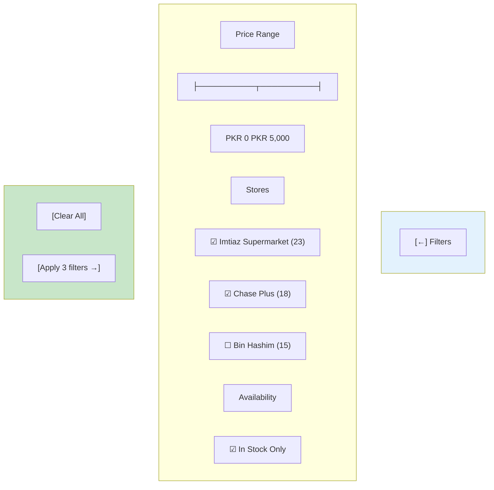

---

## Component Wireframes

### Search Bar Component

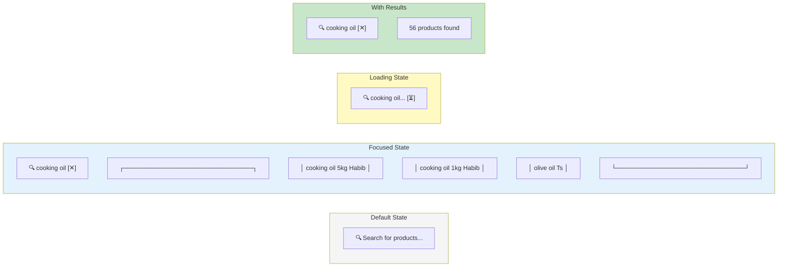

### Product Card Component

```mermaid
graph TB
    subgraph CARD["Product Card"]
        P1["═══════════════════════════════════════════"]
        P2["PRODUCT: Cooking Oil 5kg - Habib Oil"]
        P3["─────────────────────────────────────────"]
        P4["💚 BEST VALUE"]
        P5["┌─────────────────────────────────────┐"]
        P6["│ Chase Plus                          │"]
        P7["│ PKR 2,650  •  In Stock  •  3.2km    │"]
        P8["│ [View on Chase Plus Website →]      │"]
        P9["└─────────────────────────────────────┘"]
        P10["Imtiaz - PKR 2,800  •  In Stock  •  2.5km"]
        P11["Bin Hashim - PKR 2,700  •  In Stock  •  4.1km"]
        P12["[↓ Show 3 stores]"]
        P13["─────────────────────────────────────────"]
        P14["Updated: 2 hours ago"]
        P15("═══════════════════════════════════════════")
    end

    subgraph EXPANDED["Expanded State"]
        E1["═══════════════════════════════════════════"]
        E2["PRODUCT: Cooking Oil 5kg - Habib Oil"]
        E3["─────────────────────────────────────────"]
        E4["💚 BEST VALUE"]
        E5["┌─────────────────────────────────────┐"]
        E6["│ Chase Plus                          │"]
        E7["│ PKR 2,650  •  In Stock  •  3.2km    │"]
        E8["│ [View on Chase Plus Website →]      │"]
        E9["│ [ℹ Store Info]                      │"]
        E10["└─────────────────────────────────────┘"]
        E11["┌─────────────────────────────────────┐"]
        E12["│ Imtiaz Supermarket                  │"]
        E13["│ PKR 2,800  •  In Stock  •  2.5km    │"]
        E14["│ [View on Imtiaz Website →]          │"]
        E15["│ [ℹ Store Info]                      │"]
        E16["└─────────────────────────────────────┘"]
        E17["┌─────────────────────────────────────┐"]
        E18["│ Bin Hashim                          │"]
        E19["│ PKR 2,700  •  In Stock  •  4.1km    │"]
        E20["│ [View on Bin Hashim Website →]      │"]
        E21["│ [ℹ Store Info]                      │"]
        E22["└─────────────────────────────────────┘"]
        E23["[↑ Show less]"]
        E24["─────────────────────────────────────────"]
        E25["Updated: 2 hours ago")
        E26("═══════════════════════════════════════════")
    end

    style P4 fill:#c8e6c9
    style E4 fill:#c8e6c9
```

### Filter Pills Component

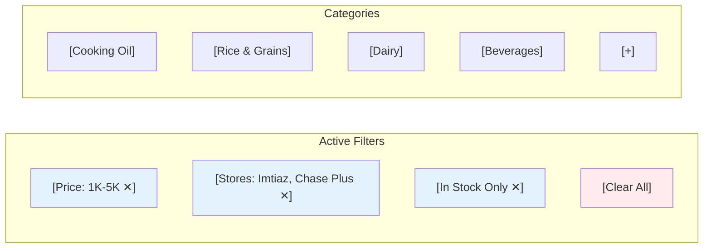

### Store Card Component

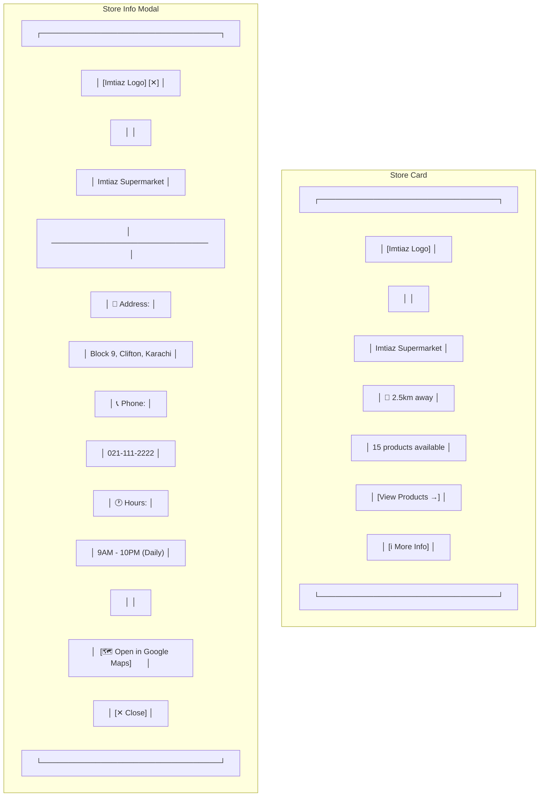

---

## State Wireframes

### Loading States

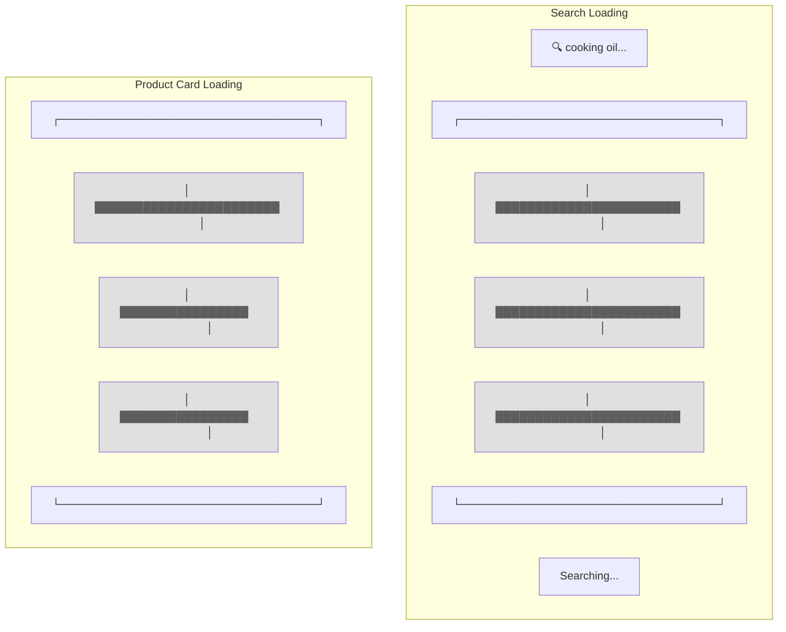

### Error States

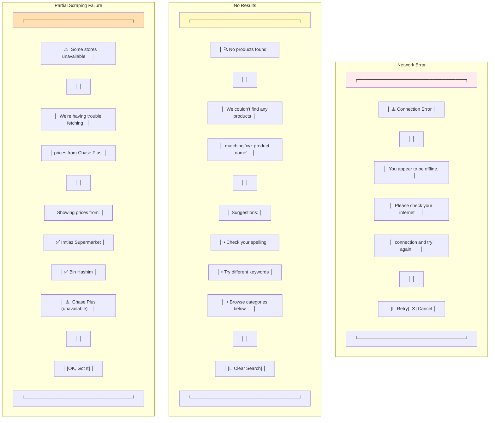

### Success States

```mermaid
graph TB
    subgraph SEARCH_SUCCESS["Search Success"]
        S1["🔍   cooking oil          [✕]"]
        S2["23 products found  Sorted: Price ↓"]
        S3["─────────────────────────────────────────"]
        S4["💚 BEST VALUE"]
        S5["Chase Plus - PKR 2,650  In Stock  3.2km"]
        S6["[View →]")
        S7["Imtiaz - PKR 2,800  In Stock  2.5km"]
        S8["[View →]"]
    end

    subgraph FILTER_SUCCESS["Filter Applied"]
        F1["56 products found  [Price: 1K-5K ✕] [Stores: 2 ✕]"]
        F2["─────────────────────────────────────────"]
        F3["💚 BEST VALUE"]
        F4["Chase Plus - PKR 2,650  In Stock  3.2km"]
        F5["[View →]"]
    end

    style S4 fill:#c8e6c9
    style F3 fill:#c8e6c9
```

---

## Accessibility Wireframes

### Keyboard Navigation Flow

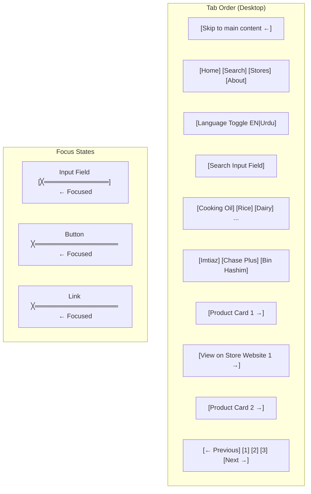

### Screen Reader Structure

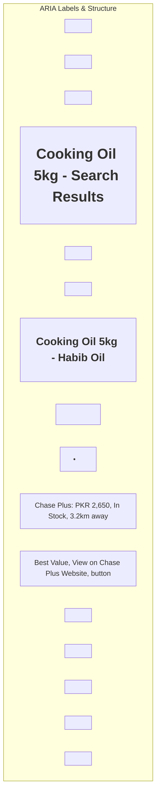

---

## Color & Typography Specifications

### Color Palette (MUI Theme)

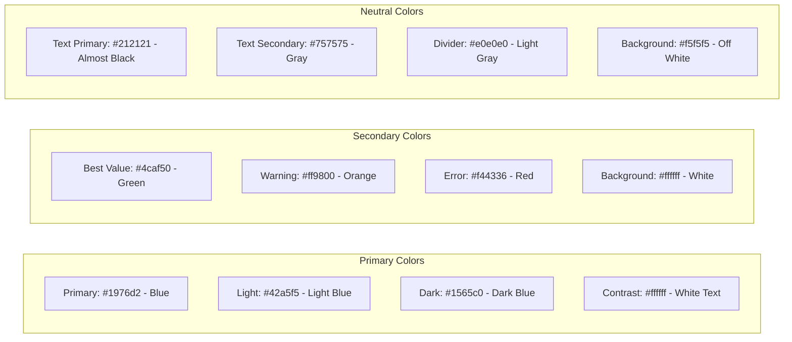

### Typography Scale

```mermaid
graph TB
    subgraph TYPOGRAPHY["Typography System"]
        T1["H1: 48px / 56px line-height - Bold"]
        T2["H2: 36px / 44px line-height - Bold"]
        T3["H3: 28px / 36px line-height - Bold"]
        T4["H4: 24px / 32px line-height - Medium"]
        T5["H5: 20px / 28px line-height - Medium"]
        T6["H6: 18px / 24px line-height - Medium"]
        T7["Body 1: 16px / 24px line-height - Regular"]
        T8["Body 2: 14px / 20px line-height - Regular"]
        T9["Caption: 12px / 16px line-height - Regular"]
    end

    T1 -->|Headlines| T2
    T2 --> T3
    T3 -->|Subheadings| T4
    T4 --> T5
    T5 -->|Small headings| T6
    T6 -->|Body text| T7
    T7 --> T8
    T8 -->|Supporting| T9
```

---

## Wireframe Summary

**Responsive Breakpoints:**

| Breakpoint | Width | Device Type | Layout |
|------------|-------|-------------|--------|
| **XS** | 0-359px | Small phones | Single column, stacked |
| **SM** | 360-480px | Phones | Single column, optimized |
| **MD** | 481-768px | Tablets | Two columns possible |
| **LG** | 769px+ | Desktop | Multi-column, sidebar |

**Component Library:**
- **Framework:** MUI v6
- **Styling:** Emotion (CSS-in-JS)
- **Icons:** Material Icons
- **Font:** Roboto (via @fontsource/roboto)

---

## Next Steps

- Convert wireframes to actual React components
- Test on real devices (multiple screen sizes)
- Validate with accessibility tools (axe-core, Lighthouse)
- Test with real users (all 3 personas)

