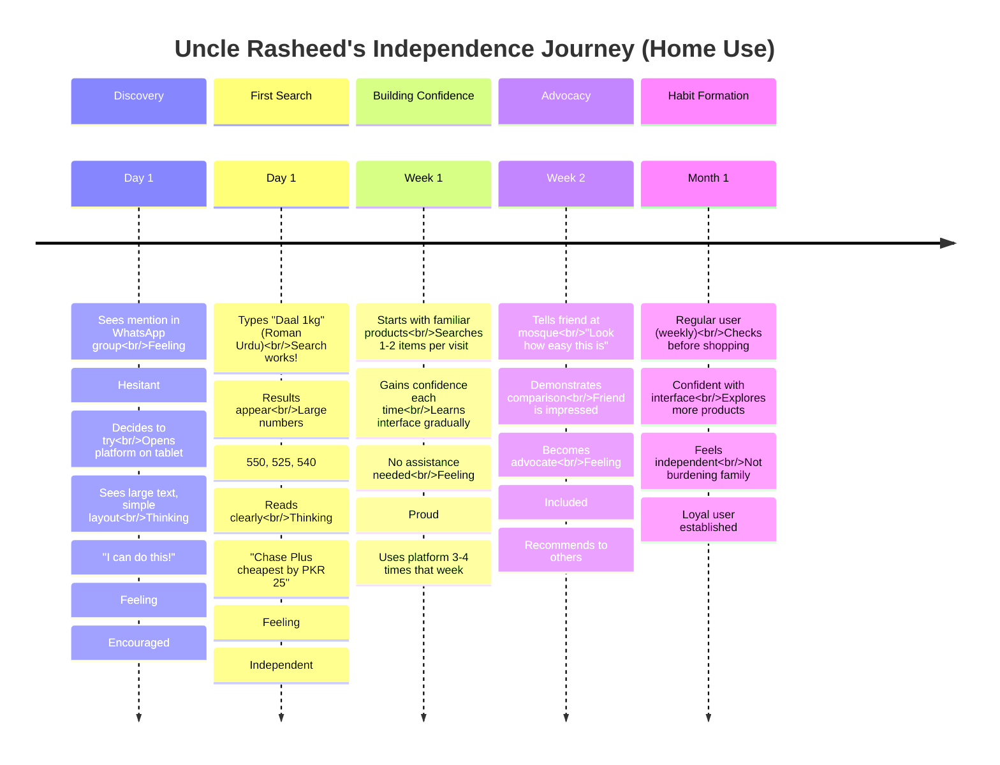
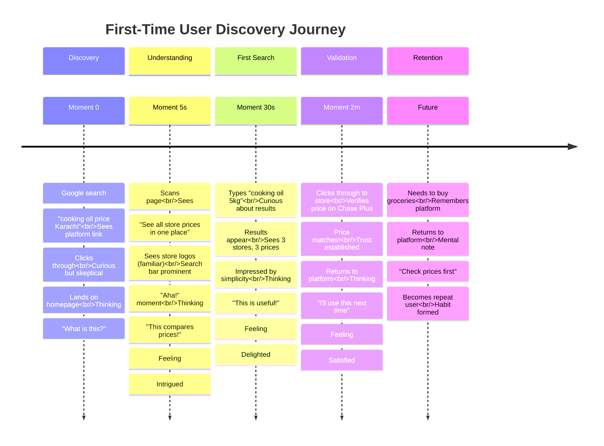

# User Journey Maps - Retail Recommendation System

**Document Version:** 1.0
**Last Updated:** 2026-02-03
**Author:** Jibran

---

## Table of Contents

1. [Sarah's Weekly Planning Journey](#sarahs-weekly-planning-journey)
2. [Ahmed's Efficiency Journey](#ahmeds-efficiency-journey)
3. [Uncle Rasheed's Independence Journey](#uncle-rasheeds-independence-journey)
4. [First-Time User Discovery Journey](#first-time-user-discovery-journey)
5. [Admin Monitoring Journey](#admin-monitoring-journey)
6. [Journey Comparison Matrix](#journey-comparison-matrix)

---

## Sarah's Weekly Planning Journey

**Persona:** Sarah (42, mother of 6, household manager)
**Scenario:** Sunday evening weekly grocery planning
**Goal:** Optimize budget and time for weekly shopping
**Duration:** 10-15 minutes

### Journey Timeline

```mermaid
timeline
    title Sarah's Weekly Planning Journey (Sunday Evening)

    section Discovery
        7:00 PM : Opens platform on laptop<br/>Feeling: Dreaded chore
        : Sees clear search bar & store logos<br/>Thinking: "This looks simple"
        : Feeling: Hopeful

    section First Search
        7:02 PM : Types "cooking oil 5kg"<br/>Search bar responsive
        : Results appear in < 2 seconds<br/>💚 "Best Value" badge highlights
        : Sees 3 stores side-by-side<br/>Thinking: "PKR 150 savings at Chase Plus"
        : Feeling: Delighted

    section Multi-Product Planning
        7:05 PM : Adds to mental list<br/>Searches "basmati rice 5kg"
        : Compares prices<br/>Bin Hashim cheapest but farther
        : Calculates: Distance vs Savings<br/>Decides: Worth the trip
        : Feeling: Empowered

    section Route Optimization
        7:10 PM : Has compared 6 products<br/>Mental route planned
        : 1. Chase Plus (oil, biggest savings)<br/>2. Bin Hashim (rice)<br/>3. Imtiaz (dairy, on way home)
        : Total savings: ~PKR 800<br/>Feeling: Accomplished

    section Completion
        7:15 PM : Planning complete<br/>Time: 15 minutes (vs 2+ hours physical)
        : Money saved: PKR 800<br/>Feeling: Relief
        : Adds to weekly routine<br/>Shares with WhatsApp family group
```

### Sarah's Emotional Journey Map

```mermaid
graph LR
    Start([Dread:<br/>"Another Sunday of<br/>store hopping"]) --> Hope[Hope:<br/>"This might<br/>actually work"]
    Hope --> Delight[Delight:<br/>"PKR 150 savings<br/>on first item!"]
    Delight --> Empowered[Empowered:<br/>"I can compare<br/>everything at once"]
    Empowered --> Smart[Smart:<br/>"Making informed<br/>decisions"]
    Smart --> Accomplished[Accomplished:<br/>"PKR 800 saved<br/>15 minutes done"]
    Accomplished --> Relief[Relief:<br/>"Weekly chore<br/>transformed"]

    style Start fill:#ffcdd2
    style Accomplished fill:#c8e6c9
    style Relief fill:#b2dfdb
```

### Sarah's Touchpoints

| Stage | Touchpoint | Emotion | Pain Point Solved |
|-------|-----------|---------|-------------------|
| **Discovery** | Homepage clarity | Hope → Curiosity | Unclear value prop |
| **First Search** | Fast results (< 2s) | Delight | Slow loading |
| **Comparison** | Side-by-side prices | Empowered | Visiting multiple stores |
| **Decision** | Savings highlighted | Smart | Hidden costs |
| **Planning** | Route optimization | Accomplished | Time-consuming planning |
| **Completion** | Total savings visible | Relief | Budget uncertainty |

### Sarah's Key Insights

**What Works Well:**
- ✅ Fast search results (critical for time-sensitive planning)
- ✅ Clear savings visualization (PKR 800 total)
- ✅ Distance info helps route planning
- ✅ All stores in one view (no tab switching)

**Opportunities:**
- 💡 Shopping list feature (save items, reference later)
- 💡 Route calculator (optimize based on selected items)
- 💡 Share list with family (WhatsApp integration)
- 💡 Weekly shopping history (track savings over time)

---

## Ahmed's Efficiency Journey

**Persona:** Ahmed (32, busy professional)
**Scenario:** Tuesday 5:30 PM, needs printer cartridge before stores close
**Goal:** Find product quickly, confirm availability, minimize travel
**Duration:** 2-3 minutes (time-critical)

### Journey Timeline

```mermaid
timeline
    title Ahmed's Efficiency Journey (Tuesday Evening)

    section Context
        5:30 PM : Leaving office in Korangi<br/>Needs printer cartridge urgently
        : Stores close at 8 PM<br/>Feeling: Stressed, time pressure
        : Opens platform on phone (3G network)

    section Search
        5:31 PM : Types "HP 680 cartridge"<br/>Optimistic UI loads quickly
        : Results in < 2 seconds on 3G<br/>Feeling: Impressed
        : Sees 2 stores with stock<br/>Thinking: "Both have it!"

    section Decision
        5:32 PM : Quick comparison<br/>Imtiaz: PKR 3500 (2.5km)<br/>Chase Plus: PKR 3400 (3.8km)
        : Calculates: PKR 100 vs 1.3km extra<br/>Thinking: "Chase Plus is on my route"
        : Decision made in seconds<br/>Feeling: Efficient

    section Navigation
        5:33 PM : Clicks "View on Chase Plus Website"<br/>Store site opens in new tab
        : Confirms hours & stock<br/>Clicks "Open in Google Maps"
        : Turn-by-turn navigation starts<br/>Feeling: Confident

    section Success
        5:45 PM : Arrives at Chase Plus<br/>Finds cartridge, buys it
        : Back on highway by 6:45 PM<br/>Feeling: Satisfied
        : Platform becomes go-to tool<br/>for quick decisions
```

### Ahmed's Emotional Journey Map

```mermaid
graph LR
    Start([Stressed:<br/>"Need cartridge<br/>before 8 PM"]) --> Impressed[Impressed:<br/>"This is fast<br/>even on 3G"]
    Impressed --> Relieved[Relieved:<br/>"Both stores<br/>have it"]
    Relieved --> Decisive[Decisive:<br/>"Chase Plus on<br/>my route"]
    Decisive --> Confident[Confident:<br/>"Navigation<br/>ready"]
    Confident --> Satisfied[Satisfied:<br/>"Mission<br/>accomplished"]

    style Start fill:#ffebee
    style Satisfied fill:#c8e6c9
    style Impressed fill:#fff9c4
```

### Ahmed's Touchpoints

| Stage | Touchpoint | Emotion | Pain Point Solved |
|-------|-----------|---------|-------------------|
| **Search** | Fast 3G loading | Impressed | Slow mobile networks |
| **Results** | In-stock visible | Relieved | Wasted trips to OOS items |
| **Decision** | Price + distance | Decisive | Trade-off confusion |
| **Navigation** | Google Maps integration | Confident | Getting lost |
| **Purchase** | Seamless click-through | Satisfied | Complex navigation |

### Ahmed's Key Insights

**What Works Well:**
- ✅ Fast loading on 3G (critical for commuters)
- ✅ In-stock status (prevents wasted trips)
- ✅ Distance calculation (route optimization)
- ✅ Google Maps integration (turn-by-turn)
- ✅ Single-column mobile layout (easy thumb reach)

**Opportunities:**
- 💡 Push notifications (price drops on saved items)
- 💡 Location-aware (auto-detect current location)
- 💡 Quick-access recent searches (on home screen)
- 💡 Offline mode (cache recent searches for no-signal areas)

---

## Uncle Rasheed's Independence Journey

**Persona:** Uncle Rasheed (65, retired teacher, low tech comfort)
**Scenario:** Home use, wants to check supplement prices independently
**Goal:** Find price without asking family for help
**Duration:** 5-10 minutes (slow, deliberate)

### Journey Timeline



### Uncle Rasheed's Emotional Journey Map

```mermaid
graph LR
    Start([Hesitant:<br/>"Will I be able<br/>to use this?"]) --> Encouraged[Encouraged:<br/>"Large text,<br/>simple layout"]
    Encouraged --> Independent[Independent:<br/>"I found it<br/>myself!"]
    Independent --> Proud[Proud:<br/>"I didn't ask<br/>for help"]
    Proud --> Included[Included:<br/>"Even people<br/>like us can use"]
    Included --> Empowered[Empowered:<br/>"I can do this<br/>independently"]

    style Start fill:#f3e5f5
    style Empowered fill:#c8e6c9
    style Encouraged fill:#fff9c4
```

### Uncle Rasheed's Touchpoints

| Stage | Touchpoint | Emotion | Pain Point Solved |
|-------|-----------|---------|-------------------|
| **Discovery** | No signup barrier | Encouraged | Complex registration |
| **Interface** | Large text, high contrast | Independent | Small, hard-to-read UI |
| **Search** | Roman Urdu support | Proud | English-only platforms |
| **Results** | Simple number display | Included | Complex layouts |
| **Success** | Immediate value | Empowered | Feeling left behind |

### Uncle Rasheed's Key Insights

**What Works Well:**
- ✅ No account/signup (immediate access)
- ✅ Large text (minimum 16px)
- ✅ High contrast (WCAG AA)
- ✅ Simple layout (minimal cognitive load)
- ✅ Urdu language support
- ✅ Clear numbers (PKR formatting)

**Opportunities:**
- 💡 Voice search (dictate instead of type)
- 💡 Tutorial overlay (first visit guidance)
- 💡 Larger touch targets (50x50px for easier tapping)
- 💡 Phone support (call for assistance)
- 💡 Community features (share deals with friends)

---

## First-Time User Discovery Journey

**Persona:** Aisha (28, working professional)
**Scenario:** Discovers via Google search, exploring platform
**Goal**: Understand value proposition and test functionality
**Duration**: 5-10 minutes (exploration)

### Journey Timeline



### First-Time User Emotional Map

```mermaid
graph LR
    Start([Curious:<br/>"What is this<br/>platform?"]) --> Intrigued[Intrigued:<br/>"Shows all<br/>prices?"]
    Intrigued --> Impressed[Impressed:<br/>"So simple<br/>and fast"]
    Impressed --> Trusted[Trusted:<br/>"Prices match<br/>store sites"]
    Trusted --> Satisfied[Satisfied:<br/>"Added to my<br/>toolkit"]

    style Start fill:#e1f5fe
    style Intrigued fill:#fff9c4
    style Satisfied fill:#c8e6c9
```

### First-Time User Touchpoints

| Stage | Touchpoint | Emotion | Barrier Removed |
|-------|-----------|---------|-----------------|
| **Landing** | Clear value prop | Curious → Intrigued | Confusion about purpose |
| **Search** | Immediate results | Impressed | Wait time, complexity |
| **Results** | All stores visible | Delighted | Tab switching, incomplete data |
| **Click-through** | Price verification | Trusted | Skepticism about accuracy |
| **Return** | Mental bookmark | Satisfied | Forgotten platform |

---

## Admin Monitoring Journey

**Persona:** Jibran (System Administrator)
**Scenario:** Daily platform health check, respond to issues
**Goal**: Ensure 95%+ uptime, rapid error detection/resolution
**Duration**: Ongoing (10-15 minutes per check)

### Journey Timeline

```mermaid
timeline
    title Admin Monitoring Journey (Daily Routine)

    section Morning Check
        10:00 AM : Opens admin dashboard<br/>Authenticates (password)
        : Views scraping status<br/>All green ✅ (success)
        : Checks metrics<br/>Feeling: Relieved

    section Issue Detection
        10:05 AM : Red indicator on Chase Plus<br/>⚠️ Failed at 6:02 AM
        : Clicks error logs<br/>Reads diagnostics
        : "CSS selector not found"<br/>Thinking: "Website structure changed"
        : Feeling: Alert

    section Investigation
        10:10 AM : Opens Chase Plus site (incognito)<br/>Verifies structure change
        : Finds: `.price-new` not `.product-price`<br/>Root cause confirmed
        : Updates scraper logic<br/>Deploys fix
        : Feeling: Focused

    section Recovery
        10:15 AM : Triggers manual re-scrape<br/>Watches progress
        : Success: 812 products scraped<br/>Issue resolved
        : Dashboard shows all green ✅<br/>Feeling: Accomplished

    section Prevention
        10:20 AM : Documents incident<br/>Adds to playbook
        : Sets up monitoring alert<br/>Prevents future issues
        : Daily check complete<br/>Feeling: Prepared
```

### Admin Emotional Journey

```mermaid
graph LR
    Start([Relieved:<br/>"All systems<br/>operational"]) --> Alert[Alert:<br/>"Chase Plus<br/>failed"]
    Alert --> Focused[Focused:<br/>"Need to fix<br/>this quickly"]
    Focused --> ProblemSolving[Problem-Solving:<br/>"Found root<br/>cause"]
    ProblemSolving --> Accomplished[Accomplished:<br/>"Fixed in<br/>15 minutes"]
    Accomplished --> Prepared[Prepared:<br/>"Better monitoring<br/>next time"]

    style Start fill:#c8e6c9
    style Alert fill:#ffebee
    style Accomplished fill:#c8e6c9
    style Prepared fill:#b2dfdb
```

---

## Journey Comparison Matrix

### Cross-Persona Journey Comparison

| Aspect | Sarah | Ahmed | Uncle Rasheed | First-Time | Admin |
|--------|-------|-------|---------------|------------|-------|
| **Primary Goal** | Budget optimization | Time efficiency | Independence | Discovery | System health |
| **Time Pressure** | Medium (15 min) | High (2-3 min) | Low (5-10 min) | Low (5-10 min) | Medium (10-15 min) |
| **Device** | Laptop | Smartphone (mobile) | Tablet/Desktop | Smartphone | Desktop |
| **Network** | WiFi/Broadband | 3G Mobile | WiFi/Broadband | Varies | Broadband |
| **Tech Comfort** | Normal | High | Low | Varies | High (admin) |
| **Key Features** | Multi-product search, Filters | Fast search, Maps, Stock | Large text, Urdu, Simple | Clear value prop, Fast | Dashboard, Alerts, Logs |
| **Emotional Arc** | Dread → Relief | Stressed → Satisfied | Hesitant → Empowered | Curious → Confident | Relieved → Prepared |
| **Success Metric** | PKR 800 saved, 15 min | Decision in 3 min | Independent use | Return visit | < 15 min resolution |

### Journey Success Factors

**Common Success Factors (All Personas):**
1. ✅ **Fast loading** - < 2 second search performance
2. ✅ **Clear results** - Side-by-side comparison visible
3. ✅ **Accurate data** - Prices match store websites
4. ✅ **Easy navigation** - Intuitive interface
5. ✅ **Zero barriers** - No signup required

**Persona-Specific Success Factors:**

| Persona | Critical Success Factor | Why It Matters |
|----------|------------------------|----------------|
| **Sarah** | Multi-product comparison | Optimizes entire shopping list |
| **Ahmed** | 3G performance + Stock status | Time-sensitive, on-the-go usage |
| **Uncle Rasheed** | Large text + Urdu support | Accessibility, independence |
| **First-Time** | Immediate value clarity | Quick understanding, trust building |
| **Admin** | Real-time alerts + Fast recovery | Minimize downtime, user impact |

---

## Journey Optimization Opportunities

### Cross-Journey Improvements

**High Priority:**

1. **Persistent Shopping Lists** (Sarah)
   - Save products for weekly planning
   - Share with family members
   - Track savings over time

2. **Location-Aware Search** (Ahmed)
   - Auto-detect user location
   - Sort by distance automatically
   - Optimize route based on selected items

3. **Voice Search** (Uncle Rasheed)
   - Dictate search instead of type
   - Urdu voice recognition
   - Reduce typing effort

4. **Progressive Onboarding** (First-Time)
   - Quick tutorial on first visit
   - Sample search demonstrated
   - Feature highlights

5. **Predictive Alerts** (Admin)
   - ML-based failure prediction
   - Proactive issue detection
   - Automated recovery suggestions

**Medium Priority:**

6. **Offline Mode** (Ahmed, Uncle Rasheed)
   - Cache recent searches
   - Work without signal
   - Sync when connected

7. **Social Sharing** (Sarah, Uncle Rasheed)
   - WhatsApp integration
   - Share deals with friends
   - Build community

8. **Price History** (All users)
   - Track price trends
   - "Best time to buy" predictions
   - Price drop alerts

---

## Journey Map Summary

**Key Takeaways:**

1. **Speed is Critical** - All personas value fast performance
2. **Simplicity Wins** - Complex features frustrate users
3. **Trust = Accuracy** - Price accuracy drives repeat usage
4. **Accessibility Matters** - Uncle Rasheed represents underserved market
5. **Mobile-First** - Ahmed represents Pakistani mobile reality

**Emotional Design Principles:**

- **Empowerment** - Users feel smart and capable
- **Efficiency** - Time respected, fast interactions
- **Inclusion** - All users can use independently
- **Transparency** - Complete information builds trust
- **Delight** - "Aha!" moments create advocates

---

## Next Steps

- Conduct user testing with each persona
- Validate journey assumptions
- Measure actual vs. intended journeys
- Iterate based on feedback
- Update journey maps quarterly

