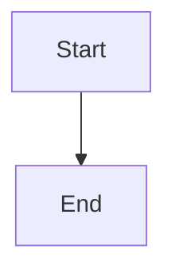

# UX Diagrams - Complete Documentation Package

**Project:** Retail Recommendation System
**Author:** Jibran
**Date:** 2026-02-03
**Status:** Complete

---

## Package Contents

This documentation package contains comprehensive UX diagrams based on your Product Brief, PRD, UX Design Specification, Epics, and Architecture documents. All diagrams represent the **intended product vision**, not the current implementation state.

### Document Structure

```
ux-diagrams/
├── 00-UX-Diagrams-Overview.md           (This file)
├── 01-user-flows.md                      (6 user flow diagrams)
├── 02-process-flows.md                   (6 detailed process flows)
├── 03-state-diagrams.md                  (6 state machine diagrams)
├── 04-information-architecture.md        (Navigation & content structure)
├── 05-wireframes.md                      (UI layout mockups)
└── 06-user-journey-maps.md              (5 end-to-end journey maps)
```

---

## Quick Reference Guide

### Diagram Types & Usage

| Diagram File | Contains | Best For | Stakeholder |
|--------------|---------|----------|--------------|
| **User Flows** | High-level user journeys | Understanding complete paths | Product managers, Stakeholders |
| **Process Flows** | Detailed interaction steps | Implementation logic | Developers, QA |
| **State Diagrams** | Component states & transitions | State management logic | Frontend developers |
| **Information Architecture** | Site structure, navigation | Content organization | UX designers, Information architects |
| **Wireframes** | UI layout mockups | Visual design reference | UI/UX designers, Developers |
| **Journey Maps** | End-to-end experiences | Empathy, user understanding | All stakeholders |

---

## Diagram Index

### User Flows (01-user-flows.md)

| # | Diagram | Persona | Focus |
|---|---------|---------|-------|
| 1 | Universal User Flow | All users | Core platform journey |
| 2 | Sarah's Weekly Planning | Household manager | Multi-product comparison |
| 3 | Ahmed's Quick Search | Busy professional | Time-critical decisions |
| 4 | Uncle Rasheed's Discovery | Non-tech user | Accessibility & simplicity |
| 5 | First-Time Onboarding | New users | Value proposition clarity |
| 6 | Admin Monitoring | System admin | Platform health |

### Process Flows (02-process-flows.md)

| # | Process | Focus | Complexity |
|---|---------|-------|-----------|
| 1 | Product Search | Search functionality | Medium |
| 2 | Price Comparison | Multi-store comparison | Low |
| 3 | Filter & Sort | Result refinement | Medium |
| 4 | Store Click-Through | Navigation to stores | Low |
| 5 | Error Handling | Error recovery | High |
| 6 | Data Scraping | Background data pipeline | High |

### State Diagrams (03-state-diagrams.md)

| # | Component | States | Transitions |
|---|-----------|--------|------------|
| 1 | Search Component | 7 states | Idle → Typing → Loading → Success |
| 2 | Product Card | 8 states | Loading → Idle → Expanded → Clicking |
| 3 | Filter State | 4 states | No filters → Active → Multiple → Sorted |
| 4 | API Request | 11 states | Pending → Success/Error/Network/Timeout |
| 5 | Modal | 7 states | Closed → Opening → Open → Active → Closing |
| 6 | Data Scraping | 8 states | Scheduled → Running → Partial/Complete/Failed |

### Information Architecture (04-information-architecture.md)

| Section | Content | Pages |
|---------|---------|-------|
| **Site Structure** | Page hierarchy | 4 main pages |
| **Navigation** | Desktop & mobile nav | Responsive patterns |
| **Content Organization** | Homepage sections | 7 content blocks |
| **Category Taxonomy** | Product categories | 5 main, 20+ sub-categories |
| **URL Structure** | Routing & lazy loading | RESTful URLs |

### Wireframes (05-wireframes.md)

| Section | Breakpoints | Key Screens |
|---------|------------|-------------|
| **Desktop** | 769px+ | Homepage, Search results, Filters |
| **Mobile** | 320-480px | Homepage, Search results, Bottom nav |
| **Components** | All sizes | Search bar, Product card, Filters |
| **States** | All sizes | Loading, Error, Success states |

### User Journey Maps (06-user-journey-maps.md)

| Journey | Persona | Duration | Emotional Arc |
|---------|---------|----------|---------------|
| 1 | Sarah's Weekly Planning | 15 min | Dread → Relief |
| 2 | Ahmed's Efficiency | 3 min | Stressed → Satisfied |
| 3 | Uncle Rasheed's Independence | Weeks | Hesitant → Empowered |
| 4 | First-Time Discovery | 10 min | Curious → Confident |
| 5 | Admin Monitoring | Daily | Relieved → Prepared |

---

## Mermaid Diagram Syntax

All diagrams use **Mermaid** syntax, which renders beautifully in:

### Supporting Tools

- **GitHub/GitLab** - Native Mermaid rendering in markdown
- **VS Code** - Mermaid Preview extension
- **Notion** - Mermaid embeds
- **Confluence** - Mermaid macro plugin
- **Draw.io** - Import Mermaid code
- **Obsidian** - Native Mermaid support

### Rendering Tips

```markdown
<!-- In Markdown files -->

```

---

## Design Specifications Summary

### Responsive Breakpoints

| Breakpoint | Width | Device | Layout |
|------------|-------|--------|--------|
| **XS** | 0-359px | Small phones | Single column |
| **SM** | 360-480px | Phones | Single column, optimized |
| **MD** | 481-768px | Tablets | Two columns possible |
| **LG** | 769px+ | Desktop | Multi-column, sidebar |

### Performance Targets

| Metric | Target | Why It Matters |
|--------|--------|----------------|
| **Search speed** | < 2 seconds (95th %ile) | User satisfaction, NFR-PERF-01 |
| **Page load** | < 3 seconds (3G) | Mobile users, NFR-PERF-02 |
| **Bundle size** | < 200KB initial | 3G optimization, NFR-PERF-03 |
| **Click-through** | < 1 second | Perceived responsiveness, NFR-PERF-05 |

### Accessibility Standards

| Standard | Requirement | Implementation |
|----------|------------|----------------|
| **WCAG AA** | Contrast ratios 4.5:1 (text), 3:1 (large) | MUI theme |
| **Touch targets** | Minimum 44x44px | MUI Button sizing |
| **Text size** | Minimum 16px body | Typography scale |
| **Keyboard nav** | Full functionality possible | Focus management |
| **Screen readers** | Semantic HTML + ARIA | Component structure |
| **Language** | English + Urdu support | Language toggle |

---

## Target Personas Reference

### Primary Users

**Sarah (Household Manager)**
- Demographics: 42, mother of 6
- Goals: Stretch budget, optimize time
- Device: Laptop (home), smartphone (occasional)
- Tech comfort: Normal
- Usage: Weekly planning, 5-10 products per session

**Ahmed (Busy Professional)**
- Demographics: 32, single male
- Goals: Maximize time efficiency
- Device: Smartphone (primary)
- Tech comfort: High
- Usage: Quick searches, time-critical, 1-2 products

**Uncle Rasheed (Non-Tech User)**
- Demographics: 65, retired teacher
- Goals: Independence, avoid burdening family
- Device: Tablet/desktop (home)
- Tech comfort: Low
- Usage: Slow, deliberate, 1 product at a time

### Secondary Users

**System Administrator (Jibran)**
- Role: Platform monitoring & maintenance
- Goals: 95%+ uptime, rapid error detection
- Device: Desktop (admin dashboard)
- Usage: Daily health checks, issue resolution

**First-Time User**
- Context: Discovering via Google/search
- Goals: Understand platform, test functionality
- Usage: Exploratory, 5-10 minute sessions

---

## Key Design Principles

All diagrams and documentation follow these core principles:

1. **Speed First** - < 2 second search, fast loading on 3G
2. **Radical Simplicity** - Zero barriers to value, intuitive interface
3. **Complete Transparency** - Show all stores, all prices, all availability
4. **Progressive Disclosure** - Critical info first, details on demand
5. **Accessible by Design** - WCAG AA compliance, Urdu support, inclusive

---

## How to Use This Package

### For Design Reviews

1. Start with **User Flows** to understand complete journeys
2. Review **Wireframes** for visual design reference
3. Check **Process Flows** for interaction logic
4. Validate **State Diagrams** for edge cases
5. Use **Journey Maps** for empathy and user understanding

### For Development

1. Review **Process Flows** for implementation logic
2. Study **State Diagrams** for component state management
3. Reference **Wireframes** for UI layout specifications
4. Check **Information Architecture** for routing structure
5. Follow **Accessibility** specifications in all components

### For Stakeholder Presentations

1. Show **User Journey Maps** to build empathy
2. Present **Wireframes** for visual communication
3. Use **User Flows** to explain functionality
4. Share **Key Principles** to align on vision
5. Reference **Success Metrics** to track progress

### For Quality Assurance

1. **User Flows** - Test complete user journeys
2. **Process Flows** - Validate interaction logic
3. **State Diagrams** - Test all state transitions
4. **Wireframes** - Visual regression testing
5. **Error States** - Validate error handling

---

## Implementation Priority

Based on the diagrams, here's the recommended implementation priority:

### Phase 1: Core Experience (MVP)

**Epic 1: Product Search & Discovery**
- ✅ Homepage with search bar
- ✅ Product search functionality
- ✅ Category browsing
- ✅ Multi-store price comparison
- ✅ Responsive design (mobile + desktop)

### Phase 2: Decision Support

**Epic 2: Filtering, Sorting & Distance**
- ✅ Price sorting (low-high)
- ✅ Distance sorting (near-far)
- ✅ Price range filter
- ✅ Store selection filter
- ✅ In-stock status filter

### Phase 3: Navigation

**Epic 3: Store Navigation & Click-Through**
- ✅ Store website click-through
- ✅ Store information modal
- ✅ Google Maps integration (mobile)

### Phase 4: Data Pipeline

**Epic 4: Data Pipeline & Scraping**
- ✅ Database schema (Supabase)
- ✅ Playwright web scrapers
- ✅ ETL pipeline
- ✅ Vercel Cron scheduling
- ✅ Anti-scraping countermeasures

### Phase 5: Accessibility

**Epic 5: WCAG AA Accessibility & Urdu Support**
- ✅ Keyboard navigation
- ✅ WCAG AA contrast ratios
- ✅ Urdu language support
- ✅ Screen reader compatibility
- ✅ Touch target sizing (44x44px)

### Phase 6: Monitoring

**Epic 6: Platform Monitoring & Reliability**
- ✅ Admin dashboard (post-MVP)
- ✅ Scraping status indicators
- ✅ Error logging & alerts
- ✅ Performance monitoring
- ✅ Manual re-scrape triggers

---

## Success Metrics

Each diagram includes success criteria based on your documentation:

### User Success Metrics

| Metric | Target | How to Measure |
|--------|--------|----------------|
| **Search success rate** | Users find relevant products | User feedback, analytics |
| **Click-through rate** | Users visit store websites | Click tracking |
| **Return user rate** | Users come back (Day 7, Day 30) | User analytics |
| **Data accuracy** | 95%+ price accuracy | User validation, spot-checking |

### Technical Metrics

| Metric | Target | How to Measure |
|--------|--------|----------------|
| **Search performance** | < 2 seconds (95th %ile) | Performance monitoring |
| **Page load time** | < 3 seconds on 3G | Lighthouse, Web Vitals |
| **Bundle size** | < 200KB initial | Bundle analysis tools |
| **Platform uptime** | 95%+ (MVP), 99%+ (Phase 2) | Uptime monitoring |
| **Scraping success** | 95%+ of scrapes succeed | Scraping logs |

---

## Feedback & Iteration

### How to Provide Feedback

1. **Review specific diagram sections**
2. **Identify gaps or inconsistencies**
3. **Suggest improvements or additions**
4. **Validate with user testing**
5. **Update diagrams based on feedback**

### Version Control

- **Version 1.0** (2026-02-03) - Initial documentation package
- **Version 1.1** - Post-feedback revisions
- **Version 2.0** - Major updates based on user testing

### Update Process

1. Document feedback and change requests
2. Prioritize updates (critical vs. nice-to-have)
3. Update relevant diagram sections
4. Increment version number
5. Communicate changes to stakeholders

---

## Supporting Documentation

This UX Diagrams package references and complements:

- **Product Brief** - Market focus, personas, success metrics
- **PRD** - Functional requirements, user journeys, NFRs
- **UX Design Specification** - Design principles, patterns, visual design
- **Epics** - Feature breakdown, user stories, acceptance criteria
- **Architecture** - Tech stack, patterns, project structure

---

## Contact & Support

**Questions about this documentation?**
- Review the relevant diagram section
- Check supporting documentation (PRD, UX spec, etc.)
- Consult with UX team or stakeholders

**Found an issue or gap?**
- Document the specific problem
- Suggest improvement or addition
- Propose update priority

---

## Conclusion

This comprehensive UX documentation package provides visual, actionable guidance for designing and implementing the Retail Recommendation System. All diagrams are based on your requirements documentation and represent the intended product vision.

**Remember:** These diagrams reflect what SHOULD BE built, not necessarily what IS currently implemented. Use them as your north star for design and development decisions.

**Good luck with your project, Jibran! 🚀**

---

*Generated: 2026-02-03*
*Author: Jibran*
*Tool: Claude (Tech Writer Agent - Paige)*
